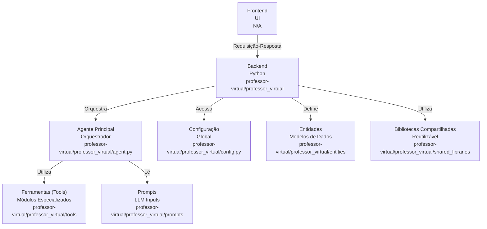
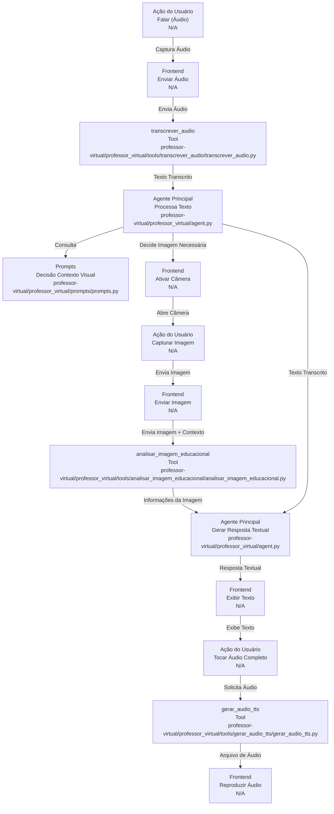
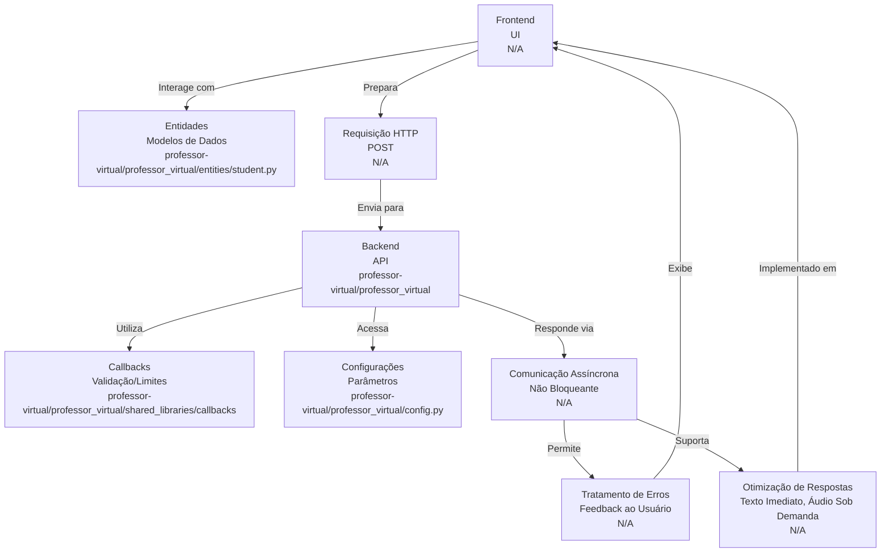

# Codebase Research Report

## Query
Analise o projeto do diretorio "/Users/institutorecriare/VSCodeProjects/projeto_professor/professor-virtual" da perspectiva da integração com o frontend (que ainda não existe). Nosso objetivo é analisar o backend e entender como deverá ser o frontend que deverá existir para que o a UI (descrita em "/Users/institutorecriare/VSCodeProjects/projeto_professor/.desenvolvedor/fonte_da_verdade.md" ). Analise fielmente cada um dos arquivos do diretório. Nosso objetivo é criar um documento que servirá como fonte da verdade deverá ser completa e expandida, mapeando cada detalhe que o usuário faz quando interage com o app e como o app responde a cada interação. Não deixe lacunas sem mapeamento. Se houver mais de uma possibilidade para uma ação, mapeie ambas ou todas elas. Não infira nada. Sempre verifique os arquivos reais do projeto

## Answer
# Análise de Integração Frontend-Backend para Professor Virtual

Este documento detalha a arquitetura do backend do projeto `professor-virtual` com foco na integração com um futuro frontend, mapeando as interações do usuário descritas em [fonte_da_verdade.md](/.desenvolvedor/fonte_da_verdade.md) para as funcionalidades do backend.

## 1. Visão Geral da Arquitetura do Backend

O backend do `professor-virtual` é estruturado em torno de um **agente principal** que orquestra a execução de **ferramentas** especializadas para processar as requisições do usuário. A comunicação com o frontend será baseada em um fluxo de requisição-resposta, onde o frontend envia dados de entrada (áudio, imagem) e o backend retorna a resposta processada (texto, áudio).

O diretório principal do backend é [professor-virtual/professor_virtual](professor-virtual/professor_virtual).

### Componentes Principais:

*   **Agente Principal**: [agent.py](professor-virtual/professor_virtual/agent.py) - Responsável por receber as entradas, orquestrar as ferramentas e gerar a resposta final.
*   **Ferramentas (Tools)**: [professor-virtual/professor_virtual/tools](professor-virtual/professor_virtual/tools) - Módulos especializados que executam tarefas específicas como transcrição de áudio, análise de imagem e geração de áudio TTS.
*   **Configuração**: [config.py](professor-virtual/professor_virtual/config.py) - Contém configurações globais para o aplicativo.
*   **Entidades**: [professor-virtual/professor_virtual/entities](professor-virtual/professor_virtual/entities) - Define modelos de dados, como a entidade `Student`.
*   **Prompts**: [professor-virtual/professor_virtual/prompts](professor-virtual/professor_virtual/prompts) - Armazena os prompts utilizados pelo agente.
*   **Bibliotecas Compartilhadas**: [professor-virtual/professor_virtual/shared_libraries](professor-virtual/professor_virtual/shared_libraries) - Contém funcionalidades reutilizáveis, como callbacks.

## 2. Mapeamento do Fluxo de Interação do Usuário com o Backend

### 2.1. Início da Interação: Ação de Falar (Captura e Transcrição de Áudio)

*   **Ação do Usuário (Frontend)**: A criança mantém um botão de microfone pressionado, capturando áudio. Ao soltar, o áudio é finalizado e enviado.
*   **Backend Expectativa**: O frontend enviará o arquivo de áudio capturado para um endpoint do backend.
*   **Componente Backend**: [transcrever_audio](professor-virtual/professor_virtual/tools/transcrever_audio)
    *   **Propósito**: Converter um arquivo de áudio em texto.
    *   **Entrada Esperada do Frontend**: Um arquivo de áudio (formato a ser definido, e.g., MP3, WAV) e, possivelmente, metadados como `student_id`.
    *   **Saída para o Agente**: O texto transcrito do áudio.
    *   **Detalhes de Implementação**: A lógica de transcrição reside em [transcrever_audio.py](professor-virtual/professor_virtual/tools/transcrever_audio/transcrever_audio.py).

### 2.2. Análise do Conteúdo e Decisão sobre Contexto Visual

*   **Ação do Usuário (Frontend)**: Nenhuma ação direta do usuário neste ponto; é uma decisão interna do backend.
*   **Backend Expectativa**: Após a transcrição, o agente principal analisará o texto para determinar a necessidade de contexto visual.
*   **Componente Backend**: [agent.py](professor-virtual/professor_virtual/agent.py) e [prompts.py](professor-virtual/professor_virtual/prompts/prompts.py)
    *   **Propósito**: O agente utiliza o texto transcrito para decidir se uma imagem é necessária para responder à pergunta. Isso provavelmente envolve lógica de processamento de linguagem natural e prompts específicos.
    *   **Entrada para o Agente**: O texto transcrito do áudio.
    *   **Saída para o Frontend (Implícita)**: Se o backend determinar que uma imagem é necessária, ele sinalizará isso ao frontend (e.g., através de um campo na resposta da API ou um novo tipo de resposta), instruindo-o a ativar a câmera.
    *   **Detalhes de Implementação**: A lógica de decisão e os prompts que guiam essa decisão estão em [agent.py](professor-virtual/professor_virtual/agent.py) e [prompts.py](professor-virtual/professor_virtual/prompts/prompts.py).

### 2.3. Ativação da Câmera e Envio/Análise da Imagem

*   **Ação do Usuário (Frontend)**: O frontend abre a câmera. A criança toca no ícone de captura (📷) ou no ícone de fechar (X).
*   **Backend Expectativa**:
    *   Se a foto for tirada: O frontend enviará a imagem capturada, juntamente com o contexto da pergunta original (texto transcrito), para um endpoint do backend.
    *   Se a câmera for fechada: O frontend sinalizará ao backend que a imagem não foi fornecida, e o backend deverá prosseguir sem ela.
*   **Componente Backend**: [analisar_imagem_educacional](professor-virtual/professor_virtual/tools/analisar_imagem_educacional)
    *   **Propósito**: Analisar uma imagem para extrair informações relevantes para a pergunta educacional.
    *   **Entrada Esperada do Frontend**: Um arquivo de imagem (formato a ser definido, e.g., JPEG, PNG) e o texto da pergunta original (contexto).
    *   **Saída para o Agente**: Informações extraídas da imagem ou um sinal de que a imagem é inadequada.
    *   **Detalhes de Implementação**: A lógica de análise de imagem está em [analisar_imagem_educacional.py](professor-virtual/professor_virtual/tools/analisar_imagem_educacional/analisar_imagem_educacional.py).
*   **Fallback Inteligente (Backend)**: O backend, através do agente ou da ferramenta de análise de imagem, é responsável por julgar a adequação da imagem. Se inadequada, o backend deve retornar uma resposta ao frontend indicando isso, possivelmente solicitando uma nova captura.

### 2.4. Geração e Apresentação da Resposta (Texto e Áudio)

*   **Ação do Usuário (Frontend)**: Nenhuma ação direta do usuário para a geração da resposta. Para o áudio completo, a criança toca no botão "Play" (▶️).
*   **Backend Expectativa**: O backend gerará a resposta final e a enviará ao frontend. Para o áudio completo, o frontend fará uma nova requisição.
*   **Componentes Backend**: [agent.py](professor-virtual/professor_virtual/agent.py) e [gerar_audio_tts](professor-virtual/professor_virtual/tools/gerar_audio_tts)
    *   **Geração da Resposta Textual**:
        *   **Propósito**: O agente principal combina todas as informações (texto da pergunta, análise da imagem) para gerar uma resposta educativa em texto.
        *   **Entrada para o Agente**: Texto transcrito, resultados da análise de imagem (se houver).
        *   **Saída para o Frontend**: A resposta textual completa.
        *   **Detalhes de Implementação**: A lógica central de geração de resposta está em [agent.py](professor-virtual/professor_virtual/agent.py).
    *   **Geração de Áudio TTS (Sob Demanda)**:
        *   **Propósito**: Converter texto em áudio.
        *   **Entrada Esperada do Frontend**: O texto da resposta que deve ser convertido em áudio.
        *   **Saída para o Frontend**: Um arquivo de áudio (formato a ser definido, e.g., MP3).
        *   **Detalhes de Implementação**: A lógica de geração de áudio TTS está em [gerar_audio_tts.py](professor-virtual/professor_virtual/tools/gerar_audio_tts/gerar_audio_tts.py).

## 3. Considerações Adicionais para Integração Frontend

### 3.1. Entidades e Modelos de Dados

O frontend precisará interagir com as entidades definidas no backend, como [student.py](professor-virtual/professor_virtual/entities/student.py). Isso implica que o frontend precisará enviar e receber dados formatados de acordo com esses modelos (e.g., `student_id`).

### 3.2. Callbacks e Fluxos de Processamento

O diretório [professor-virtual/professor_virtual/shared_libraries/callbacks](professor-virtual/professor_virtual/shared_libraries/callbacks) contém lógicas que podem influenciar o fluxo de processamento no backend, como `rate_limit_callback` e `validate_student_id_callback`. O frontend deve estar ciente de possíveis respostas de erro ou validação que podem vir dessas callbacks.

### 3.3. Configurações

O arquivo [config.py](professor-virtual/professor_virtual/config.py) pode conter parâmetros que o frontend precisa conhecer ou que influenciam o comportamento do backend, como limites de tamanho de arquivo ou tempos limite.

### 3.4. Estrutura de Comunicação

Para cada interação do usuário, o frontend precisará fazer uma requisição HTTP (e.g., POST) para um endpoint específico do backend, enviando os dados necessários (áudio, imagem, texto). O backend responderá com o resultado do processamento. A comunicação deve ser assíncrona para não bloquear a UI.

### 3.5. Tratamento de Erros

O frontend deve estar preparado para lidar com diferentes tipos de erros retornados pelo backend (e.g., falha na transcrição, imagem inadequada, erro interno do servidor) e apresentar feedback adequado ao usuário.

### 3.6. Otimização de Respostas

Para a "Apresentação da Resposta e Áudio Contextual", o frontend deve exibir o texto imediatamente e tocar o áudio pré-gravado. A requisição para o áudio completo (TTS) deve ser feita apenas quando o usuário clicar no botão "Play", para otimizar o uso de recursos do backend.

---
*Generated by [CodeViz.ai](https://codeviz.ai) on 28/07/2025, 13:19:11*
