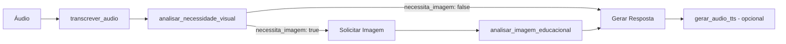

# Relatório de Inconsistências - Documento de Integração Backend-Frontend

## Data da Análise: 28/07/2025

Este relatório detalha as inconsistências encontradas entre o documento de integração backend-frontend e a implementação real do projeto professor-virtual.

## 1. Resumo Executivo

Durante a análise comparativa, foram identificadas **4 inconsistências principais** e **várias diferenças menores** entre o documento de integração e o código real. A maioria das inconsistências são relacionadas a funcionalidades não documentadas ou simplificações no documento.

## 2. Consistências Verificadas ✅

### 2.1 Estrutura de Diretórios
- ✅ Diretório principal: `professor-virtual/professor_virtual`
- ✅ Subdiretórios: `tools`, `entities`, `prompts`, `shared_libraries`, `callbacks`
- ✅ Arquivos principais: `agent.py`, `config.py`

### 2.2 Componentes Principais
- ✅ **agent.py**: Existe e implementa o agente principal com Google ADK
- ✅ **config.py**: Configurações globais presentes e funcionais
- ✅ **student.py**: Entidade Student implementada conforme descrito
- ✅ **prompts.py**: Sistema de prompts dinâmicos implementado

### 2.3 Ferramentas Documentadas
- ✅ **transcrever_audio**: Implementada em `/tools/transcrever_audio/transcrever_audio.py`
- ✅ **analisar_imagem_educacional**: Implementada em `/tools/analisar_imagem_educacional/analisar_imagem_educacional.py`
- ✅ **gerar_audio_tts**: Implementada em `/tools/gerar_audio_tts/gerar_audio_tts.py`

## 3. Inconsistências Identificadas ⚠️

### 3.1 Ferramenta Não Documentada 🔴
**Problema**: A ferramenta `analisar_necessidade_visual` existe no código mas NÃO está mencionada no documento de integração.

**Localização**: `/tools/analisar_necessidade_visual/analisar_necessidade_visual.py`

**Impacto**: O frontend não saberá que precisa implementar o fluxo de decisão visual corretamente.

**Detalhes**:
- Esta ferramenta é crucial no fluxo: analisa o texto transcrito para determinar se uma imagem é necessária
- É registrada no agent.py (linha 33)
- É mencionada nos prompts.py como parte do fluxo

### 3.2 Fluxo de Decisão Simplificado 🟡
**Problema**: O documento descreve o fluxo de decisão visual como interno do backend, mas existe uma ferramenta específica.

**Documento diz**:
> "Após a transcrição, o agente principal analisará o texto para determinar a necessidade de contexto visual"

**Realidade**: Existe a ferramenta `analisar_necessidade_visual` que deve ser chamada explicitamente.

### 3.3 Assinaturas de Funções Divergentes 🟡
**Problema**: As assinaturas das ferramentas no código real têm parâmetros adicionais não documentados.

#### transcrever_audio
- **Documentado**: `(nome_artefato_audio, tool_context)`
- **Real**: `(nome_artefato_audio: str, tool_context: ToolContext) -> Dict[str, Any]`
- **Adicional no código**: Função `transcrever_audio_avancado` com parâmetros extras

#### analisar_imagem_educacional
- **Documentado**: `(nome_artefato_imagem, contexto_pergunta, tool_context)`
- **Real**: Correto, mas retorna campos adicionais não documentados

#### gerar_audio_tts
- **Documentado**: `(texto, tool_context)`
- **Real**: `(texto: str, tool_context: ToolContext, velocidade: float = 1.0, voz: str = "pt-BR-Standard-A")`
- **Parâmetros extras**: `velocidade` e `voz`

### 3.4 Implementações Reais vs Mocks 🟠
**Problema**: O documento não esclarece que as ferramentas têm implementações completas com Gemini.

**Detalhes**:
- `transcrever_audio`: Usa Gemini 2.0 Flash para transcrição real
- `analisar_imagem_educacional`: Usa Gemini 2.5 Flash para análise de imagem
- `gerar_audio_tts`: Usa Gemini 2.5 Flash Preview TTS para geração de áudio

## 4. Outras Observações

### 4.1 Sistema de Prompts Dinâmicos
O arquivo `prompts.py` implementa um sistema sofisticado de instruction providers que não está detalhado no documento:
- `professor_instruction_provider`: Instrução principal adaptativa
- `erro_instruction_provider`: Mensagens de erro amigáveis
- `boas_vindas_provider`: Mensagens de boas-vindas personalizadas

### 4.2 Callbacks Adicionais
Existem vários callbacks implementados que podem afetar o comportamento:
- `rate_limit_callback`: Limita requisições (10 RPM)
- `validate_student_id_callback`: Valida ID do estudante
- `before_tool`, `after_tool`, `before_agent`: Hooks de processamento

### 4.3 Campos de Resposta Adicionais
As ferramentas retornam campos extras não documentados:
- **transcrever_audio**: `estatisticas`, `qualidade`, `idioma_detectado`
- **analisar_imagem_educacional**: `conceitos_abordados`, `nivel_ensino_sugerido`, `acessibilidade`
- **gerar_audio_tts**: `voz_utilizada`, `velocidade`

## 5. Recomendações

### 5.1 Para o Documento de Integração
1. **Adicionar seção** sobre a ferramenta `analisar_necessidade_visual`
2. **Atualizar fluxograma** incluindo esta ferramenta no fluxo
3. **Documentar parâmetros opcionais** das ferramentas
4. **Esclarecer** que são implementações reais, não mocks

### 5.2 Para o Desenvolvimento do Frontend
1. **Implementar suporte** para os parâmetros extras das ferramentas
2. **Considerar o fluxo completo** incluindo análise de necessidade visual
3. **Preparar-se** para campos de resposta adicionais
4. **Implementar tratamento** para rate limiting (10 RPM)

### 5.3 Fluxo Correto Completo

## 6. Conclusão

Embora a maioria dos componentes esteja corretamente documentada, existem funcionalidades importantes não mencionadas no documento de integração. A ferramenta `analisar_necessidade_visual` é crítica para o fluxo correto e deve ser incluída na documentação. Os parâmetros adicionais das ferramentas também devem ser documentados para garantir que o frontend possa aproveitar todas as funcionalidades disponíveis.

---
*Relatório gerado por análise comparativa entre `/Users/institutorecriare/VSCodeProjects/projeto_professor/.codeviz/reports/integracao_backend_frontend.md` e o código fonte em `/Users/institutorecriare/VSCodeProjects/projeto_professor/professor-virtual`*