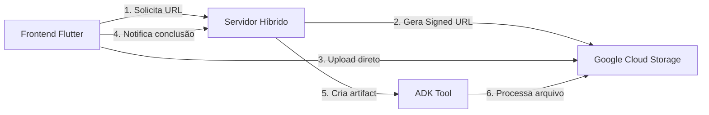

# Plano Detalhado: Implementação de Upload com Signed URLs + GCS

## Arquitetura Proposta



## Mudanças Necessárias no Código Atual

### 1. Criar Servidor Híbrido (novo arquivo: `professor_virtual/hybrid_server.py`)

```python
from google.adk.cli.fast_api import get_fast_api_app
from google.cloud import storage
from datetime import timedelta
from fastapi import HTTPException
import os

# Configurar cliente GCS
storage_client = storage.Client()
bucket_name = os.getenv("GCS_BUCKET_NAME", "professor-virtual-uploads")
bucket = storage_client.bucket(bucket_name)

# Criar app híbrido ADK + FastAPI
app = get_fast_api_app(
    agent_dir="./",
    session_db_url="sqlite:///sessions.db",
    allow_origins=["*"],
    web=True
)

@app.post("/api/get-upload-url")
async def get_upload_url(
    filename: str,
    user_id: str,
    session_id: str,
    mime_type: str
):
    """Gera URL assinada para upload direto ao GCS"""
    try:
        # Criar path único no bucket
        blob_name = f"{user_id}/{session_id}/{filename}"
        blob = bucket.blob(blob_name)
        
        # Gerar signed URL para upload
        signed_url = blob.generate_signed_url(
            version="v4",
            expiration=timedelta(minutes=15),
            method="PUT",
            content_type=mime_type
        )
        
        return {
            "upload_url": signed_url,
            "gcs_uri": f"gs://{bucket_name}/{blob_name}",
            "expires_in": 900  # 15 minutos
        }
    except Exception as e:
        raise HTTPException(status_code=500, detail=str(e))

@app.post("/api/confirm-upload")
async def confirm_upload(
    gcs_uri: str,
    filename: str,
    user_id: str,
    session_id: str
):
    """Confirma upload e solicita criação de artifact via ADK"""
    # Este endpoint triggeraria o agent com um prompt especial
    # que invocaria nossa tool upload_arquivo
    prompt = f"Process uploaded file: {filename} at {gcs_uri}"
    
    # Chamar o ADK agent via Runner
    # ... código para invocar o agent ...
    
    return {"status": "processing", "filename": filename}
```

### 2. Modificar nossa Tool (`upload_arquivo.py`)

```python
@tool(
    name="upload_arquivo",
    description="Processa arquivo já uploaded no GCS e cria artifact"
)
async def upload_arquivo(
    gcs_uri: str,  # Mudança: recebe URI ao invés de base64
    filename: str,
    mime_type: str,
    context: ToolContext
) -> Dict[str, Any]:
    """
    Processa arquivo do GCS e cria artifact.
    
    Args:
        gcs_uri: URI do arquivo no GCS (gs://bucket/path)
        filename: Nome do arquivo para o artifact
        mime_type: MIME type do arquivo
        context: ToolContext do ADK
    """
    try:
        # Baixar arquivo do GCS
        storage_client = storage.Client()
        blob = storage.Blob.from_string(gcs_uri, client=storage_client)
        content_bytes = blob.download_as_bytes()
        
        # Criar Part do arquivo
        artifact = types.Part.from_data(
            data=content_bytes,
            mime_type=mime_type
        )
        
        # Salvar artifact
        version = await context.save_artifact(
            filename=filename,
            artifact=artifact
        )
        
        return {
            "success": True,
            "filename": filename,
            "version": version,
            "size": len(content_bytes)
        }
        
    except Exception as e:
        return {
            "success": False,
            "error": str(e)
        }
```

### 3. Novo script de inicialização (`run_hybrid.py`)

```python
import uvicorn
from professor_virtual.hybrid_server import app

if __name__ == "__main__":
    uvicorn.run(
        app,
        host="0.0.0.0",
        port=8000,
        reload=True
    )
```

## Configurações Necessárias FORA do Código

### 1. Google Cloud Storage

- Criar bucket: `professor-virtual-uploads`
- Configurar IAM:
  ```bash
  # Dar permissão ao service account
  gsutil iam ch serviceAccount:YOUR_SA@PROJECT.iam.gserviceaccount.com:objectAdmin \
    gs://professor-virtual-uploads
  ```
- Configurar CORS para uploads do browser:
  ```json
  [
    {
      "origin": ["*"],
      "method": ["PUT"],
      "maxAgeSeconds": 3600
    }
  ]
  ```

### 2. Service Account

- Criar service account com permissões:
  - `storage.objects.create`
  - `storage.objects.get`
  - `iam.serviceAccounts.signBlob`

### 3. Variáveis de Ambiente (`.env`)

```bash
GOOGLE_APPLICATION_CREDENTIALS=path/to/service-account-key.json
GCS_BUCKET_NAME=professor-virtual-uploads
GOOGLE_CLOUD_PROJECT=your-project-id
```

## Fluxo Completo do Frontend

```dart
// 1. Solicitar URL de upload
final urlResponse = await http.post(
  Uri.parse('http://localhost:8000/api/get-upload-url'),
  body: jsonEncode({
    'filename': 'audio_123.wav',
    'user_id': currentUserId,
    'session_id': currentSessionId,
    'mime_type': 'audio/wav'
  }),
);

final uploadData = jsonDecode(urlResponse.body);

// 2. Upload direto para GCS
await http.put(
  Uri.parse(uploadData['upload_url']),
  headers: {'Content-Type': 'audio/wav'},
  body: fileBytes,
);

// 3. Confirmar upload
await http.post(
  Uri.parse('http://localhost:8000/api/confirm-upload'),
  body: jsonEncode({
    'gcs_uri': uploadData['gcs_uri'],
    'filename': 'audio_123.wav',
    'user_id': currentUserId,
    'session_id': currentSessionId
  }),
);
```

## Vantagens desta Arquitetura

1. ✅ Upload direto (não passa pelo servidor)
2. ✅ Escalável (GCS lida com I/O)
3. ✅ Seguro (URLs temporárias)
4. ✅ Integrado com ADK (via artifacts)
5. ✅ Suporta arquivos grandes

## Deploy

- **Local**: `python run_hybrid.py`
- **Cloud Run**: Dockerfile com o hybrid_server
- **Vertex AI**: Deploy normal do agent (precisa testar endpoints)