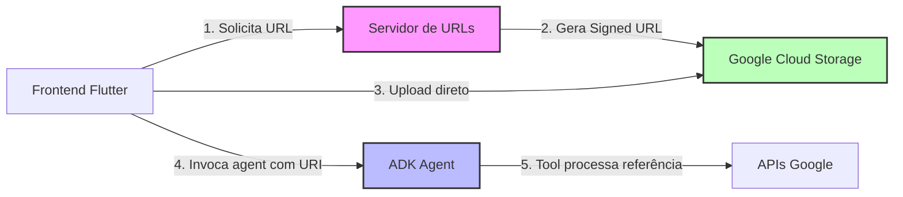

# Plano Detalhado: Implementação de Upload com Signed URLs + GCS

> **Nota**: Este plano foi validado e refinado com base no feedback do Gemini (nota 5/5 para arquitetura geral)

## Arquitetura Proposta



### Princípio Fundamental
> "A tool deve ser uma consumidora da referência do arquivo, não uma recriadora de artefatos." - Gemini

O arquivo já está no GCS. Tools devem usar a URI diretamente, sem download/re-upload desnecessário.

## Mudanças Necessárias no Código Atual

### 1. Criar Servidor Híbrido (novo arquivo: `professor_virtual/hybrid_server.py`)

```python
from google.adk.cli.fast_api import get_fast_api_app
from google.cloud import storage
from datetime import timedelta
from fastapi import HTTPException
import os

# Configurar cliente GCS
storage_client = storage.Client()
bucket_name = os.getenv("GCS_BUCKET_NAME", "professor-virtual-uploads")
bucket = storage_client.bucket(bucket_name)

# Criar app híbrido ADK + FastAPI
app = get_fast_api_app(
    agent_dir="./",
    session_db_url="sqlite:///sessions.db",
    allow_origins=["*"],
    web=True
)

@app.post("/api/get-upload-url")
async def get_upload_url(
    filename: str,
    user_id: str,
    session_id: str,
    mime_type: str
):
    """Gera URL assinada para upload direto ao GCS"""
    try:
        # Validação de segurança contra path traversal
        if ".." in filename or "/" in filename or "\\" in filename:
            raise HTTPException(status_code=400, detail="Invalid filename")
        
        # Sanitizar filename
        safe_filename = filename.replace(" ", "_").lower()
        
        # Criar path único no bucket
        blob_name = f"{user_id}/{session_id}/{safe_filename}"
        blob = bucket.blob(blob_name)
        
        # Gerar signed URL para upload
        signed_url = blob.generate_signed_url(
            version="v4",
            expiration=timedelta(minutes=15),
            method="PUT",
            content_type=mime_type
        )
        
        return {
            "upload_url": signed_url,
            "gcs_uri": f"gs://{bucket_name}/{blob_name}",
            "expires_in": 900  # 15 minutos
        }
    except HTTPException:
        raise
    except Exception as e:
        raise HTTPException(status_code=500, detail=str(e))

# Frontend deve chamar /invoke diretamente após o upload
# Não há necessidade de endpoint intermediário de confirmação
```

### 2. Tool para Validar Referência GCS (`validar_arquivo_gcs.py`)

```python
@tool(
    name="validar_arquivo_gcs",
    description="Valida se arquivo existe no GCS sem fazer download"
)
async def validar_arquivo_gcs(
    gcs_uri: str,
    filename: str,
    mime_type: str,
    context: ToolContext
) -> Dict[str, Any]:
    """
    Valida referência a arquivo no GCS sem fazer download.
    
    FILOSOFIA IMPORTANTE: Esta tool segue o princípio fundamental de que
    "tools devem ser consumidoras de referências, não recriadoras de artifacts".
    
    Esta tool APENAS valida que o arquivo existe. O processamento real
    deve ser feito por outras tools que aceitam GCS URIs nativamente.
    
    Args:
        gcs_uri: URI do arquivo no GCS (gs://bucket/path)
        filename: Nome amigável do arquivo
        mime_type: MIME type do arquivo
        context: ToolContext do ADK
    """
    try:
        # Validar formato do URI
        if not gcs_uri.startswith("gs://"):
            raise ValueError("URI deve começar com gs://")
        
        # Extrair bucket e path
        parts = gcs_uri[5:].split("/", 1)
        if len(parts) != 2:
            raise ValueError("URI inválido")
        
        bucket_name, blob_path = parts
        
        # Verificar se arquivo existe (sem baixar)
        storage_client = storage.Client()
        bucket = storage_client.bucket(bucket_name)
        blob = bucket.blob(blob_path)
        
        if not blob.exists():
            raise ValueError(f"Arquivo não encontrado: {gcs_uri}")
        
        # Retornar validação bem-sucedida
        # NÃO criar artifact - apenas validar existência
        return {
            "success": True,
            "validated": True,
            "filename": filename,
            "gcs_uri": gcs_uri,
            "mime_type": mime_type,
            "size": blob.size if blob.size else 0,
            "message": "Arquivo validado. Use o gcs_uri em tools que processam arquivos."
        }
        
    except Exception as e:
        return {
            "success": False,
            "error": str(e)
        }
```

### 3. Exemplos de Tools que Consomem Referências GCS

#### 3.1. Transcrição com Gemini Multimodal (`transcrever_audio_gcs.py`)

```python
from google import genai
from google.genai import types

@tool(
    name="transcrever_audio_gcs",
    description="Transcreve áudio usando Gemini com GCS URI"
)
async def transcrever_audio_gcs(
    gcs_uri: str,
    idioma: str = "pt-BR",
    context: ToolContext
) -> Dict[str, Any]:
    """
    Transcreve áudio usando Gemini multimodal com File API.
    
    IMPORTANTE: Gemini File API aceita GCS URIs!
    O arquivo é referenciado, não baixado.
    
    Args:
        gcs_uri: URI do arquivo no GCS (gs://bucket/path)
        idioma: Código do idioma para transcrição
    """
    try:
        # Cliente Gemini
        client = genai.Client()
        
        # Upload do arquivo usando GCS URI
        # A File API do Gemini aceita URIs diretamente!
        audio_file = client.files.upload(file=gcs_uri)
        
        # Prompt para transcrição
        prompt = f"""Transcreva este áudio para {idioma}.
        
        Forneça a resposta em JSON:
        {{
          "transcricao": "texto completo transcrito",
          "idioma_detectado": "{idioma}",
          "confianca": "alta/media/baixa"
        }}"""
        
        # Gerar transcrição usando Gemini
        response = client.models.generate_content(
            model='gemini-2.5-flash',
            contents=[audio_file, prompt],
            config=types.GenerateContentConfig(
                temperature=0.1,
                response_mime_type='application/json'
            )
        )
        
        # Processar resposta
        resultado = json.loads(response.text)
        
        return {
            "sucesso": True,
            "texto": resultado["transcricao"],
            "gcs_uri": gcs_uri,
            "idioma_detectado": resultado["idioma_detectado"],
            "confianca": resultado["confianca"],
            "file_id": audio_file.name  # ID do arquivo no Gemini
        }
        
    except Exception as e:
        return {
            "sucesso": False,
            "erro": str(e),
            "gcs_uri": gcs_uri
        }
```

#### 3.2. Análise de Imagem Educacional com Gemini (`analisar_imagem_educacional_gcs.py`)

```python
from google import genai
from google.genai import types

@tool(
    name="analisar_imagem_educacional_gcs",
    description="Analisa imagem educacional usando Gemini com GCS URI"
)
async def analisar_imagem_educacional_gcs(
    gcs_uri: str,
    contexto_pergunta: str,
    context: ToolContext
) -> Dict[str, Any]:
    """
    Analisa imagem educacional usando Gemini multimodal.
    
    IMPORTANTE: Usa File API do Gemini que aceita GCS URIs!
    Mantém compatibilidade com a tool original do projeto.
    
    Args:
        gcs_uri: URI da imagem no GCS
        contexto_pergunta: Contexto educacional para análise
    """
    try:
        # Cliente Gemini
        client = genai.Client()
        
        # Upload da imagem usando GCS URI
        # File API processa direto do GCS!
        imagem_file = client.files.upload(file=gcs_uri)
        
        # Prompt estruturado (baseado na tool original)
        prompt = f"""Analise esta imagem do ponto de vista educacional considerando: {contexto_pergunta}

        Responda APENAS com JSON válido:
        {{
            "tipo_conteudo": "categoria educacional",
            "elementos_detectados": ["lista", "de", "elementos"],
            "contexto_educacional": "descrição pedagógica",
            "conceitos_abordados": ["conceito1", "conceito2"],
            "nivel_ensino_sugerido": "fundamental_2",
            "qualidade_adequada": true,
            "sugestao_acao": null,
            "perguntas_reflexao": ["pergunta 1", "pergunta 2"],
            "aplicacoes_pedagogicas": ["aplicação 1", "aplicação 2"],
            "acessibilidade": {{
                "descricao_alternativa": "descrição para deficientes visuais",
                "elementos_textuais": ["texto visível"],
                "cores_predominantes": ["cor1", "cor2"]
            }}
        }}"""
        
        # Gerar análise
        response = client.models.generate_content(
            model='gemini-2.5-flash',
            contents=[imagem_file, prompt],
            config=types.GenerateContentConfig(
                temperature=0.2,
                response_mime_type='application/json'
            )
        )
        
        # Processar resposta
        analise = json.loads(response.text)
        
        return {
            # Campos compatíveis com tool original
            "tipo_conteudo": analise["tipo_conteudo"],
            "elementos_detectados": analise["elementos_detectados"],
            "contexto_educacional": analise["contexto_educacional"],
            "qualidade_adequada": analise["qualidade_adequada"],
            "sugestao_acao": analise["sugestao_acao"],
            
            # Metadados
            "sucesso": True,
            "gcs_uri": gcs_uri,
            "contexto_pergunta": contexto_pergunta,
            "file_id": imagem_file.name,
            
            # Enriquecimentos pedagógicos
            "conceitos_abordados": analise["conceitos_abordados"],
            "nivel_ensino_sugerido": analise["nivel_ensino_sugerido"],
            "perguntas_reflexao": analise["perguntas_reflexao"],
            "aplicacoes_pedagogicas": analise["aplicacoes_pedagogicas"],
            "acessibilidade": analise["acessibilidade"]
        }
        
    except Exception as e:
        return {
            "erro": str(e),
            "sucesso": False,
            "qualidade_adequada": False,
            "gcs_uri": gcs_uri
        }
```

#### 3.3. Tool Genérica para Processar Arquivo do GCS (`processar_arquivo_gcs.py`)

```python
from google import genai
from google.genai import types
from google.cloud import storage

@tool(
    name="processar_arquivo_gcs",
    description="Processa arquivo do GCS usando Gemini File API"
)
async def processar_arquivo_gcs(
    gcs_uri: str,
    tipo_processamento: str,
    context: ToolContext
) -> Dict[str, Any]:
    """
    Exemplo genérico de como processar arquivos do GCS.
    
    FILOSOFIA CORRETA:
    1. Valida que arquivo existe no GCS
    2. Usa File API do Gemini para referenciar
    3. Processa sem download local
    4. Retorna resultado, não artifact
    
    Args:
        gcs_uri: URI do arquivo (gs://bucket/path)
        tipo_processamento: Tipo de análise desejada
    """
    try:
        # 1. Validar URI (opcional mas recomendado)
        if not gcs_uri.startswith("gs://"):
            raise ValueError("URI deve começar com gs://")
        
        # 2. Verificar existência (sem download!)
        parts = gcs_uri[5:].split("/", 1)
        bucket_name, blob_path = parts
        
        storage_client = storage.Client()
        bucket = storage_client.bucket(bucket_name)
        blob = bucket.blob(blob_path)
        
        if not blob.exists():
            return {
                "sucesso": False,
                "erro": f"Arquivo não encontrado: {gcs_uri}"
            }
        
        # 3. Usar File API do Gemini
        client = genai.Client()
        
        # Upload referencia o arquivo, não baixa!
        arquivo = client.files.upload(file=gcs_uri)
        
        # 4. Processar conforme solicitado
        if tipo_processamento == "resumo":
            prompt = "Faça um resumo deste arquivo"
        elif tipo_processamento == "analise":
            prompt = "Analise o conteúdo deste arquivo"
        else:
            prompt = tipo_processamento
        
        response = client.models.generate_content(
            model='gemini-2.5-flash',
            contents=[arquivo, prompt]
        )
        
        # 5. Retornar resultado (NÃO criar novo artifact!)
        return {
            "sucesso": True,
            "resultado": response.text,
            "gcs_uri": gcs_uri,
            "file_id": arquivo.name,
            "tipo_processamento": tipo_processamento,
            "tamanho_bytes": blob.size
        }
        
    except Exception as e:
        return {
            "sucesso": False,
            "erro": str(e),
            "gcs_uri": gcs_uri
        }
```

### 4. Novo script de inicialização (`run_hybrid.py`)

```python
import uvicorn
from professor_virtual.hybrid_server import app

if __name__ == "__main__":
    uvicorn.run(
        app,
        host="0.0.0.0",
        port=8000,
        reload=True
    )
```

## Configurações Necessárias FORA do Código

### 1. Google Cloud Storage

- Criar bucket: `professor-virtual-uploads`
- Configurar IAM (princípio do menor privilégio):
  ```bash
  # Permissões mínimas necessárias
  gsutil iam ch serviceAccount:YOUR_SA@PROJECT.iam.gserviceaccount.com:roles/storage.objectCreator \
    gs://professor-virtual-uploads
  
  gsutil iam ch serviceAccount:YOUR_SA@PROJECT.iam.gserviceaccount.com:roles/storage.objectViewer \
    gs://professor-virtual-uploads
  ```
- Configurar CORS para uploads do browser:
  ```json
  [
    {
      "origin": ["*"],
      "method": ["PUT"],
      "maxAgeSeconds": 3600
    }
  ]
  ```

### 2. Service Account

- Criar service account com permissões:
  - `storage.objects.create`
  - `storage.objects.get`
  - `iam.serviceAccounts.signBlob`

### 3. Variáveis de Ambiente (`.env`)

```bash
GOOGLE_APPLICATION_CREDENTIALS=path/to/service-account-key.json
GCS_BUCKET_NAME=professor-virtual-uploads
GOOGLE_CLOUD_PROJECT=your-project-id
```

## Fluxo Simplificado do Frontend (3 passos)

```dart
// 1. Solicitar URL de upload
final urlResponse = await http.post(
  Uri.parse('http://localhost:8000/api/get-upload-url'),
  headers: {'Content-Type': 'application/json'},
  body: jsonEncode({
    'filename': 'audio_123.wav',
    'user_id': currentUserId,
    'session_id': currentSessionId,
    'mime_type': 'audio/wav'
  }),
);

final uploadData = jsonDecode(urlResponse.body);

// 2. Upload direto para GCS (sem passar pelo servidor)
await http.put(
  Uri.parse(uploadData['upload_url']),
  headers: {'Content-Type': 'audio/wav'},
  body: fileBytes,
);

// 3. Invocar agent diretamente com URI do arquivo
final agentResponse = await http.post(
  Uri.parse('http://localhost:8000/invoke'),  // Endpoint padrão do ADK
  headers: {'Content-Type': 'application/json'},
  body: jsonEncode({
    'user_id': currentUserId,
    'session_id': currentSessionId,
    'prompt': 'Transcreva o áudio que enviei',
    'files': [{
      'uri': uploadData['gcs_uri'],
      'mime_type': 'audio/wav',
      'filename': 'audio_123.wav'
    }]
  }),
);
```

## Boas Práticas: Uso de Referências GCS

### Princípio Fundamental
> **"O arquivo já está no GCS. Use a referência, não faça download."**

### Gemini File API e Suporte a GCS

| Recurso | Suporte GCS | Exemplo de Uso |
|---------|-------------|----------------|
| Gemini File API | ✅ Sim | `client.files.upload(file="gs://...")` |
| Análise de Imagem | ✅ Sim | Upload via File API + prompt |
| Transcrição de Áudio | ✅ Sim | Upload via File API + prompt |
| Análise de Vídeo | ✅ Sim | Upload via File API + prompt |
| Processamento de Docs | ✅ Sim | Upload via File API + prompt |
| TTS (Text-to-Speech) | ➖ N/A | Gera áudio, não consome |

### Como Gemini Processa Arquivos do GCS

```python
# 1. Upload referencia o arquivo (não baixa!)
arquivo = client.files.upload(file="gs://bucket/path/file.ext")

# 2. Use o arquivo em prompts
response = client.models.generate_content(
    model='gemini-2.5-flash',
    contents=[arquivo, "Seu prompt aqui"]
)

# 3. O arquivo permanece no GCS o tempo todo!
```

### Quando NÃO Baixar Arquivos

❌ **NUNCA faça download quando:**
- Gemini File API aceita o GCS URI
- Você só precisa validar existência
- O processamento é feito pelo Gemini
- O arquivo é grande (> 10MB)

✅ **Faça download APENAS quando:**
- Precisa processar com biblioteca Python local
- Precisa modificar o arquivo antes de processar
- O processamento não pode ser feito via Gemini

### Exemplo de Anti-Pattern (EVITAR)

```python
# ❌ RUIM: Download desnecessário + recriação de artifact
async def processar_arquivo_ruim(gcs_uri: str, context: ToolContext):
    # Download para memória (EVITAR!)
    storage_client = storage.Client()
    blob = storage.Blob.from_string(gcs_uri, client=storage_client)
    content_bytes = blob.download_as_bytes()
    
    # Re-criar artifact (DUPLO PROBLEMA!)
    new_artifact = await context.save_artifact("copia.bin", content_bytes)
    
    # Processar localmente quando Gemini aceita URI
    # Isso gasta recursos e tempo desnecessariamente
    result = processar_localmente(content_bytes)
```

### Exemplo de Pattern Correto

```python
# ✅ BOM: Uso direto via Gemini File API
async def processar_arquivo_correto(gcs_uri: str, context: ToolContext):
    # Gemini processa diretamente do GCS
    client = genai.Client()
    arquivo = client.files.upload(file=gcs_uri)
    
    response = client.models.generate_content(
        model='gemini-2.5-flash',
        contents=[arquivo, "Processe este arquivo"]
    )
    
    # Retorna resultado, não recria arquivo
    return {"resultado": response.text, "gcs_uri": gcs_uri}
```

## Vantagens desta Arquitetura

1. ✅ Upload direto (não passa pelo servidor)
2. ✅ Escalável (GCS lida com I/O)
3. ✅ Seguro (URLs temporárias)
4. ✅ Integrado com ADK (via artifacts)
5. ✅ Suporta arquivos grandes

## Deploy em Produção

### Desenvolvimento Local
```bash
python run_hybrid.py  # Servidor híbrido com ambos os serviços
```

### Cloud Run (Recomendado)
Servidor híbrido funciona perfeitamente:
```dockerfile
FROM python:3.11-slim
WORKDIR /app
COPY requirements.txt .
RUN pip install -r requirements.txt
COPY . .
CMD ["python", "run_hybrid.py"]
```

### Vertex AI (Requer Arquitetura Separada)
**IMPORTANTE**: Vertex AI NÃO permite endpoints customizados. Solução:

1. **Serviço de URLs (Cloud Run)**:
   - Deploy `hybrid_server.py` no Cloud Run
   - Expõe apenas `/api/get-upload-url`
   - URL: `https://upload-service-xxx.run.app`

2. **Agent ADK (Vertex AI)**:
   - Deploy normal do agent
   - Expõe `/invoke`, `/run_sse`, etc.
   - URL: `https://agent-xxx.vertexai.app`

3. **Frontend se comunica com ambos**:
   ```dart
   // 1. Obter URL do Cloud Run
   final url = await getUploadUrl('https://upload-service-xxx.run.app');
   
   // 2. Upload para GCS
   await uploadFile(url);
   
   // 3. Invocar agent no Vertex AI
   await invokeAgent('https://agent-xxx.vertexai.app', gcsUri);
   ```

### Resumo de Deploy
| Ambiente | Arquitetura | Complexidade |
|----------|-------------|--------------|
| Local | Servidor híbrido único | ⭐ Simples |
| Cloud Run | Servidor híbrido único | ⭐⭐ Média |
| Vertex AI | 2 serviços separados | ⭐⭐⭐ Complexa |