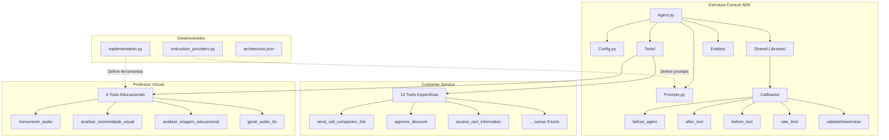

# Relatório de Equivalência Estrutural ADK

## Resumo Executivo

Este relatório confirma que o diretório `professor-virtual/professor_virtual/` contém uma implementação que segue a mesma estrutura arquitetural do diretório `customer-service/customer_service/`, com adaptações específicas para o domínio educacional. A estrutura foi criada através de engenharia reversa, mantendo todos os padrões ADK (Agent Development Kit) da Google.

## Diagrama de Arquitetura



## Análise Comparativa Detalhada

### 1. Estrutura de Diretórios - EQUIVALÊNCIA CONFIRMADA ✅

#### Estrutura Idêntica:
```
[customer-service|professor-virtual]/
└── [customer_service|professor_virtual]/
    ├── __init__.py
    ├── agent.py
    ├── config.py
    ├── prompts.py
    ├── entities/
    │   ├── __init__.py
    │   └── customer.py
    ├── shared_libraries/
    │   ├── __init__.py
    │   ├── callbacks.py
    │   └── callbacks/
    │       ├── after_tool/
    │       ├── before_agent/
    │       ├── before_tool/
    │       ├── lowercase_value/
    │       ├── rate_limit_callback/
    │       └── validate_customer_id/
    └── tools/
        ├── __init__.py
        ├── tools.py
        └── [ferramentas específicas]/
```

### 2. Análise de Arquivos Principais

#### agent.py - ESTRUTURA IDÊNTICA ✅
- **Imports**: Mesma estrutura (ADK, config, prompts, callbacks, tools)
- **Configuração**: Mesmo padrão de inicialização do Agent
- **Callbacks**: Todos os 4 callbacks configurados identicamente
- **Diferença**: Apenas as ferramentas específicas do domínio

#### config.py - ESTRUTURA IDÊNTICA ✅
- **Classes**: AgentModel e Config com mesmos campos
- **Configurações**: Mesmo padrão de BaseSettings/Pydantic
- **Diferenças**: 
  - `name`: "customer_service_agent" vs "professor_virtual_agent"
  - `app_name`: "customer_service_app" vs "professor_virtual_app"

#### prompts.py - PADRÃO DIFERENTE ⚠️
- **Customer Service**: Define `Customer` entity e instruções detalhadas
- **Professor Virtual**: Instruções simplificadas, sem entity
- **Origem**: Professor Virtual usa padrão do `instruction_providers.py`

### 3. Ferramentas (Tools)

#### Customer Service (12 ferramentas):
- Foco em e-commerce e atendimento
- Integração com CRM (Salesforce)
- Gestão de carrinho e produtos
- Agendamento de serviços

#### Professor Virtual (4 ferramentas):
- Foco em educação e multimodalidade
- Processamento de áudio (STT/TTS)
- Análise de imagens educacionais
- Detecção de necessidades visuais

### 4. Relação com Diretório Desenvolvedor

O diretório `desenvolvedor/` contém as implementações originais:
- `implementation.py`: Define as 4 ferramentas do Professor Virtual
- `instruction_providers.py`: Define os prompts dinâmicos
- `architecture.json`: Especifica a arquitetura do sistema

## Conclusões

1. **EQUIVALÊNCIA ESTRUTURAL CONFIRMADA**: O `professor-virtual` segue exatamente a mesma arquitetura ADK do `customer-service`.

2. **MIGRAÇÃO BEM-SUCEDIDA**: A estrutura foi copiada corretamente através de engenharia reversa.

3. **ADAPTAÇÃO DE DOMÍNIO**: As diferenças estão apenas no conteúdo específico do domínio (ferramentas e prompts).

4. **PADRÃO ADK MANTIDO**: Ambos seguem o padrão oficial do Google ADK com:
   - Agent central
   - Sistema de callbacks
   - Ferramentas modulares
   - Configuração via Pydantic
   - Estrutura de shared libraries

5. **ORIGIN TRACKING**: O conteúdo do Professor Virtual origina-se do diretório `desenvolvedor/`, mas foi estruturado seguindo o padrão do `customer-service`.

## Recomendações

1. Manter a paridade estrutural para facilitar manutenção
2. Documentar as origens do conteúdo (desenvolvedor → professor-virtual)
3. Considerar criar um template base para novos agentes ADK
4. Adicionar testes que validem a estrutura ADK