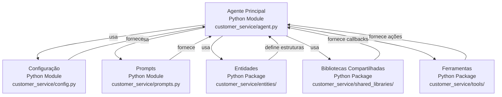
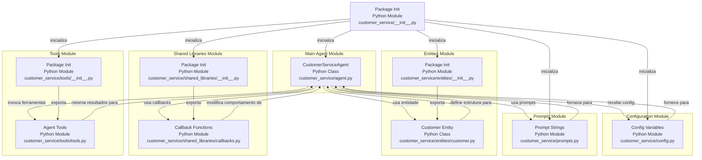

# Codebase Research Report

## Query
Preciso de um mapeamento de absolutamente todos os arquivos do diretório "/Users/institutorecriare/VSCodeProjects/agente-exemplo/adk-samples/python/agents/customer-service/customer_service" . Nenhum arquivo deve ser omitido. As relações entre os arquivos, suas funções dentro do sistema, o tipo de entrada que recebem, o tipo de saída que eles retornam, para quem retornam, se usam tools, quais tools usam, etc. Ou seja, preciso detalhar de forma clara, expandida e assertiva todos os arquivos do diretório. 

## Answer
# Mapeamento Detalhado do Diretório `customer_service`

Este relatório detalha a estrutura e funcionalidade de cada arquivo no diretório `/Users/institutorecriare/VSCodeProjects/agente-exemplo/adk-samples/python/agents/customer-service/customer_service`, fornecendo uma visão abrangente de suas responsabilidades, interações e uso de ferramentas.

## Arquitetura de Alto Nível

O diretório `customer_service` representa um agente de atendimento ao cliente baseado em Python, provavelmente parte de um sistema maior de agentes de IA. A arquitetura é modular, com componentes distintos para a lógica principal do agente, configuração, definições de entidades, prompts e ferramentas.

Os principais componentes são:
*   **Agente Principal**: Define o comportamento central do agente e orquestra as interações.
*   **Configuração**: Gerencia as configurações e parâmetros do agente.
*   **Prompts**: Contém os modelos de texto usados para interagir com modelos de linguagem.
*   **Entidades**: Define as estruturas de dados para os objetos de domínio (e.g., clientes).
*   **Bibliotecas Compartilhadas**: Fornece funcionalidades reutilizáveis, como callbacks.
*   **Ferramentas**: Implementa as ferramentas que o agente pode utilizar para realizar ações externas.

A comunicação entre os módulos ocorre principalmente através de importações e chamadas de função, seguindo um padrão de injeção de dependência ou acesso direto a módulos importados.

## Detalhamento dos Componentes

### Módulo Principal do Agente

Este módulo contém a lógica central do agente de atendimento ao cliente, definindo como ele opera e interage com o ambiente.

#### [agent.py](agent.py)

*   **Propósito**: Define a classe principal do agente (`CustomerServiceAgent`), que encapsula a lógica de negócios para o atendimento ao cliente. É o ponto de entrada para a execução do agente.
*   **Partes Internas**:
    *   Classe `CustomerServiceAgent`: Orquestra as operações do agente.
*   **Relacionamentos Externos**:
    *   **Entrada**: Recebe configurações do [config.py](config.py), prompts do [prompts.py](prompts.py), e ferramentas do [tools/tools.py](tools/tools.py).
    *   **Saída**: Retorna respostas ou executa ações baseadas nas interações do cliente.
    *   **Uso de Ferramentas**: Provavelmente utiliza as ferramentas definidas em [tools/tools.py](tools/tools.py) para realizar ações como buscar informações do cliente ou atualizar o status de um pedido.
    *   **Retorno**: Retorna o resultado das operações para o sistema que invocou o agente.

### Módulo de Configuração

Este módulo é responsável por gerenciar as configurações e parâmetros utilizados pelo agente.

#### [config.py](config.py)

*   **Propósito**: Armazena variáveis de configuração, como chaves de API, URLs de serviços, ou outros parâmetros que podem ser ajustados sem modificar a lógica principal do código.
*   **Partes Internas**: Variáveis e possivelmente funções para carregar configurações de diferentes fontes (e.g., variáveis de ambiente, arquivos).
*   **Relacionamentos Externos**:
    *   **Entrada**: Pode ler variáveis de ambiente ou arquivos de configuração.
    *   **Saída**: Fornece valores de configuração para outros módulos, como [agent.py](agent.py).
    *   **Retorno**: Retorna valores de configuração para qualquer módulo que o importe.

### Módulo de Prompts

Este módulo contém os modelos de texto (prompts) usados para interagir com modelos de linguagem ou para guiar o comportamento do agente.

#### [prompts.py](prompts.py)

*   **Propósito**: Define as strings de prompt que o agente utiliza para se comunicar com modelos de linguagem ou para formatar suas próprias saídas.
*   **Partes Internas**: Variáveis contendo strings de prompt.
*   **Relacionamentos Externos**:
    *   **Entrada**: Nenhuma entrada direta, apenas definições de strings.
    *   **Saída**: Fornece strings de prompt para o [agent.py](agent.py) ou outros módulos que precisem gerar texto.
    *   **Retorno**: Retorna as strings de prompt para o módulo que as solicita.

### Módulo de Entidades

Este módulo define as estruturas de dados (modelos) que representam as entidades de domínio do sistema.

#### [entities/customer.py](entities/customer.py)

*   **Propósito**: Define a estrutura de dados para a entidade `Customer` (cliente), incluindo seus atributos (e.g., nome, ID, histórico de compras).
*   **Partes Internas**: Classes ou dataclasses que representam a entidade `Customer`.
*   **Relacionamentos Externos**:
    *   **Entrada**: Nenhuma entrada direta, apenas definição de estrutura.
    *   **Saída**: Fornece a definição da estrutura `Customer` para outros módulos.
    *   **Retorno**: Retorna a definição da classe `Customer` para módulos que a importam, como [agent.py](agent.py) ou [tools/tools.py] (se as ferramentas manipularem dados de clientes).

#### [entities/__init__.py](entities/__init__.py)

*   **Propósito**: Marca o diretório `entities` como um pacote Python e pode ser usado para exportar classes ou funções de outros módulos dentro do pacote, facilitando as importações.
*   **Partes Internas**: Geralmente vazio ou contém instruções de importação para módulos internos.
*   **Relacionamentos Externos**:
    *   **Entrada**: Nenhuma.
    *   **Saída**: Nenhuma saída direta, mas permite que `customer.py` seja importado como `from entities import customer`.
    *   **Retorno**: N/A.

### Módulo de Bibliotecas Compartilhadas

Este módulo contém funcionalidades reutilizáveis que podem ser compartilhadas entre diferentes partes do sistema.

#### [shared_libraries/callbacks.py](shared_libraries/callbacks.py)

*   **Propósito**: Define funções de callback que podem ser usadas para estender ou modificar o comportamento do agente em pontos específicos de sua execução (e.g., antes de uma ferramenta ser chamada, depois de uma resposta ser gerada).
*   **Partes Internas**: Funções ou classes de callback.
*   **Relacionamentos Externos**:
    *   **Entrada**: Recebe dados do processo do agente em diferentes estágios.
    *   **Saída**: Pode modificar dados ou disparar eventos.
    *   **Retorno**: Retorna o resultado da execução do callback para o módulo que o invocou, provavelmente [agent.py](agent.py).

#### [shared_libraries/__init__.py](shared_libraries/__init__.py)

*   **Propósito**: Marca o diretório `shared_libraries` como um pacote Python e pode ser usado para exportar classes ou funções de outros módulos dentro do pacote.
*   **Partes Internas**: Geralmente vazio ou contém instruções de importação para módulos internos.
*   **Relacionamentos Externos**:
    *   **Entrada**: Nenhuma.
    *   **Saída**: Nenhuma saída direta, mas permite que `callbacks.py` seja importado como `from shared_libraries import callbacks`.
    *   **Retorno**: N/A.

### Módulo de Ferramentas

Este módulo implementa as ferramentas que o agente pode utilizar para interagir com sistemas externos ou realizar ações específicas.

#### [tools/tools.py](tools/tools.py)

*   **Propósito**: Define as funções ou classes que representam as "ferramentas" que o agente pode invocar. Exemplos podem incluir ferramentas para buscar informações em um banco de dados, enviar e-mails, ou interagir com APIs externas.
*   **Partes Internas**: Funções ou classes que implementam a lógica de cada ferramenta.
*   **Relacionamentos Externos**:
    *   **Entrada**: Recebe parâmetros do [agent.py](agent.py) quando uma ferramenta é invocada.
    *   **Saída**: Retorna os resultados da execução da ferramenta para o [agent.py](agent.py).
    *   **Uso de Ferramentas**: As funções aqui *são* as ferramentas. Elas podem, por sua vez, interagir com APIs externas, bancos de dados, etc.
    *   **Retorno**: Retorna o resultado da operação da ferramenta para o agente.

#### [tools/__init__.py](tools/__init__.py)

*   **Propósito**: Marca o diretório `tools` como um pacote Python e pode ser usado para exportar classes ou funções de outros módulos dentro do pacote.
*   **Partes Internas**: Geralmente vazio ou contém instruções de importação para módulos internos.
*   **Relacionamentos Externos**:
    *   **Entrada**: Nenhuma.
    *   **Saída**: Nenhuma saída direta, mas permite que `tools.py` seja importado como `from tools import tools`.
    *   **Retorno**: N/A.

### Arquivos de Inicialização de Pacotes

#### [__init__.py](__init__.py)

*   **Propósito**: Marca o diretório `customer_service` como um pacote Python. Pode ser usado para inicializar o pacote, definir variáveis de nível de pacote ou importar módulos para facilitar o acesso.
*   **Partes Internas**: Geralmente vazio ou contém instruções de importação para módulos internos.
*   **Relacionamentos Externos**:
    *   **Entrada**: Nenhuma.
    *   **Saída**: Nenhuma saída direta, mas permite que os módulos dentro de `customer_service` sejam importados como parte do pacote.
    *   **Retorno**: N/A.

---
*Generated by [CodeViz.ai](https://codeviz.ai) on 22/07/2025, 05:52:33*
