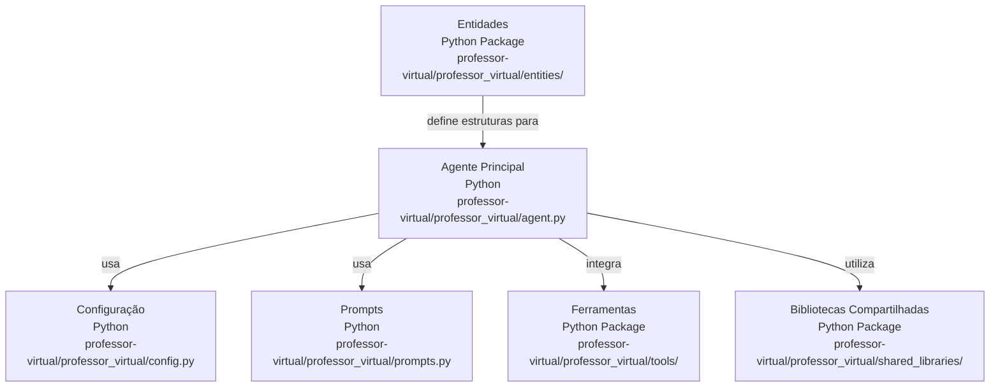
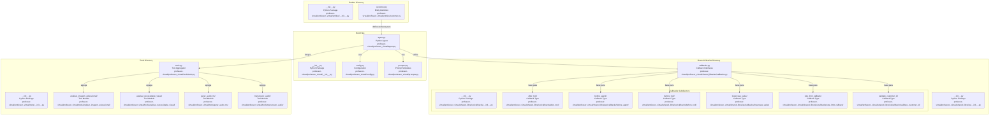

# Codebase Research Report

## Query
crie relatório codebase expandido, detalhado, completo que mapeie e explique absolutamente todos os arquivos do diretório "/Users/institutorecriare/VSCodeProjects/projeto_professor/professor-virtual/professor_virtual".

## Answer
# Relatório Detalhado do Código: `professor-virtual/professor_virtual`

Este relatório detalha a estrutura e a funcionalidade de todos os arquivos dentro do diretório `professor-virtual/professor_virtual`, fornecendo uma visão abrangente de seus propósitos, componentes internos e relacionamentos.

## Visão Geral da Arquitetura

O diretório `professor-virtual/professor_virtual` encapsula a lógica central do agente "Professor Virtual". Ele é estruturado para modularizar diferentes aspectos do agente, incluindo sua configuração, prompts, definição de entidades, ferramentas e bibliotecas compartilhadas.

### Componentes Principais

*   **Agente Principal**: Definido em [agent.py](professor-virtual/professor_virtual/agent.py), este é o ponto de entrada e a orquestração principal do Professor Virtual.
*   **Configuração**: Gerencia as configurações e variáveis de ambiente para o agente, localizado em [config.py](professor-virtual/professor_virtual/config.py).
*   **Prompts**: Contém os modelos de prompt utilizados pelo agente para interagir com modelos de linguagem, em [prompts.py](professor-virtual/professor_virtual/prompts.py).
*   **Entidades**: Define as estruturas de dados ou modelos de objetos que representam conceitos chave no domínio do Professor Virtual, encontradas no diretório [entities/](professor-virtual/professor_virtual/entities).
*   **Ferramentas**: Agrupa as funcionalidades específicas que o Professor Virtual pode executar, cada uma em seu próprio módulo dentro de [tools/](professor-virtual/professor_virtual/tools).
*   **Bibliotecas Compartilhadas**: Contém utilitários e callbacks reutilizáveis que podem ser usados por diferentes partes do agente, localizadas em [shared_libraries/](professor-virtual/professor_virtual/shared_libraries).

## Detalhamento dos Arquivos e Diretórios

### Arquivos Raiz

#### `__init__.py`

*   **Propósito**: Este arquivo [__init__.py](professor-virtual/professor_virtual/__init__.py) marca o diretório `professor_virtual` como um pacote Python. Geralmente, ele pode ser usado para inicializar o pacote, definir variáveis de nível de pacote ou importar módulos para facilitar o acesso. Neste contexto, ele serve principalmente para permitir que os módulos dentro de `professor_virtual` sejam importados.
*   **Conteúdo Interno**: Vazio, indicando uma inicialização padrão do pacote.
*   **Relacionamentos Externos**: Essencial para a importação de qualquer outro módulo dentro do pacote `professor_virtual`.

#### `agent.py`

*   **Propósito**: O arquivo [agent.py](professor-virtual/professor_virtual/agent.py) é o coração do Professor Virtual, responsável por definir a lógica principal do agente, sua interação com modelos de linguagem e a orquestração das ferramentas disponíveis.
*   **Conteúdo Interno**: Contém a classe ou função principal que inicializa e executa o agente, integrando prompts, configurações e ferramentas.
*   **Relacionamentos Externos**:
    *   Depende de [config.py](professor-virtual/professor_virtual/config.py) para configurações.
    *   Utiliza prompts definidos em [prompts.py](professor-virtual/professor_virtual/prompts.py).
    *   Integra e utiliza as ferramentas definidas no diretório [tools/](professor-virtual/professor_virtual/tools).
    *   Pode fazer uso de callbacks e utilitários de [shared_libraries/](professor-virtual/professor_virtual/shared_libraries).

#### `config.py`

*   **Propósito**: O arquivo [config.py](professor-virtual/professor_virtual/config.py) é responsável por carregar e gerenciar as configurações e variáveis de ambiente necessárias para o funcionamento do Professor Virtual. Isso inclui chaves de API, URLs de serviços e outras configurações específicas do ambiente.
*   **Conteúdo Interno**: Funções ou classes para carregar variáveis de ambiente (e.g., de um arquivo `.env`) e fornecer acesso a elas.
*   **Relacionamentos Externos**: Utilizado por [agent.py](professor-virtual/professor_virtual/agent.py) e potencialmente por outras ferramentas ou bibliotecas que necessitem de configurações.

#### `prompts.py`

*   **Propósito**: O arquivo [prompts.py](professor-virtual/professor_virtual/prompts.py) armazena os modelos de prompt que o Professor Virtual utiliza para guiar as interações com os modelos de linguagem. Isso garante consistência e clareza nas instruções fornecidas ao LLM.
*   **Conteúdo Interno**: Variáveis ou funções que retornam strings formatadas, representando os prompts para diferentes cenários de uso do agente.
*   **Relacionamentos Externos**: Utilizado principalmente por [agent.py](professor-virtual/professor_virtual/agent.py) para construir as entradas para o modelo de linguagem.

### Diretório `entities/`

*   **Propósito**: O diretório [entities/](professor-virtual/professor_virtual/entities) é dedicado à definição de estruturas de dados ou modelos de objetos que representam as entidades do domínio do Professor Virtual. Isso ajuda a manter a consistência dos dados e a clareza do código.

#### `entities/__init__.py`

*   **Propósito**: Marca o diretório `entities` como um pacote Python.
*   **Conteúdo Interno**: Vazio.

#### `entities/customer.py`

*   **Propósito**: O arquivo [customer.py](professor-virtual/professor_virtual/entities/customer.py) provavelmente define a estrutura de dados para uma entidade "cliente" ou "usuário" no contexto do Professor Virtual. Embora o nome "customer" possa parecer genérico, neste contexto educacional, pode se referir ao aluno ou usuário que interage com o Professor Virtual.
*   **Conteúdo Interno**: Definições de classes (e.g., usando `dataclasses` ou `pydantic`) com atributos como `id`, `nome`, `email`, etc., relevantes para o usuário do sistema.
*   **Relacionamentos Externos**: Pode ser utilizado por ferramentas que precisam manipular informações do usuário ou pelo agente principal para gerenciar o estado da interação.

### Diretório `shared_libraries/`

*   **Propósito**: O diretório [shared_libraries/](professor-virtual/professor_virtual/shared_libraries) contém código reutilizável que pode ser compartilhado entre diferentes partes do agente ou até mesmo entre diferentes agentes no projeto. Isso inclui utilitários e implementações de callbacks.

#### `shared_libraries/__init__.py`

*   **Propósito**: Marca o diretório `shared_libraries` como um pacote Python.
*   **Conteúdo Interno**: Vazio.

#### `shared_libraries/callbacks.py`

*   **Propósito**: O arquivo [callbacks.py](professor-virtual/professor_virtual/shared_libraries/callbacks.py) provavelmente define interfaces ou classes base para callbacks que podem ser acionados em diferentes estágios da execução do agente (e.g., antes de uma ferramenta ser chamada, depois de uma ferramenta, antes do agente iniciar).
*   **Conteúdo Interno**: Definições de classes abstratas ou interfaces para callbacks, que são então implementadas em subdiretórios específicos.
*   **Relacionamentos Externos**: As implementações específicas de callbacks nos subdiretórios dependem dessas definições. O agente principal pode registrar e chamar esses callbacks.

#### Diretório `shared_libraries/callbacks/`

*   **Propósito**: Este diretório [shared_libraries/callbacks/](professor-virtual/professor_virtual/shared_libraries/callbacks) agrupa as implementações concretas de diferentes tipos de callbacks.

##### `shared_libraries/callbacks/__init__.py`

*   **Propósito**: Marca o diretório `callbacks` como um pacote Python.
*   **Conteúdo Interno**: Vazio.

##### Diretório `shared_libraries/callbacks/after_tool/`

*   **Propósito**: Contém callbacks que são executados após a conclusão de uma ferramenta.

###### `shared_libraries/callbacks/after_tool/__init__.py`

*   **Propósito**: Marca o diretório `after_tool` como um pacote Python.
*   **Conteúdo Interno**: Vazio.

###### `shared_libraries/callbacks/after_tool/after_tool_callback.py`

*   **Propósito**: O arquivo [after_tool_callback.py](professor-virtual/professor_virtual/shared_libraries/callbacks/after_tool/after_tool_callback.py) implementa a lógica específica para um callback que é executado após uma ferramenta ter sido utilizada pelo agente.
*   **Conteúdo Interno**: Uma classe que herda de uma interface de callback (provavelmente definida em [callbacks.py](professor-virtual/professor_virtual/shared_libraries/callbacks.py)) e contém o método para ser executado.
*   **Relacionamentos Externos**: Chamado pelo agente principal após a execução de uma ferramenta.

##### Diretório `shared_libraries/callbacks/before_agent/`

*   **Propósito**: Contém callbacks que são executados antes do agente iniciar sua execução principal.

###### `shared_libraries/callbacks/before_agent/__init__.py`

*   **Propósito**: Marca o diretório `before_agent` como um pacote Python.
*   **Conteúdo Interno**: Vazio.

###### `shared_libraries/callbacks/before_agent/before_agent_callback.py`

*   **Propósito**: O arquivo [before_agent_callback.py](professor-virtual/professor_virtual/shared_libraries/callbacks/before_agent/before_agent_callback.py) implementa a lógica para um callback que é executado antes do agente iniciar seu processamento.
*   **Conteúdo Interno**: Uma classe de callback com lógica de pré-processamento.
*   **Relacionamentos Externos**: Chamado pelo agente principal antes de sua execução.

##### Diretório `shared_libraries/callbacks/before_tool/`

*   **Propósito**: Contém callbacks que são executados antes de uma ferramenta ser invocada.

###### `shared_libraries/callbacks/before_tool/__init__.py`

*   **Propósito**: Marca o diretório `before_tool` como um pacote Python.
*   **Conteúdo Interno**: Vazio.

###### `shared_libraries/callbacks/before_tool/before_tool_callback.py`

*   **Propósito**: O arquivo [before_tool_callback.py](professor-virtual/professor_virtual/shared_libraries/callbacks/before_tool/before_tool_callback.py) implementa a lógica para um callback que é executado imediatamente antes de uma ferramenta ser chamada.
*   **Conteúdo Interno**: Uma classe de callback com lógica de pré-execução de ferramenta.
*   **Relacionamentos Externos**: Chamado pelo agente principal antes de invocar uma ferramenta.

##### Diretório `shared_libraries/callbacks/lowercase_value/`

*   **Propósito**: Contém um callback específico para converter valores para minúsculas.

###### `shared_libraries/callbacks/lowercase_value/__init__.py`

*   **Propósito**: Marca o diretório `lowercase_value` como um pacote Python.
*   **Conteúdo Interno**: Vazio.

###### `shared_libraries/callbacks/lowercase_value/lowercase_value.py`

*   **Propósito**: O arquivo [lowercase_value.py](professor-virtual/professor_virtual/shared_libraries/callbacks/lowercase_value/lowercase_value.py) implementa um callback que pode ser usado para normalizar entradas, convertendo-as para minúsculas.
*   **Conteúdo Interno**: Uma classe de callback que realiza a conversão de string para minúsculas.
*   **Relacionamentos Externos**: Pode ser aplicado a entradas de ferramentas ou a outros dados que necessitem de normalização.

##### Diretório `shared_libraries/callbacks/rate_limit_callback/`

*   **Propósito**: Contém um callback para gerenciar limites de taxa.

###### `shared_libraries/callbacks/rate_limit_callback/__init__.py`

*   **Propósito**: Marca o diretório `rate_limit_callback` como um pacote Python.
*   **Conteúdo Interno**: Vazio.

###### `shared_libraries/callbacks/rate_limit_callback/rate_limit_callback.py`

*   **Propósito**: O arquivo [rate_limit_callback.py](professor-virtual/professor_virtual/shared_libraries/callbacks/rate_limit_callback/rate_limit_callback.py) implementa um callback para impor limites de taxa em chamadas de API ou outras operações, prevenindo o uso excessivo de recursos.
*   **Conteúdo Interno**: Lógica para controlar a frequência de chamadas.
*   **Relacionamentos Externos**: Pode ser integrado a ferramentas ou ao agente principal para gerenciar o consumo de recursos externos.

##### Diretório `shared_libraries/callbacks/validate_customer_id/`

*   **Propósito**: Contém um callback para validar IDs de clientes.

###### `shared_libraries/callbacks/validate_customer_id/__init__.py`

*   **Propósito**: Marca o diretório `validate_customer_id` como um pacote Python.
*   **Conteúdo Interno**: Vazio.

###### `shared_libraries/callbacks/validate_customer_id/validate_customer_id_callback.py`

*   **Propósito**: O arquivo [validate_customer_id_callback.py](professor-virtual/professor_virtual/shared_libraries/callbacks/validate_customer_id/validate_customer_id_callback.py) implementa um callback para validar o formato ou a existência de IDs de clientes.
*   **Conteúdo Interno**: Lógica de validação para IDs de clientes.
*   **Relacionamentos Externos**: Pode ser usado por ferramentas que recebem ou processam IDs de clientes.

### Diretório `tools/`

*   **Propósito**: O diretório [tools/](professor-virtual/professor_virtual/tools) contém as definições e implementações das ferramentas que o Professor Virtual pode utilizar para realizar ações específicas. Cada subdiretório representa uma ferramenta distinta.

#### `tools/__init__.py`

*   **Propósito**: Marca o diretório `tools` como um pacote Python.
*   **Conteúdo Interno**: Vazio.

#### `tools/tools.py`

*   **Propósito**: O arquivo [tools.py](professor-virtual/professor_virtual/tools/tools.py) pode atuar como um módulo agregador, importando e expondo todas as ferramentas disponíveis para o agente principal. Alternativamente, pode conter funções utilitárias genéricas relacionadas a ferramentas.
*   **Conteúdo Interno**: Pode conter uma lista ou dicionário de todas as ferramentas, ou funções auxiliares para o registro e gerenciamento de ferramentas.
*   **Relacionamentos Externos**: Utilizado por [agent.py](professor-virtual/professor_virtual/agent.py) para descobrir e carregar as ferramentas.

#### Diretório `tools/analisar_imagem_educacional/`

*   **Propósito**: Contém a ferramenta para analisar imagens educacionais.

##### `tools/analisar_imagem_educacional/__init__.py`

*   **Propósito**: Marca o diretório `analisar_imagem_educacional` como um pacote Python.
*   **Conteúdo Interno**: Vazio.

##### `tools/analisar_imagem_educacional/analisar_imagem_educacional.py`

*   **Propósito**: O arquivo [analisar_imagem_educacional.py](professor-virtual/professor_virtual/tools/analisar_imagem_educacional/analisar_imagem_educacional.py) implementa a funcionalidade para o Professor Virtual analisar o conteúdo de imagens com foco educacional. Isso pode envolver reconhecimento de objetos, texto ou conceitos visuais.
*   **Conteúdo Interno**: Funções ou classes que interagem com APIs de visão computacional ou modelos de IA para processar imagens.
*   **Relacionamentos Externos**: Chamado pelo agente principal quando a análise de imagem é necessária. Pode depender de serviços externos ou bibliotecas de processamento de imagem.

#### Diretório `tools/analisar_necessidade_visual/`

*   **Propósito**: Contém a ferramenta para analisar necessidades visuais.

##### `tools/analisar_necessidade_visual/__init__.py`

*   **Propósito**: Marca o diretório `analisar_necessidade_visual` como um pacote Python.
*   **Conteúdo Interno**: Vazio.

##### `tools/analisar_necessidade_visual/analisar_necessidade_visual.py`

*   **Propósito**: O arquivo [analisar_necessidade_visual.py](professor-virtual/professor_virtual/tools/analisar_necessidade_visual/analisar_necessidade_visual.py) implementa uma ferramenta para o Professor Virtual avaliar ou identificar necessidades visuais específicas de um usuário ou contexto. Isso pode estar relacionado a acessibilidade ou preferências de exibição.
*   **Conteúdo Interno**: Lógica para interpretar entradas e determinar requisitos visuais.
*   **Relacionamentos Externos**: Chamado pelo agente principal para adaptar a saída ou a interação com base nas necessidades visuais.

#### Diretório `tools/gerar_audio_tts/`

*   **Propósito**: Contém a ferramenta para gerar áudio via Text-to-Speech (TTS).

##### `tools/gerar_audio_tts/__init__.py`

*   **Propósito**: Marca o diretório `gerar_audio_tts` como um pacote Python.
*   **Conteúdo Interno**: Vazio.

##### `tools/gerar_audio_tts/gerar_audio_tts.py`

*   **Propósito**: O arquivo [gerar_audio_tts.py](professor-virtual/professor_virtual/tools/gerar_audio_tts/gerar_audio_tts.py) implementa a funcionalidade de Text-to-Speech (TTS), permitindo que o Professor Virtual converta texto em fala.
*   **Conteúdo Interno**: Funções ou classes que interagem com APIs de TTS (e.g., Google Cloud Text-to-Speech, Amazon Polly) para sintetizar áudio a partir de texto.
*   **Relacionamentos Externos**: Chamado pelo agente principal quando uma resposta de áudio é necessária.

#### Diretório `tools/transcrever_audio/`

*   **Propósito**: Contém a ferramenta para transcrever áudio.

##### `tools/transcrever_audio/__init__.py`

*   **Propósito**: Marca o diretório `transcrever_audio` como um pacote Python.
*   **Conteúdo Interno**: Vazio.

##### `tools/transcrever_audio/transcrever_audio.py`

*   **Propósito**: O arquivo [transcrever_audio.py](professor-virtual/professor_virtual/tools/transcrever_audio/transcrever_audio.py) implementa a funcionalidade de Speech-to-Text (STT), permitindo que o Professor Virtual transcreva áudio em texto.
*   **Conteúdo Interno**: Funções ou classes que interagem com APIs de STT (e.g., Google Cloud Speech-to-Text, OpenAI Whisper) para converter fala em texto.
*   **Relacionamentos Externos**: Chamado pelo agente principal quando a entrada de áudio precisa ser processada.

---
*Generated by [CodeViz.ai](https://codeviz.ai) on 24/07/2025, 13:46:30*
