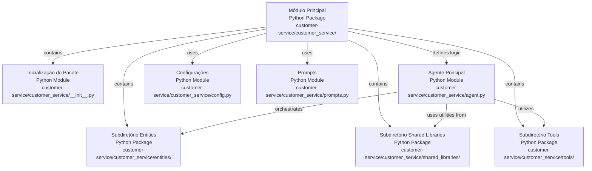

# Relatório de Análise de Código: `customer_service`

Este relatório detalha a funcionalidade de cada arquivo Python dentro do diretório `/Users/institutorecriare/VSCodeProjects/projeto_professor/customer-service/customer_service`, organizando as informações de forma hierárquica para refletir a estrutura do projeto.

## Módulo Principal `customer_service`

O diretório principal `customer_service` atua como o contêiner para a lógica central do serviço de atendimento ao cliente. Ele orquestra a interação entre o agente, as configurações, os prompts e as ferramentas e bibliotecas compartilhadas.

*   **[Inicialização do Pacote](customer-service/customer_service/__init__.py)**: Este arquivo marca o diretório `customer_service` como um pacote Python, permitindo que seus módulos sejam importados.
*   **[Agente Principal](customer-service/customer_service/agent.py)**: Define a lógica principal do agente de atendimento ao cliente, incluindo como ele processa as entradas, utiliza as ferramentas disponíveis e gera respostas. Este é o coração do sistema de atendimento.
*   **[Configurações](customer-service/customer_service/config.py)**: Contém variáveis de configuração e parâmetros globais utilizados em todo o serviço, como chaves de API, URLs de serviços externos e outras configurações de ambiente.
*   **[Prompts](customer-service/customer_service/prompts.py)**: Armazena os modelos de prompt e as instruções textuais que guiam o comportamento do agente, definindo seu persona e as diretrizes para suas interações.

### Subdiretório `entities`

O subdiretório `entities` é responsável por definir as estruturas de dados (modelos) que representam as entidades de negócio manipuladas pelo serviço.

*   **[Inicialização do Pacote](customer-service/customer_service/entities/__init__.py)**: Marca `entities` como um pacote Python.
*   **[Entidade Cliente](customer-service/customer_service/entities/customer.py)**: Define a estrutura de dados para a entidade `Customer`, incluindo seus atributos e possíveis métodos relacionados à manipulação de dados do cliente.

### Subdiretório `shared_libraries`

O subdiretório `shared_libraries` contém código reutilizável e utilitários que podem ser compartilhados por diferentes partes do serviço.

*   **[Inicialização do Pacote](customer-service/customer_service/shared_libraries/__init__.py)**: Marca `shared_libraries` como um pacote Python.
*   **[Callbacks Gerais](customer-service/customer_service/shared_libraries/callbacks.py)**: Este arquivo pode conter definições de callbacks genéricos ou funções utilitárias relacionadas a callbacks que são aplicáveis a múltiplas situações.

#### Subdiretório `shared_libraries/callbacks`

Este subdiretório é dedicado a funções de callback que são executadas em pontos específicos do fluxo de trabalho do agente, permitindo a inserção de lógica personalizada.

*   **[Inicialização do Pacote](customer-service/customer_service/shared_libraries/callbacks/__init__.py)**: Marca `callbacks` como um pacote Python.

##### Subdiretório `shared_libraries/callbacks/after_tool`

*   **[Inicialização do Pacote](customer-service/customer_service/shared_libraries/callbacks/after_tool/__init__.py)**: Marca `after_tool` como um pacote Python.
*   **[Callback Pós-Ferramenta](customer-service/customer_service/shared_libraries/callbacks/after_tool/after_tool_callback.py)**: Contém a lógica a ser executada imediatamente após a utilização de uma ferramenta pelo agente.

##### Subdiretório `shared_libraries/callbacks/before_agent`

*   **[Inicialização do Pacote](customer-service/customer_service/shared_libraries/callbacks/before_agent/__init__.py)**: Marca `before_agent` como um pacote Python.
*   **[Callback Pré-Agente](customer-service/customer_service/shared_libraries/callbacks/before_agent/before_agent_callback.py)**: Contém a lógica a ser executada antes que o agente inicie seu processamento principal.

##### Subdiretório `shared_libraries/callbacks/before_tool`

*   **[Inicialização do Pacote](customer-service/customer_service/shared_libraries/callbacks/before_tool/__init__.py)**: Marca `before_tool` como um pacote Python.
*   **[Callback Pré-Ferramenta](customer-service/customer_service/shared_libraries/callbacks/before_tool/before_tool_callback.py)**: Contém a lógica a ser executada imediatamente antes da utilização de uma ferramenta pelo agente.

##### Subdiretório `shared_libraries/callbacks/lowercase_value`

*   **[Inicialização do Pacote](customer-service/customer_service/shared_libraries/callbacks/lowercase_value/__init__.py)**: Marca `lowercase_value` como um pacote Python.
*   **[Callback de Minúsculas](customer-service/customer_service/shared_libraries/callbacks/lowercase_value/lowercase_value.py)**: Implementa um callback para converter um valor para minúsculas, útil para padronização de entradas.

##### Subdiretório `shared_libraries/callbacks/rate_limit_callback`

*   **[Inicialização do Pacote](customer-service/customer_service/shared_libraries/callbacks/rate_limit_callback/__init__.py)**: Marca `rate_limit_callback` como um pacote Python.
*   **[Callback de Limite de Taxa](customer-service/customer_service/shared_libraries/callbacks/rate_limit_callback/rate_limit_callback.py)**: Implementa a lógica para controlar e limitar a taxa de requisições ou ações do agente.

##### Subdiretório `shared_libraries/callbacks/validate_customer_id`

*   **[Inicialização do Pacote](customer-service/customer_service/shared_libraries/callbacks/validate_customer_id/__init__.py)**: Marca `validate_customer_id` como um pacote Python.
*   **[Callback de Validação de ID do Cliente](customer-service/customer_service/shared_libraries/callbacks/validate_customer_id/validate_customer_id_callback.py)**: Contém a lógica para validar o formato ou a existência de um ID de cliente.

### Subdiretório `tools`

O subdiretório `tools` contém as definições das ferramentas que o agente pode utilizar para interagir com sistemas externos ou executar ações específicas.

*   **[Inicialização do Pacote](customer-service/customer_service/tools/__init__.py)**: Marca `tools` como um pacote Python.
*   **[Ferramentas Gerais](customer-service/customer_service/tools/tools.py)**: Este arquivo pode conter definições de ferramentas genéricas ou funções utilitárias relacionadas a ferramentas que são aplicáveis a múltiplas situações.

#### Subdiretório `tools/access_cart_information`

*   **[Inicialização do Pacote](customer-service/customer_service/tools/access_cart_information/__init__.py)**: Marca `access_cart_information` como um pacote Python.
*   **[Acessar Informações do Carrinho](customer-service/customer_service/tools/access_cart_information/access_cart_information.py)**: Implementa a funcionalidade para acessar e recuperar informações sobre o carrinho de compras de um cliente.

#### Subdiretório `tools/approve_discount`

*   **[Inicialização do Pacote](customer-service/customer_service/tools/approve_discount/__init__.py)**: Marca `approve_discount` como um pacote Python.
*   **[Aprovar Desconto](customer-service/customer_service/tools/approve_discount/approve_discount.py)**: Implementa a funcionalidade para aprovar um desconto para um cliente.

#### Subdiretório `tools/check_product_availability`

*   **[Inicialização do Pacote](customer-service/customer_service/tools/check_product_availability/__init__.py)**: Marca `check_product_availability` como um pacote Python.
*   **[Verificar Disponibilidade do Produto](customer-service/customer_service/tools/check_product_availability/check_product_availability.py)**: Implementa a funcionalidade para verificar a disponibilidade de um produto no estoque.

#### Subdiretório `tools/generate_qr_code`

*   **[Inicialização do Pacote](customer-service/customer_service/tools/generate_qr_code/__init__.py)**: Marca `generate_qr_code` como um pacote Python.
*   **[Gerar Código QR](customer-service/customer_service/tools/generate_qr_code/generate_qr_code.py)**: Implementa a funcionalidade para gerar um código QR para diversas finalidades.

#### Subdiretório `tools/get_available_planting_times`

*   **[Inicialização do Pacote](customer-service/customer_service/tools/get_available_planting_times/__init__.py)**: Marca `get_available_planting_times` como um pacote Python.
*   **[Obter Horários de Plantio Disponíveis](customer-service/customer_service/tools/get_available_planting_times/get_available_planting_times.py)**: Implementa a funcionalidade para consultar e retornar horários disponíveis para serviços de plantio.

#### Subdiretório `tools/get_product_recommendations`

*   **[Inicialização do Pacote](customer-service/customer_service/tools/get_product_recommendations/__init__.py)**: Marca `get_product_recommendations` como um pacote Python.
*   **[Obter Recomendações de Produtos](customer-service/customer_service/tools/get_product_recommendations/get_product_recommendations.py)**: Implementa a funcionalidade para fornecer recomendações de produtos com base em critérios específicos.

#### Subdiretório `tools/modify_cart`

*   **[Inicialização do Pacote](customer-service/customer_service/tools/modify_cart/__init__.py)**: Marca `modify_cart` como um pacote Python.
*   **[Modificar Carrinho](customer-service/customer_service/tools/modify_cart/modify_cart.py)**: Implementa a funcionalidade para adicionar, remover ou atualizar itens no carrinho de compras de um cliente.

#### Subdiretório `tools/schedule_planting_service`

*   **[Inicialização do Pacote](customer-service/customer_service/tools/schedule_planting_service/__init__.py)**: Marca `schedule_planting_service` como um pacote Python.
*   **[Agendar Serviço de Plantio](customer-service/customer_service/tools/schedule_planting_service/schedule_planting_service.py)**: Implementa a funcionalidade para agendar um serviço de plantio para um cliente.

#### Subdiretório `tools/send_call_companion_link`

*   **[Inicialização do Pacote](customer-service/customer_service/tools/send_call_companion_link/__init__.py)**: Marca `send_call_companion_link` como um pacote Python.
*   **[Enviar Link do Companheiro de Chamada](customer-service/customer_service/tools/send_call_companion_link/send_call_companion_link.py)**: Implementa a funcionalidade para enviar um link para uma ferramenta ou página de acompanhamento de chamada.

#### Subdiretório `tools/send_care_instructions`

*   **[Inicialização do Pacote](customer-service/customer_service/tools/send_care_instructions/__init__.py)**: Marca `send_care_instructions` como um pacote Python.
*   **[Enviar Instruções de Cuidado](customer-service/customer_service/tools/send_care_instructions/send_care_instructions.py)**: Implementa a funcionalidade para enviar instruções de cuidado para produtos ou plantas.

#### Subdiretório `tools/sync_ask_for_approval`

*   **[Inicialização do Pacote](customer-service/customer_service/tools/sync_ask_for_approval/__init__.py)**: Marca `sync_ask_for_approval` como um pacote Python.
*   **[Sincronizar Pedido de Aprovação](customer-service/customer_service/tools/sync_ask_for_approval/sync_ask_for_approval.py)**: Implementa a funcionalidade para sincronizar e gerenciar pedidos de aprovação.

#### Subdiretório `tools/update_salesforce_crm`

*   **[Inicialização do Pacote](customer-service/customer_service/tools/update_salesforce_crm/__init__.py)**: Marca `update_salesforce_crm` como um pacote Python.
*   **[Atualizar Salesforce CRM](customer-service/customer_service/tools/update_salesforce_crm/update_salesforce_crm.py)**: Implementa a funcionalidade para atualizar registros no sistema Salesforce CRM.

---
*Generated by [CodeViz.ai](https://codeviz.ai) on 23/07/2025, 13:42:02*
