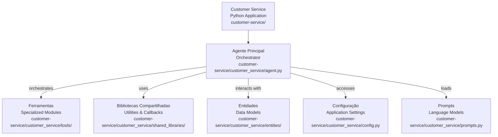

# Codebase Research Report

## Query
preciso que vc atualize o relatório "/Users/institutorecriare/VSCodeProjects/projeto_professor/customer-service/docs_para_desenvolvedores/customer_service_mapeamento_orginal.md". Esse relatório era de uma versao anterior do codigo, antes da refatoração que modularizou os arquivos, transformando os arquivos de monoliticos em modularizados.

## Answer
# Relatório de Análise de Código: Serviço de Atendimento ao Cliente (Customer Service)

Este relatório detalha a arquitetura e a modularização do serviço de atendimento ao cliente, com foco na estrutura atual após a refatoração que transformou componentes monolíticos em módulos especializados.

## Arquitetura de Alto Nível

O serviço de atendimento ao cliente é uma aplicação Python modularizada, projetada para gerenciar interações com clientes. Sua arquitetura é centrada em um **agente** principal que orquestra a execução de **ferramentas** (tools) e utiliza **bibliotecas compartilhadas** (shared libraries) para funcionalidades comuns, além de interagir com **entidades** de domínio.

-   **Agente Principal**: O coração da aplicação, responsável por processar as requisições e delegar tarefas. [agent.py](customer-service/customer_service/agent.py)
-   **Ferramentas (Tools)**: Módulos especializados que encapsulam funcionalidades específicas, como acesso a informações do carrinho, aprovação de descontos, etc. [tools/](customer-service/customer_service/tools/)
-   **Bibliotecas Compartilhadas (Shared Libraries)**: Coleção de utilitários e callbacks reutilizáveis por diferentes partes do sistema. [shared_libraries/](customer-service/customer_service/shared_libraries/)
-   **Entidades (Entities)**: Definições de modelos de dados, como o cliente. [entities/](customer-service/customer_service/entities/)
-   **Configuração (Config)**: Gerencia as configurações da aplicação. [config.py](customer-service/customer_service/config.py)
-   **Prompts**: Contém os modelos de prompts utilizados pelo agente. [prompts.py](customer-service/customer_service/prompts.py)

## Componentes e Interações

```mermaid
graph TB
  subgraph Agent
    agentMain["Agente Principal<br>CustomerServiceAgent<br>customer-service/customer_service/agent.py"]
  end

  subgraph Tools
    toolsDir["Ferramentas<br>Module Collection<br>customer-service/customer_service/tools/"]
    accessCart["Access Cart Info<br>Tool<br>customer-service/customer_service/tools/access_cart_information/access_cart_information.py"]
    approveDiscount["Approve Discount<br>Tool<br>customer-service/customer_service/tools/approve_discount/approve_discount.py"]
    checkProduct["Check Product Availability<br>Tool<br>customer-service/customer_service/tools/check_product_availability/check_product_availability.py"]
    generateQR["Generate QR Code<br>Tool<br>customer-service/customer_service/tools/generate_qr_code/generate_qr_code.py"]
    getPlantingTimes["Get Available Planting Times<br>Tool<br>customer-service/customer_service/tools/get_available_planting_times/get_available_planting_times.py"]
    getProductRecs["Get Product Recommendations<br>Tool<br>customer-service/customer_service/tools/get_product_recommendations/get_product_recommendations.py"]
    modifyCart["Modify Cart<br>Tool<br>customer-service/customer_service/tools/modify_cart/modify_cart.py"]
    schedulePlanting["Schedule Planting Service<br>Tool<br>customer-service/customer_service/tools/schedule_planting_service/schedule_planting_service.py"]
    sendCallLink["Send Call Companion Link<br>Tool<br>customer-service/customer_service/tools/send_call_companion_link/send_call_companion_link.py"]
    sendCareInstructions["Send Care Instructions<br>Tool<br>customer-service/customer_service/tools/send_care_instructions/send_care_instructions.py"]
    syncApproval["Sync Ask For Approval<br>Tool<br>customer-service/customer_service/tools/sync_ask_for_approval/sync_ask_for_approval.py"]
    updateSalesforce["Update Salesforce CRM<br>Tool<br>customer-service/customer_service/tools/update_salesforce_crm/update_salesforce_crm.py"]
  end

  subgraph SharedLibraries
    sharedLibsDir["Shared Libraries<br>Reusable Code<br>customer-service/customer_service/shared_libraries/"]
    callbacksDir["Callbacks<br>Reusable Logic<br>customer-service/customer_service/shared_libraries/callbacks/"]
    afterToolCb["After Tool Callback<br>Callback<br>customer-service/customer_service/shared_libraries/callbacks/after_tool/after_tool_callback.py"]
    beforeAgentCb["Before Agent Callback<br>Callback<br>customer-service/customer_service/shared_libraries/callbacks/before_agent/before_agent_callback.py"]
    beforeToolCb["Before Tool Callback<br>Callback<br>customer-service/customer_service/shared_libraries/callbacks/before_tool/before_tool_callback.py"]
    lowercaseValue["Lowercase Value<br>Utility<br>customer-service/customer_service/shared_libraries/callbacks/lowercase_value/lowercase_value.py"]
    rateLimitCb["Rate Limit Callback<br>Callback<br>customer-service/customer_service/shared_libraries/callbacks/rate_limit_callback/rate_limit_callback.py"]
    validateCustomerId["Validate Customer ID<br>Callback<br>customer-service/customer_service/shared_libraries/callbacks/validate_customer_id/validate_customer_id_callback.py"]
  end

  subgraph Entities
    entitiesDir["Entities<br>Data Models<br>customer-service/customer_service/entities/"]
    customerEntity["Customer<br>Data Model<br>customer-service/customer_service/entities/customer.py"]
  end

  config["Config<br>Application Settings<br>customer-service/customer_service/config.py"]
  prompts["Prompts<br>Language Model Prompts<br>customer-service/customer_service/prompts.py"]

  agentMain --> |"invokes"| toolsDir
  agentMain --> |"uses"| sharedLibsDir
  agentMain --> |"accesses"| config
  agentMain --> |"loads"| prompts
  agentMain --> |"manipulates"| entitiesDir

  toolsDir --> accessCart
  toolsDir --> approveDiscount
  toolsDir --> checkProduct
  toolsDir --> generateQR
  toolsDir --> getPlantingTimes
  toolsDir --> getProductRecs
  toolsDir --> modifyCart
  toolsDir --> schedulePlanting
  toolsDir --> sendCallLink
  toolsDir --> sendCareInstructions
  toolsDir --> syncApproval
  toolsDir --> updateSalesforce

  sharedLibsDir --> callbacksDir
  callbacksDir --> afterToolCb
  callbacksDir --> beforeAgentCb
  callbacksDir --> beforeToolCb
  callbacksDir --> lowercaseValue
  callbacksDir --> rateLimitCb
  callbacksDir --> validateCustomerId

  entitiesDir --> customerEntity
```

### **Agente Principal**

O módulo principal do agente, definido em [agent.py](customer-service/customer_service/agent.py), é responsável por inicializar o fluxo de trabalho do atendimento ao cliente. Ele integra as ferramentas disponíveis e as bibliotecas de callback para gerenciar a lógica de conversação e a execução de ações.

-   **Propósito**: Orquestrar a interação com o cliente, utilizando ferramentas e callbacks para resolver as solicitações.
-   **Partes Internas**:
    -   `CustomerServiceAgent`: A classe principal do agente que define o comportamento.
-   **Relacionamentos Externos**:
    -   Utiliza **Ferramentas** para executar ações específicas.
    -   Utiliza **Bibliotecas Compartilhadas** para callbacks e validações.
    -   Acessa **Configurações** para parâmetros operacionais.
    -   Carrega **Prompts** para guiar a interação.

### **Ferramentas (Tools)**

O diretório [tools/](customer-service/customer_service/tools/) contém uma coleção de módulos, onde cada módulo representa uma ferramenta específica que o agente pode utilizar. A modularização aqui permite a adição e remoção fácil de funcionalidades. O arquivo [tools.py](customer-service/customer_service/tools/tools.py) agrega e expõe essas ferramentas.

-   **Propósito**: Fornecer funcionalidades específicas e bem definidas que o agente pode invocar para realizar tarefas.
-   **Partes Internas**: Cada subdiretório dentro de [tools/](customer-service/customer_service/tools/) representa uma ferramenta individual, contendo seu próprio `__init__.py` e o arquivo de implementação da ferramenta. Exemplos incluem:
    -   **Acessar Informações do Carrinho**: [access_cart_information/access_cart_information.py](customer-service/customer_service/tools/access_cart_information/access_cart_information.py)
    -   **Aprovar Desconto**: [approve_discount/approve_discount.py](customer-service/customer_service/tools/approve_discount/approve_discount.py)
    -   **Verificar Disponibilidade do Produto**: [check_product_availability/check_product_availability.py](customer-service/customer_service/tools/check_product_availability/check_product_availability.py)
    -   **Gerar QR Code**: [generate_qr_code/generate_qr_code.py](customer-service/customer_service/tools/generate_qr_code/generate_qr_code.py)
    -   **Obter Tempos de Plantio Disponíveis**: [get_available_planting_times/get_available_planting_times.py](customer-service/customer_service/tools/get_available_planting_times/get_available_planting_times.py)
    -   **Obter Recomendações de Produto**: [get_product_recommendations/get_product_recommendations.py](customer-service/customer_service/tools/get_product_recommendations/get_product_recommendations.py)
    -   **Modificar Carrinho**: [modify_cart/modify_cart.py](customer-service/customer_service/tools/modify_cart/modify_cart.py)
    -   **Agendar Serviço de Plantio**: [schedule_planting_service/schedule_planting_service.py](customer-service/customer_service/tools/schedule_planting_service/schedule_planting_service.py)
    -   **Enviar Link de Companheiro de Chamada**: [send_call_companion_link/send_call_companion_link.py](customer-service/customer_service/tools/send_call_companion_link/send_call_companion_link.py)
    -   **Enviar Instruções de Cuidado**: [send_care_instructions/send_care_instructions.py](customer-service/customer_service/tools/send_care_instructions/send_care_instructions.py)
    -   **Sincronizar Pedido de Aprovação**: [sync_ask_for_approval/sync_ask_for_approval.py](customer-service/customer_service/tools/sync_ask_for_approval/sync_ask_for_approval.py)
    -   **Atualizar Salesforce CRM**: [update_salesforce_crm/update_salesforce_crm.py](customer-service/customer_service/tools/update_salesforce_crm/update_salesforce_crm.py)
-   **Relacionamentos Externos**:
    -   As ferramentas são invocadas pelo **Agente Principal**.
    -   Podem interagir com sistemas externos (CRM, APIs de e-commerce, etc.).

### **Bibliotecas Compartilhadas (Shared Libraries)**

O diretório [shared_libraries/](customer-service/customer_service/shared_libraries/) e seu subdiretório [callbacks/](customer-service/customer_service/shared_libraries/callbacks/) contêm funcionalidades reutilizáveis, principalmente na forma de callbacks que podem ser executados em diferentes estágios do fluxo do agente.

-   **Propósito**: Fornecer utilitários e lógica comum que podem ser compartilhados entre diferentes ferramentas ou fases do agente, promovendo a reutilização de código e a consistência.
-   **Partes Internas**:
    -   [callbacks.py](customer-service/customer_service/shared_libraries/callbacks.py): Agrega e expõe os callbacks.
    -   [after_tool/after_tool_callback.py](customer-service/customer_service/shared_libraries/callbacks/after_tool/after_tool_callback.py): Callback executado após a execução de uma ferramenta.
    -   [before_agent/before_agent_callback.py](customer-service/customer_service/shared_libraries/callbacks/before_agent/before_agent_callback.py): Callback executado antes do agente iniciar o processamento.
    -   [before_tool/before_tool_callback.py](customer-service/customer_service/shared_libraries/callbacks/before_tool/before_tool_callback.py): Callback executado antes da execução de uma ferramenta.
    -   [lowercase_value/lowercase_value.py](customer-service/customer_service/shared_libraries/callbacks/lowercase_value/lowercase_value.py): Utilitário para converter valores para minúsculas.
    -   [rate_limit_callback/rate_limit_callback.py](customer-service/customer_service/shared_libraries/callbacks/rate_limit_callback/rate_limit_callback.py): Callback para gerenciar limites de taxa.
    -   [validate_customer_id/validate_customer_id_callback.py](customer-service/customer_service/shared_libraries/callbacks/validate_customer_id/validate_customer_id_callback.py): Callback para validar IDs de cliente.
-   **Relacionamentos Externos**:
    -   Utilizadas pelo **Agente Principal** e potencialmente por **Ferramentas**.

### **Entidades (Entities)**

O diretório [entities/](customer-service/customer_service/entities/) define os modelos de dados utilizados em toda a aplicação.

-   **Propósito**: Representar as estruturas de dados do domínio, garantindo consistência e tipagem.
-   **Partes Internas**:
    -   [customer.py](customer-service/customer_service/entities/customer.py): Define a entidade `Customer`.
-   **Relacionamentos Externos**:
    -   Utilizadas pelo **Agente Principal** e **Ferramentas** para manipular dados.

### **Configuração (Config)**

O arquivo [config.py](customer-service/customer_service/config.py) lida com as configurações da aplicação.

-   **Propósito**: Centralizar e gerenciar as configurações e variáveis de ambiente necessárias para o funcionamento do serviço.
-   **Relacionamentos Externos**:
    -   Acessado pelo **Agente Principal** e outras partes do sistema que necessitam de configurações.

### **Prompts**

O arquivo [prompts.py](customer-service/customer_service/prompts.py) contém os modelos de prompts utilizados pelo agente.

-   **Propósito**: Armazenar e gerenciar os textos e estruturas de prompts que guiam o comportamento do agente e suas interações com os modelos de linguagem.
-   **Relacionamentos Externos**:
    -   Utilizado pelo **Agente Principal** para construir as interações.

---
*Generated by [CodeViz.ai](https://codeviz.ai) on 23/07/2025, 13:56:49*
