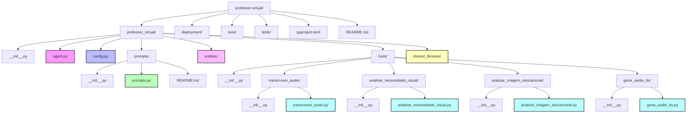
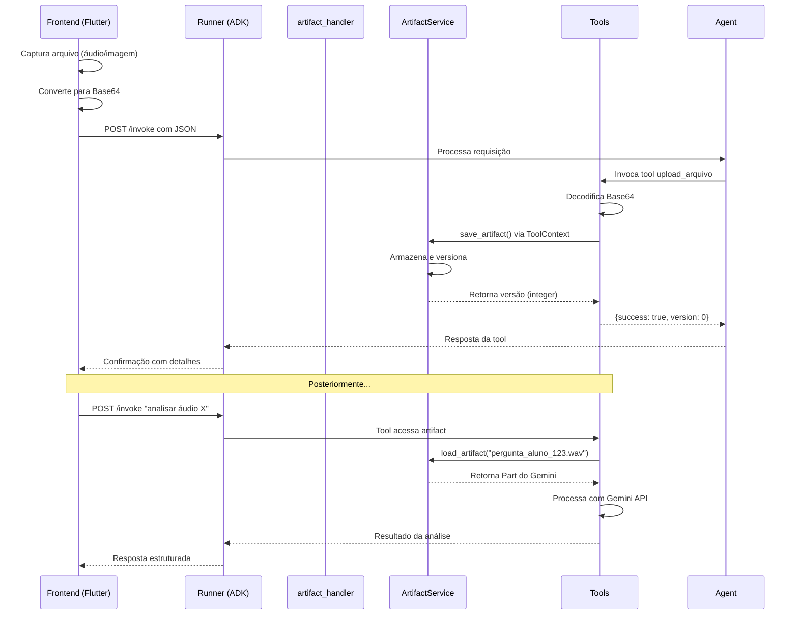

# Professor Virtual - Contexto do Projeto

- **Backend**: Python com Google ADK
  - Framework: ADK Runner com artifacts assíncronos
  - APIs: Gemini Pro para processamento de linguagem e visão
  - Armazenamento: GCS (Google Cloud Storage) em produção, InMemory em desenvolvimento
  - Importante: as capacidades do modo "produção" e do modo "desenvolvimento" devem coexistir.
  
- **Frontend**: Flutter (mobile/web) - ainda não implementado, estamos justamente preparando tudo para a implementação.
  - Comunição via HTTP REST com o backend ADK.
  - Suporte para reprodução e gravação de áudio, suporte para câmera (tirar foto e enviar imagem).
  - As respostas do backend deverão alterar setores da UI (UI dinâmica, estilo 'Canvas')

## Estrutura do Projeto



### Descrição dos Componentes

#### Diretório Raiz (professor-virtual/)
- **professor_virtual/**: Módulo principal contendo toda a lógica do agente educacional
- **deployment/**: Scripts e configurações para implantação em produção
- **eval/**: Testes de avaliação para validar o comportamento do agente
- **tests/**: Testes unitários para garantir qualidade do código
- **pyproject.toml**: Arquivo de configuração do projeto Python (dependências, metadados)
- **README.md**: Documentação principal do projeto

#### Módulo Principal (professor_virtual/)
- **__init__.py**: Arquivo que marca o diretório como um pacote Python
- **agent.py**: Lógica principal do agente - coordena todas as interações e decisões do professor virtual
- **config.py**: Configurações do sistema (URLs, credenciais, parâmetros)
- **prompts/**: Sistema de instruction providers para personalização dinâmica do comportamento
  - **prompts.py**: Providers dinâmicos que adaptam as instruções conforme o contexto
  - **README.md**: Documentação sobre como criar e usar os providers
- **entities/**: Modelos de dados (classes para representar alunos, lições, etc.)
- **shared_libraries/**: Código compartilhado entre diferentes componentes

#### Ferramentas Educacionais (tools/)
Cada ferramenta está organizada em seu próprio subdiretório:

1. **transcrever_audio/**
   - **Função**: Converte áudio do aluno em texto usando Gemini API
   - **Uso**: Permite que o aluno faça perguntas por voz
   - **Entrada**: Arquivo de áudio (wav, mp3, etc.)
   - **Saída**: Texto transcrito da fala

2. **analisar_necessidade_visual/**
   - **Função**: Determina se uma resposta precisa de apoio visual
   - **Uso**: Decide quando gerar diagramas ou imagens explicativas
   - **Entrada**: Contexto da conversa e pergunta do aluno
   - **Saída**: Boolean indicando necessidade + tipo de visual sugerido

3. **analisar_imagem_educacional/**
   - **Função**: Analisa imagens enviadas pelo aluno (exercícios, dúvidas)
   - **Uso**: Corrige trabalhos fotografados, identifica erros em diagramas
   - **Entrada**: Imagem + contexto educacional
   - **Saída**: Análise detalhada com feedback pedagógico

4. **gerar_audio_tts/**
   - **Função**: Converte texto em áudio falado (Text-to-Speech)
   - **Uso**: Permite respostas em áudio para alunos com dificuldades de leitura
   - **Entrada**: Texto a ser falado + parâmetros de voz
   - **Saída**: Arquivo de áudio com a fala sintetizada

## Sistema de Artifacts

### O que são Artifacts no ADK?

Artifacts são a forma padronizada do Google ADK para gerenciar arquivos e dados binários (imagens, áudio, vídeo) em aplicações de IA. Eles permitem:

- **Armazenamento persistente**: Arquivos enviados pelo usuário são salvos e versionados
- **Processamento assíncrono**: Ferramentas podem acessar artifacts salvos anteriormente
- **Integração com Gemini**: Artifacts são automaticamente convertidos para o formato `Part` aceito pela API Gemini
- **Suporte multi-ambiente**: Desenvolvimento (memória) e produção (Google Cloud Storage)

### Implementação no Projeto

#### 1. **tools/upload_arquivo/upload_arquivo.py** (ATUALIZADO)
- **Função principal**: Tool ADK que processa uploads de arquivos do frontend
- **Contexto correto**: Usa ToolContext que possui métodos de artifact
- **Conversão**: Base64 → Binary → ADK Artifact
- **Versionamento**: Cada upload recebe uma versão INTEGER (0, 1, 2...)
- **Formato de entrada esperado**:
  ```json
  {
    "action": "upload_file",
    "file_data": {
      "content": "base64_encoded_content",
      "mime_type": "audio/wav",
      "filename": "pergunta_aluno_123.wav"
    },
    "session_id": "session_abc",
    "user_id": "user_123"
  }
  ```

#### 2. **artifact_handler.py** (agora apenas documentação)
- **Função**: Documentação para desenvolvedores frontend
- **Mudança importante**: Não contém mais código, apenas guidelines

#### 3. **Configuração em config.py**
```python
# Modo de armazenamento
artifact_storage_type: str = "memory"  # ou "gcs" para produção
gcs_bucket_name: str = "adk-professor-virtual-artifacts"
is_production: bool = False
```

#### 4. **Integração em agent.py**
- **InMemoryArtifactService**: Para desenvolvimento local (dados em RAM)
- **GcsArtifactService**: Para produção (Google Cloud Storage)
- **Runner com artifact_service**: Essencial para uploads funcionarem
- **Tool upload_arquivo**: Registrada como ferramenta do agente

### Fluxo de Upload Frontend → Backend



### Tipos de Arquivo Suportados

- **Áudio**: wav, mp3, mpeg, webm (para transcrição)
- **Imagens**: jpeg, png, gif, webp (para análise visual)

### Exemplo de Código Frontend (Flutter)

```dart
// 1. Converter arquivo para base64
String base64Content = base64Encode(await file.readAsBytes());

// 2. Preparar requisição
Map<String, dynamic> requestData = {
  'action': 'upload_file',
  'file_data': {
    'content': base64Content,
    'mime_type': 'audio/wav',
    'filename': 'question_${DateTime.now().millisecondsSinceEpoch}.wav'
  },
  'session_id': currentSessionId,
  'user_id': currentUserId
};

// 3. Enviar para backend
final response = await http.post(
  Uri.parse('https://api.example.com/upload'),
  headers: {'Content-Type': 'application/json'},
  body: jsonEncode(requestData),
);

// 4. Processar resposta
final responseData = jsonDecode(response.body);
if (responseData['success']) {
  // Note: version é agora um integer, não string
  print('Upload ok: ${responseData['filename']} versão ${responseData['version']}');
}
```

### Pontos Importantes para Frontend

1. **Sempre use Base64**: O ADK não aceita uploads binários diretos via JSON
2. **Aguarde confirmação**: Só considere o upload completo após receber `success: true`
3. **Guarde o filename**: Será necessário para referenciar o arquivo em comandos posteriores
4. **MIME types corretos**: Essencial para o Gemini processar corretamente
5. **Não use ADK diretamente**: Não existe SDK Flutter oficial do ADK
6. **Version é integer**: A versão retornada é um número (0, 1, 2...), não string ("v1")

