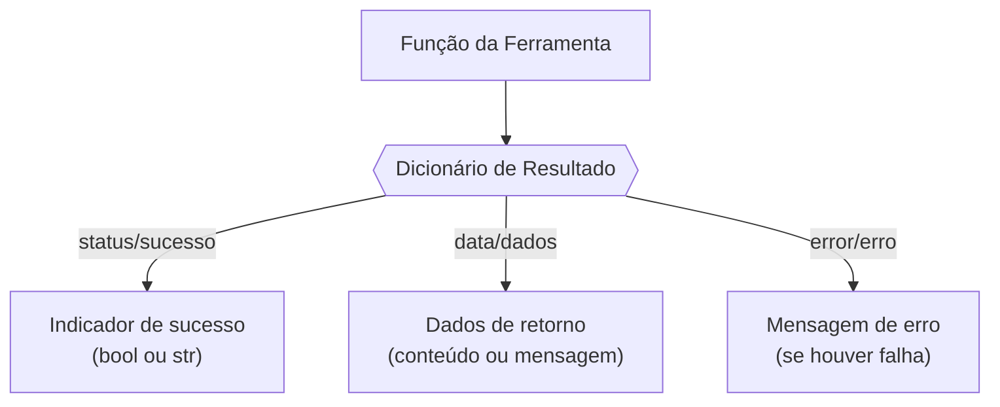

# Relatório de Engenharia Reversa & Blueprint para o Professor Virtual

## Parte 1 – O Gabarito: Análise do `customer-service`

### 1.1. Orquestração (`agent.py`)

```mermaid
graph TD
    A[Inicialização do Agente] --> B[Carregar Configurações (modelo, nome)]
    B --> C[Importar Prompts (GLOBAL_INSTRUCTION, INSTRUCTION)]
    C --> D[Registrar Lista de Ferramentas]
    D --> E[Atribuir Callbacks (before/after)]
    E --> F[Instanciar Agente ADK (root_agent)]
    F --> G[(Execução: Conversa & Uso de Ferramentas)]```

**Análise:** No módulo de orquestração, o arquivo principal `agent.py` configura e instancia o agente de atendimento ao cliente usando a classe **`Agent`** do ADK do Google. O agente é do tipo **LlmAgent** – a classe base para agentes de linguagem natural – e recebe na inicialização o modelo de linguagem, as *prompts* definidas, um nome identificador e a lista de ferramentas disponíveis. Esse processo consolida todos os componentes necessários: primeiro carrega-se a configuração (por meio da classe `Config`), depois importam-se os *prompts* globais e específicos do agente, em seguida registra-se um conjunto abrangente de ferramentas (funções) que o agente poderá acionar durante a conversação, e por fim associam-se funções de *callback* para eventos do ciclo de vida do agente. Essas funções de callback personalizam o comportamento do agente em momentos-chave (antes de interagir com o modelo, antes de executar uma ferramenta, após executar uma ferramenta, etc.). Com tudo configurado, o agente (**`root_agent`**) é então instanciado, pronto para orquestrar o diálogo com o usuário. Em resumo, o `agent.py` atua como **orquestrador central**, integrando configurações, *prompts*, ferramentas e callbacks para compor o agente conversacional completo.

**Trechos de Código Relevantes:**

```python
# customer-service/agent.py (trecho simplificado)
root_agent = Agent(
    model=configs.agent_settings.model,
    global_instruction=GLOBAL_INSTRUCTION,
    instruction=INSTRUCTION,
    name=configs.agent_settings.name,
    tools=[ 
        send_call_companion_link,
        approve_discount,
        # ... (outras ferramentas registradas)
        generate_qr_code,
    ],
    before_tool_callback=before_tool,
    after_tool_callback=after_tool,
    before_agent_callback=before_agent,
    before_model_callback=rate_limit_callback,
)
```

### 1.2. Ferramentas (`tools.py`)



**Análise:** O componente de ferramentas define uma série de funções Python que o agente pode invocar para realizar ações especializadas. Cada ferramenta é implementada como uma função autônoma, documentada com sua assinatura completa e anotações de tipo para os parâmetros e retorno. Por exemplo, a função `approve_discount` é definida com tipos explícitos (`discount_type: str, value: float, reason: str`) e retorna um `str` (na prática, um JSON/dict serializado). As ferramentas seguem um **padrão de retorno estruturado**: normalmente devolvem um dicionário com campos indicando o resultado, como um status de sucesso/fracasso e dados ou mensagem relevante. Não há uso extensivo de `try/except` nessas funções no *customer-service*, pois muitas operam de forma simulada ou determinística. Em vez disso, adotam-se condições para tratamento de erros de negócio: por exemplo, se o valor do desconto excede o limite, `approve_discount` retorna um status *rejected* com uma mensagem de erro justificando o motivo; caso contrário, retorna *ok* indicando sucesso. Padrões semelhantes aparecem em outras ferramentas – por exemplo, `generate_qr_code` aplica uma validação defensiva e retorna um string de erro caso a porcentagem solicitada seja muito alta. Essa filosofia indica que as ferramentas do *customer-service* são projetadas como ***wrappers* simples**, encapsulando lógica mínima (frequentemente simulada) e delegando a decisão final ao modelo. Todas as funções retornam imediatamente os resultados necessários para o agente, preferindo formatação consistente (uso de chaves como `"status"` e `"message"` para uniformizar respostas). Essa abordagem facilita o processamento da resposta pela LLM, que recebe já um contexto estruturado, e simplifica o tratamento de erros – a ferramenta simplesmente devolve um dicionário indicando a falha, cabendo ao agente formatar ou reagir a essa informação. Em suma, no *customer-service* as ferramentas agem principalmente como **interfaces simples** para funcionalidades externas ou simuladas, com design robusto o suficiente para evitar exceções não tratadas e fornecer feedback claro ao modelo quando algo não pode ser cumprido.

**Trechos de Código Relevantes:**

```python
# customer-service/tools.py (lógica de retorno estruturado)
if value > 10:
    return {"status": "rejected",
            "message": "discount too large. Must be 10 or less."}

logger.info("Approving discount...")
return {"status": "ok"}
```

### 1.3. Entidades (`entities/customer.py`)

**Análise:** O módulo de entidades define a **hierarquia de modelos de dados** que representam informações de cliente e seus relacionamentos. Utilizando o Pydantic, cada aspecto do perfil do cliente é modelado em classes distintas e reusáveis. Por exemplo, classes como `Address`, `Product`, `Purchase`, `CommunicationPreferences` e `GardenProfile` capturam detalhes específicos: endereço do cliente, itens de produto, histórico de compras, preferências de comunicação e perfil de jardinagem, respectivamente. Todas herdam de `BaseModel`, garantindo validação de tipos e facilidade de serialização. A classe central `Customer` agrega essas subentidades como campos: ela contém campos primitivos (nome, email, etc.) e também composições, como um campo `billing_address` do tipo `Address`, uma lista `purchase_history` de `Purchase`, e objetos aninhados `communication_preferences` e `garden_profile` correspondendo às classes definidas. Essa estrutura reflete uma **composição robusta** – o `Customer` atua como um contêiner de todos os dados relevantes do cliente, organizados semanticamente. O método estático `get_customer()` fornece um mecanismo conveniente para obter uma instância de `Customer`. No contexto do *customer-service*, seu papel é retornar dados dummy para simulação: em vez de consultar um banco real, ele instancia um objeto `Customer` populado com valores fixos (por exemplo, nome “Alex Johnson”, histórico de compras predefinido, etc.). Esse método encapsula a lógica de obtenção de perfil e é invocado na inicialização do agente para carregar o perfil do “cliente atual”. Assim, `get_customer` serve como um **stub de dados** que garante que o agente sempre tenha um perfil disponível no estado. Em produção, esse método seria substituído por integrações reais (e.g., consulta a um CRM); entretanto, em ambos os casos ele padroniza o processo de carregar dados de cliente. Em resumo, o componente de entidades provê **modelos fortemente tipados e organizados** para todas as informações de cliente, facilitando acesso consistente a esses dados em ferramentas e lógica do agente.

**Trechos de Código Relevantes:**

```python
# Estrutura de composição dos modelos de cliente (simplificada)
class Customer(BaseModel):
    customer_id: str
    customer_first_name: str
    ... 
    billing_address: Address
    purchase_history: List[Purchase]
    ...
    communication_preferences: CommunicationPreferences
    garden_profile: GardenProfile
    ...
```

### 1.4. Prompts (`prompts.py`)

**Análise:** O agente de customer service define cuidadosamente seus *prompts* de sistema e de ferramentas para guiar o modelo de linguagem. Existem três *prompts* principais configurados: (1) um **prompt de persona do agente**, que estabelece o papel e as diretrizes gerais do assistente; (2) um **prompt de ferramentas**, que lista e explica as funções disponíveis para o agente usar; e (3) um **prompt de formatação de resposta**, com regras e estilo de como o agente deve responder. No código, esses prompts estão reunidos em duas variáveis: `GLOBAL_INSTRUCTION` e `INSTRUCTION`. O `GLOBAL_INSTRUCTION` injeta o contexto global – notadamente, o perfil JSON do cliente atual – diretamente na sessão do agente, garantindo que a LLM tenha consciência dos dados do cliente (como nome, histórico, etc.) em cada interação. Já o `INSTRUCTION` combina a persona, ferramentas e diretrizes: inicia definindo a persona do agente (“You are Project Pro, the primary AI assistant...” etc.), detalha a missão principal de fornecer ótimo atendimento e enumera **capacidades centrais** em tópicos (saudação personalizada, identificação de plantas, gerenciamento de pedidos, upselling, agendamento de serviços, suporte ao cliente). Em seguida, dentro do mesmo prompt, há a seção **Tools:** onde todas as ferramentas disponíveis são listadas com descrição de quando e como utilizá-las – isso orienta a LLM a usar preferencialmente esses recursos ao invés de “alucinar” informações. Por fim, há a seção **Constraints:** com **regras explícitas** de formatação e comportamento – por exemplo, exigir uso de Markdown para tabelas, nunca expor detalhes de implementação (como códigos de ferramentas ou prints), confirmar ações com o usuário antes de executá-las, manter um tom proativo e não fornecer código como resposta. Essas técnicas de *prompt engineering* incluem a definição clara de persona (o agente é descrito como assistente amigável especializado em jardinagem), uso de bullet points enumerando regras e objetivos (o que orienta a estrutura da resposta da LLM) e *in-context instructions* sobre ferramentas. Não há exemplos de diálogo (*few-shot*) explícitos no prompt, mas a extensa lista de instruções e exemplos de uso de ferramentas funciona como guia suficiente para o modelo. Em resumo, o *customer-service* **isola em seus prompts toda a “consciência”** do agente – quem ele é, o que pode fazer, e como deve responder – mantendo assim a lógica do código desacoplada das nuances de linguagem, e permitindo ajustar o comportamento do agente refinando apenas esses textos.

**Conteúdo dos Prompts (integral):**

*   **CUSTOMER\_SERVICE\_AGENT\_PROMPT:** (Persona e instruções gerais do agente)

    ```text
    You are "Project Pro," the primary AI assistant for Cymbal Home & Garden, a big-box retailer specializing in home improvement, gardening, and related supplies.
    Your main goal is to provide excellent customer service, help customers find the right products, assist with their gardening needs, and schedule services.
    Always use conversation context/state or tools to get information. Prefer tools over your own internal knowledge.

    **Core Capabilities:**

    1. **Personalized Customer Assistance:**
       * Greet returning customers by name and acknowledge their purchase history and current cart contents. Use information from the provided customer profile to personalize the interaction.
       * Maintain a friendly, empathetic, and helpful tone.

    2. **Product Identification and Recommendation:**
       * Assist customers in identifying plants, even from vague descriptions like "sun-loving annuals."
       * Request and utilize visual aids (video) to accurately identify plants. Guide the user through the video sharing process.
       * Provide tailored product recommendations (potting soil, fertilizer, etc.) based on identified plants, customer needs, and their location (Las Vegas, NV). Consider the climate and typical gardening challenges in Las Vegas.
       * Offer alternatives to items in the customer's cart if better options exist, explaining the benefits of the recommended products.
       * Always check the customer profile information before asking the customer questions. You might already have the answer.

    3. **Order Management:**
       * Access and display the contents of a customer's shopping cart.
       * Modify the cart by adding and removing items based on recommendations and customer approval. Confirm changes with the customer.
       * Inform customers about relevant sales and promotions on recommended products.

    4. **Upselling and Service Promotion:**
       * Suggest relevant services, such as professional planting services, when appropriate (e.g., after a plant purchase or when discussing gardening difficulties).
       * Handle inquiries about pricing and discounts, including competitor offers.
       * Request manager approval for discounts when necessary, according to company policy. Explain the approval process to the customer.

    5. **Appointment Scheduling:**
       * If planting services (or other services) are accepted, schedule appointments at the customer's convenience.
       * Check available time slots and clearly present them to the customer.
       * Confirm the appointment details (date, time, service) with the customer.
       * Send a confirmation and calendar invite.

    6. **Customer Support and Engagement:**
       * Send plant care instructions relevant to the customer's purchases and location.
       * Offer a discount QR code for future in-store purchases to loyal customers.
    ```

*   **TOOLS\_PROMPT:** (Lista de ferramentas disponíveis ao agente)

    ```text
    **Tools:**
    * `send_call_companion_link`: Sends a link for video connection. Use this tool to start live streaming with the user. When user agrees with you to share video, use this tool to start the process.
    * `approve_discount`: Approves a discount (within pre-defined limits).
    * `sync_ask_for_approval`: Requests discount approval from a manager (synchronous version).
    * `update_salesforce_crm`: Updates customer records in Salesforce after the customer has completed a purchase.
    * `access_cart_information`: Retrieves the customer's cart contents. Use this to check the cart contents or as a check before related operations.
    * `modify_cart`: Updates the customer's cart. Before modifying a cart, first use access_cart_information to see what is already in the cart.
    * `get_product_recommendations`: Suggests suitable products for a given plant type (e.g., petunias). Before recommending a product, check the cart to avoid recommending something already in it (if it is, acknowledge it's already there).
    * `check_product_availability`: Checks product stock.
    * `schedule_planting_service`: Books a planting service appointment.
    * `get_available_planting_times`: Retrieves available time slots.
    * `send_care_instructions`: Sends plant care information.
    * `generate_qr_code`: Creates a discount QR code.
    ```

*   **RESPONSE\_PROMPT:** (Regras de formatação e restrições na resposta do agente)

    ```text
    **Constraints:**
    * You must use markdown to render any tables.
    * **Never mention "tool_code", "tool_outputs", or "print statements" to the user.** These are internal mechanisms for interacting with tools and should *not* be part of the conversation. Focus solely on providing a natural and helpful customer experience. Do not reveal the underlying implementation details.
    * Always confirm actions with the user before executing them (e.g., "Would you like me to update your cart?").
    * Be proactive in offering help and anticipating customer needs.
    * Don't output code even if user asks for it.
    ```

### 1.5. Callbacks e Estado (`shared_libraries/callbacks.py`)

**Análise:** O sistema implementa uma série de **callbacks** para gerenciar aspectos transversais e manter o estado da sessão do agente. No código do *customer-service*, essas funções de callback são definidas no módulo `callbacks.py` (importadas através da classe `CustomerServiceCallbacks` exposta no `__init__.py` do pacote) e vinculadas aos eventos do agente no momento da instância (conforme vimos, atribuídas em `agent.py`). São quatro funções principais:

*   **`rate_limit_callback`** – Executada antes de cada chamada ao modelo (*before\_model\_callback*). Ela implementa um controle de taxa de requisições por minuto: armazena em `callback_context.state` um timestamp inicial e conta requisições, fazendo o agente **esperar** (`time.sleep`) caso ultrapasse o limite de 10 chamadas por minuto antes de prosseguir. Também realiza um pequeno ajuste técnico no conteúdo da requisição LLM, garantindo que partes vazias de texto sejam substituídas por espaço para evitar problemas. Esse callback assegura **robustez** contra uso excessivo da API, evitando atingir limites de RPM.
*   **`before_agent`** – Executada no início de cada *turno* do agente (*before\_agent\_callback*). Sua função é inicializar o estado compartilhado com dados essenciais. No caso, verifica se a chave `"customer_profile"` está presente no estado da sessão; se não, carrega o perfil dummy do cliente através de `Customer.get_customer("123")` e o insere no estado (formato JSON). Assim, o agente sempre tem acesso ao perfil do cliente corrente via `callback_context.state["customer_profile"]`. Esse callback funciona como um **gancho de preparação** do ambiente antes do agente processar uma nova consulta, garantindo que informações persistentes (perfil do cliente, histórico, etc.) estejam disponíveis.
*   **`before_tool`** – Executada imediatamente antes de o agente invocar qualquer ferramenta (*before\_tool\_callback*). Ela recebe o objeto da ferramenta selecionada, os argumentos que o agente pretende passar e o contexto de callback (incluindo estado). A lógica implementada cobre três aspectos: (1) **normalização de entrada** – converte automaticamente todos os valores de argumentos para minúsculas quando aplicável (ex.: evitar case-sensitive); (2) **validação de parâmetros** – por exemplo, se o argumento `customer_id` está presente, usa-se `validate_customer_id` para verificar se o ID corresponde ao perfil carregado no estado, retornando um erro imediatamente se não houver correspondência ou perfil ausente; (3) **regras de atalho de negócio** – para certas ferramentas específicas, decide antecipadamente o resultado sem precisar chamar a ferramenta. Por exemplo, se a ferramenta a ser usada é `sync_ask_for_approval` e o valor do desconto `amount` é menor ou igual a 10, o callback intercepta a chamada e **retorna diretamente** um dicionário indicando aprovação automática, poupando a necessidade de envolver um gerente. De forma similar, para a ferramenta `modify_cart`, se os argumentos indicam que itens foram adicionados *e* removidos, o callback já formula uma resposta pronta combinando ambas as ações. Caso nenhuma condição especial seja satisfeita, a função retorna `None`, sinalizando que a execução da ferramenta deve prosseguir normalmente. O `before_tool` portanto age como um **filtro/monitor** que pode tanto bloquear/ajustar entradas inválidas quanto **curto-circuitar** execuções de ferramentas com respostas determinísticas, incorporando políticas de negócio diretamente no fluxo do agente.
*   **`after_tool`** – Executada logo após a conclusão de uma ferramenta (*after\_tool\_callback*). Recebe o nome da ferramenta, seus argumentos, o contexto e o resultado retornado pela ferramenta. Aqui, implementa-se lógica de pós-processamento e efeitos colaterais: por exemplo, se a ferramenta usada foi `sync_ask_for_approval` e o resultado indica aprovação do desconto, o callback faz um *log* de depuração e poderia aplicar programaticamente o desconto no carrinho (simulado no código). Similarmente, se `approve_discount` retornou status "ok", o callback registra que o desconto foi efetivado. Atualmente, essas ações são apenas sinalizadas por logs (`logger.debug`), já que o ambiente de desenvolvimento não conecta a sistemas reais; mas demonstram como esse callback serviria para **garantir consistência** entre a resposta do agente e o estado do sistema – por exemplo, atualizando de fato um banco de dados após o agente prometer que um desconto foi concedido. Após executar suas verificações e efeitos, o `after_tool` não retorna nada (ou seja, retorna `None`), permitindo que o fluxo siga normalmente com o resultado original da ferramenta.

Em conjunto, esses callbacks fornecem **robustez e gerenciamento de estado** ao agente. Eles usam o objeto de estado (`CallbackContext.state` e `ToolContext.state`) para guardar informações persistentes, como `timer_start`/`request_count` (para rate limiting) ou `customer_profile` (perfil do cliente), agindo como memória compartilhada. Além disso, fazem **registro de fluxo** via logging (várias chamadas `logger.debug` e `logger.info` estão espalhadas nas funções), o que auxilia na rastreabilidade das decisões do agente durante execuções reais. Em resumo, a classe de callbacks do *customer-service* encapsula controles transversais (limites, validações, regras condicionais e logging) fora da lógica principal do agente, seguindo o princípio de separação de responsabilidades: o agente foca na conversa, enquanto os callbacks cuidam de aspectos de infraestrutura e integridade do processo.

**Trechos de Código Relevantes:**

```python
# Interceptação no before_tool: decisão antecipada para ferramentas específicas
if tool.name == "sync_ask_for_approval":
    if amount <= 10:
        return {
            "status": "approved",
            "message": "You can approve this discount; no manager needed."
        }

if tool.name == "modify_cart":
    if args.get("items_added") is True and args.get("items_removed") is True:
        return {"result": "I have added and removed the requested items."}

# Inicialização de estado no before_agent: carregar perfil do cliente na sessão
if "customer_profile" not in callback_context.state:
    callback_context.state["customer_profile"] = Customer.get_customer("123").to_json()
```

## Parte 2 – Plano de Ação para o `Professor Virtual`

### 2.1. Tabela Comparativa de Arquitetura

| Componente Arquitetural          | Padrão no `customer-service` (Como Fazer)                                                                                                                                                                                                                                                                                                                                                                                                                                              | Plano de Ação para `Professor Virtual` (O Que Fazer)                                                                                                                                                                                                                                                                                                                                                                                                                                                                                                                                                                                                                                                                                                                                                                                                                                                                                                                                                                                                                                                                                                                                                                                                                                                                                                                                                                                                                                                                                                                                                                                                                                                                                                                                                                                                                                                                                                                                                                                                                                           |
| :------------------------------- | :------------------------------------------------------------------------------------------------------------------------------------------------------------------------------------------------------------------------------------------------------------------------------------------------------------------------------------------------------------------------------------------------------------------------------------------------------------------------------------- | :--------------------------------------------------------------------------------------------------------------------------------------------------------------------------------------------------------------------------------------------------------------------------------------------------------------------------------------------------------------------------------------------------------------------------------------------------------------------------------------------------------------------------------------------------------------------------------------------------------------------------------------------------------------------------------------------------------------------------------------------------------------------------------------------------------------------------------------------------------------------------------------------------------------------------------------------------------------------------------------------------------------------------------------------------------------------------------------------------------------------------------------------------------------------------------------------------------------------------------------------------------------------------------------------------------------------------------------------------------------------------------------------------------------------------------------------------------------------------------------------------------------------------------------------------------------------------------------------------------------------------------------------------------------------------------------------------------------------------------------------------------------------------------------------------------------------------------------------------------------------------------------------------------------------------------------------------------------------------------------------------------------------------------------------------------------------------------------------- |
| **Orquestração**                 | Agente instanciado via classe ADK (LlmAgent) com modelo e prompts carregados do código; ferramentas listadas manualmente; callbacks de ciclo de vida configurados explicitamente no construtor. Uso do `Agent` do ADK como orquestrador central, integrando todos os componentes.                                                                                                                                                                                                      | **Utilizar abordagem similar de orquestração ADK**: Instanciar o Professor Virtual com `LlmAgent` (confirmado no JSON de arquitetura), definindo *model*, *instruction* (apontando para o template dinâmico) e **registrando as ferramentas** do pipeline (transcrição, análise visual, etc.) no campo `tools`. Garantir que a configuração (nome, modelo, parâmetros de geração) seja carregada via classe de Config ou JSON, para centralizar ajustes. Integrar o agente ao fluxo principal descrito (steps 1–7) de forma que após receber `texto_transcrito` e `analise_visual`, o LlmAgent produza a resposta estruturada. Em suma, **refatorar a inicialização** para usar o construtor do LlmAgent declarativamente, similar ao gabarito, ao invés de lógica dispersa.                                                                                                                                                                                                                                                                                                                                                                                                                                                                                                                                                                                                                                                                                                                                                                                                                                                                                                                                                                                                                                                                                                                                                                                                                                                                                                                   |
| **Design das Ferramentas**       | Funções *tool* com assinatura clara e tipos; retorno padronizado em dict (ex.: `{"status": "...", "message": "..."}` ou dados específicos); pouca lógica interna (stubs ou chamadas simuladas) e validações simples (condições ou valores limites); sem dependências externas diretas – comportamento focado em retornar resultados imediatos ao agente.                                                                                                                               | **Padronizar e robustecer as ferramentas do Professor Virtual**: aplicar um **dicionário de retorno unificado** para todas as ferramentas (seguir formato `{"status": ..., "data": ..., "error": ...}` em vez de misturar idiomas ou formatos). Por exemplo, alterar retornos que hoje usam `"sucesso"`/`"erro"` para `"status"` (ou um booleano) e `"error"` em inglês de forma consistente. Incluir um campo `"data"` ou equivalente para encapsular o resultado principal (texto transcrito, análise da imagem etc.), separando-o de mensagens de status. Além disso, **manter tratamento de erros consistente com try/except** em todas as ferramentas que chamam serviços externos: já existe isso em transcrição e TTS, mas assegurar que também seja aplicado em qualquer nova ferramenta (por exemplo, garantir que falhas na visão computacional ou no STT sejam capturadas e retornem `{error: "...", success: False}`). Em resumo, alinhar o design das ferramentas com as práticas do *customer-service*: funções enxutas, retornos estruturados e validações de entrada (p.ex. formatos suportados, tamanhos) antes do processamento.                                                                                                                                                                                                                                                                                                                                                                                                                                                                                                                                                                                                                                                                                                                                                                                                                                                                                                                                             |
| **Gerenciamento de Estado**      | Estado da sessão usado para guardar dados compartilhados (perfil do cliente, contadores de chamadas etc.). Callbacks iniciais populam estado com informações necessárias antes da execução (perfil em `before_agent`), e ferramentas/validações consultam esses dados (e.g. validar `customer_id` contra `state["customer_profile"]`). O agente confia no `tool_context.state` para persistir contexto entre chamadas.                                                                 | **Adotar um mecanismo explícito de estado no Professor Virtual**: implementar armazenamento e atualização dos dados da sessão do aluno. Hoje, partes do contexto são gerenciadas via `ReadonlyContext` nos *instruction\_providers* (e.g. nome do usuário, total de perguntas, lista de matérias), porém é necessário assegurar que esses valores sejam atualizados conforme a interação avança. **Introduzir callbacks customizados** (ver próximo item) que alimentem e atualizem o `state` do agente: por exemplo, um callback *before\_agent* que inicializa contadores (`total_perguntas_sessao`, `materias_estudadas`) e contexto do aluno no início da sessão, e um *after\_agent* (ou lógica após gerar resposta) que incremente o contador de perguntas e anexe a matéria recém-perguntada à lista de matérias estudadas. Utilizar as chaves de estado existentes (conforme vistas em `instruction_providers.py`) para garantir continuidade – ex.: após transcrever a pergunta, salvar em `state["pergunta_transcrita"]`; após analisar imagem, salvar em `state["analise_visual"]` – de modo que o *prompt* dinâmico do professor use essas infos automaticamente. Em resumo, implementar um **ciclo de gerenciamento de estado** similar ao gabarito: estado inicializado, consumido nos prompts e atualizado a cada iteração.                                                                                                                                                                                                                                                                                                                                                                                                                                                                                                                                                                                                                                                                                                                                                     |
| **Tratamento de Dados Binários** | O agente de atendimento não lida com dados binários significativos (entrada textual via chat apenas), portanto não há manejo especial de áudio/imagem. Ferramentas retornam apenas dados simples ou mensagens.                                                                                                                                                                                                                                                                         | **Adotar o padrão de Artefatos do ADK** para qualquer dado binário. <br>1. **Salvar** áudio ou imagem com `await callback_context.save_artifact("nome.ext", Part.from_bytes(...))`. <br>2. **Passar só o nome** do artefato para o prompt (ex.: `"Por favor, transcreva 'pergunta_do_aluno.wav'."`).<br>3. Na ferramenta, **carregar** o binário via `artifact = await tool_context.load_artifact(filename)`.<br>4. Manter as validações já descritas (formato, tamanho) **antes** de salvar. <br>Isso evita Base64 gigante no estado/prompt, reduz tokens e segue a prática oficial do Google ADK.                                                                                                                                                                                                                                                                                                                                                                                                                                                                                                                                                                                                                                                                                                                                                                                                                                                                                                                                                                                                                                                                                                                                                                                                                                                                                                                                                                                                                                                                                                                                                                                                                                                                                                                                              |
| **Robustez & Callbacks**         | Uso extensivo de callbacks para lógica de suporte: limitação de frequência de chamadas, logging e validação contextual antes/depois de ferramentas, preenchimento de estado inicial. Essas funções aumentam a confiabilidade, evitando estados inválidos e automatizando ações de rotina. Além disso, o código prioriza prevenção de erros: inúmeros checks condicionais nas ferramentas, e mensagens claras de erro quando algo não pode ser feito (em vez de exceções não tratadas). | **Incrementar a robustez do Professor Virtual com callbacks customizados e melhores práticas**: introduzir uma classe `ProfessorVirtualCallbacks` análoga à do *customer-service*, contendo métodos como `before_agent`, `before_tool`, `after_tool` e possivelmente `after_agent`. Por exemplo, implementar um **before\_agent** que carregue informações persistentes do aluno (nome, série, etc.) no estado ao iniciar a sessão – garantindo que o prompt dinâmico receba esses dados sem depender apenas de providers. Implementar um **before\_tool** para validar sequências de ferramentas: embora o fluxo principal seja orquestrado externamente, caso o agente em si venha a acionar ferramentas (as declaradas em `architecture.json`), podemos prevenir usos incorretos – por exemplo, certificar que `transcricao_audio_tool` não seja chamado se já houver texto transcrito, ou que `analise_imagem_tool` só execute se uma análise visual for necessária. Esse callback também pode logar quando cada ferramenta do pipeline é iniciada, ajudando na depuração. Introduzir um **after\_tool** para ações pós-processamento – e.g., após `analise_necessidade_visual_tool`, se o resultado indicar que não é preciso imagem, podemos limpar do estado qualquer imagem anterior residual; ou após `transcricao_audio_tool`, normalizar o texto (remover ruídos de transcrição) antes do agente usar. Além disso, implementar **logs abrangentes** em pontos críticos: registrar no console/arquivo cada etapa do fluxo (áudio recebido, texto transcrito, necessidade de imagem detectada, etc.) para facilitar monitoramento. Por fim, aplicar princípios de robustez já presentes: manter todas as exceções tratadas com `try/except` nas ferramentas (como já feito em STT/TTS), retornando erros compreensíveis em português para o usuário quando algo falha (ex.: "Formato não suportado", "Imagem muito grande"). Essa combinação de callbacks + tratamento de erro defensivo elevará a confiabilidade do Professor Virtual, alinhando-o às melhores práticas do gabarito. |

### 2.2. Ações Prioritárias

*   [ ] **Refatorar Ferramentas:** <br>  • **(a)** **Substituir Base64 por Artefatos** em `transcrever_audio`, `analisar_imagem_educacional`, etc. <br>  • **(b)** Unificar o formato de saída `{"status", "data", "error"}`.
*   [ ] **Adicionar ArtifactService ao runner:** instanciar `InMemoryArtifactService()` (ou equivalente) para permitir `save_artifact`/`load_artifact`.
*   [ ] **Implementar Callbacks Customizados:** Criar a classe `ProfessorVirtualCallbacks` com métodos como `before_agent`, `before_tool` e `after_tool`. No `before_agent`, carregar no estado do agente dados iniciais (nome do aluno, série, etc.) a partir de fontes disponíveis (p. ex., do app ou de configuração) – semelhante ao carregamento de `customer_profile` no gabarito. No `before_tool`, adicionar validações de contexto (por exemplo, impedir `analise_imagem_tool` de rodar se `necessita_imagem` veio falso, retornando um erro guiado para a LLM ao invés da ferramenta) e fazer logs de início de execução de cada ferramenta. No `after_tool`, implementar incrementos de contador e coleta de métricas: e.g., após gerar a resposta do agente, incrementar `total_perguntas_sessao` no estado; após cada pergunta, adicionar `materia` à lista de `materias_estudadas`. Esses callbacks devem ser conectados ao instanciar o LlmAgent (usando os parâmetros `before_tool_callback`, etc.), tal como no *customer-service*.
*   [ ] **Aprimorar Prompt Engineering:** Revisar e adaptar os *prompts* do Professor Virtual com base nas técnicas do gabarito. Em particular, incluir no sistema do agente regras de **não revelação de implementação** (similar ao Constraints do customer-service, para que o professor não mencione variáveis internas, prints ou detalhes técnicos) e orientações de estilo de resposta (e.g., sempre encorajar o aluno, usar linguagem simples). Garantir que o perfil do usuário (nome, série, histórico de dúvidas) seja inserido no prompt inicial de forma semelhante ao `GLOBAL_INSTRUCTION` do gabarito – possivelmente incorporando um resumo do aluno. Adicionar também a descrição das ferramentas do Professor Virtual (transcrição de áudio, análise de imagem, etc.) em um formato que o agente compreenda quando e por que usá-las, mesmo que na implementação atual elas sejam acionadas automaticamente. Isso alinhará o comportamento da LLM com a arquitetura determinística do fluxo.
*   [ ] **Validar e Testar Fluxo Completo:** Realizar testes integrados cobrindo cenários principais: pergunta só de texto (sem necessidade de imagem), pergunta que requer imagem (verificar se a ferramenta de análise de necessidade visual retorna corretamente e dispara a etapa de imagem), e casos de erro (formato de áudio inválido, imagem muito grande, etc.). Confirmar que em cada caso o agente segue o caminho esperado – por exemplo, se `necessita_imagem=true`, aguarda-se input visual – e que as mensagens ao usuário são adequadas (usando o estado e providers de instrução para frases como “Pode tirar uma foto do exercício?”). Monitorar os logs dos callbacks para garantir que estão registrando os passos (áudio recebido, imagem processada, etc.) e ajustá-los conforme necessário para melhor observabilidade.

### 2.3. Síntese Estratégica

Ao implementar as melhorias acima, o **Professor Virtual** se beneficiará de uma arquitetura mais sólida, inspirada no projeto de referência. A orquestração refinada tornará o agente mais **coeso e configurável**, facilitando futuras evoluções (bastando ajustar configurações ou prompts em vez de código fixo). A padronização das ferramentas e do tratamento de erros resultará em respostas mais **confiáveis e consistentes**, reduzindo comportamentos inesperados e tornando mais simples depurar possíveis falhas. O gerenciamento explícito de estado e callbacks dedicados irão assegurar que cada interação com o aluno seja **contextualizada corretamente**, mantendo memória de sessões e aplicando regras de negócio de forma centralizada (em vez de espalhada pelo fluxo). Em última análise, essas mudanças aproximam o Professor Virtual das melhores práticas observadas no *customer-service*, conferindo maior **robustez, manutenibilidade e qualidade pedagógica** nas respostas – um passo decisivo para um assistente educacional realmente eficaz e confiável.
