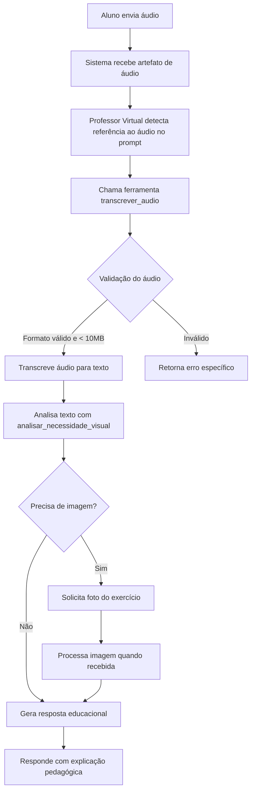
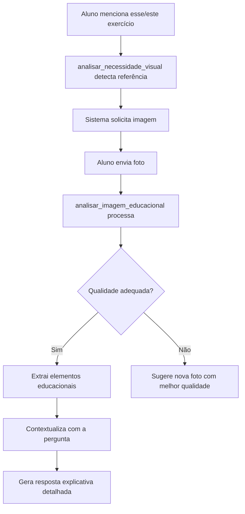
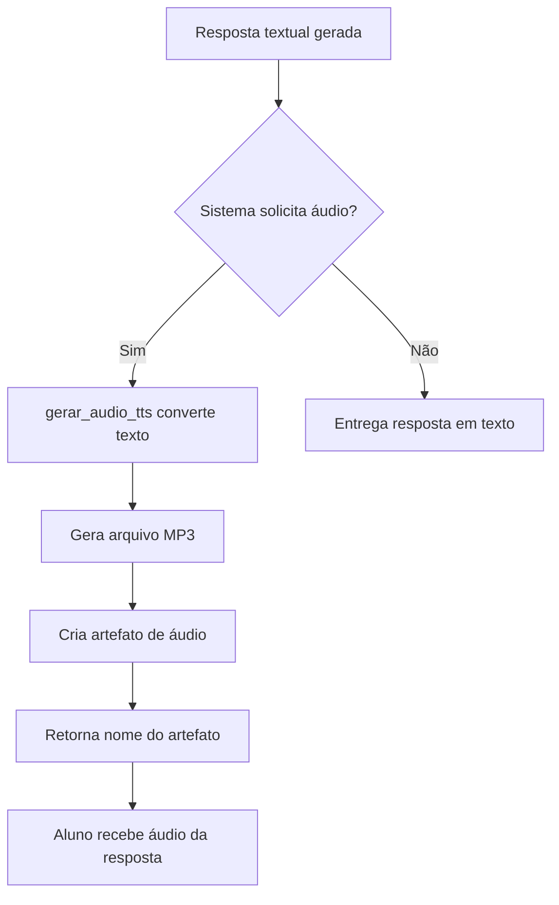

## Fonte da Verdade – Professor Virtual (v0.1.0 - Arquitetura ADK Multimodal Educacional)

[NOTA: Este documento foi reconstruído através de engenharia reversa do código implementado]

Este documento descreve o comportamento completo e os fluxos de interação do agente Professor Virtual, baseado em análise sistemática do código, arquitetura e componentes implementados.

# Fluxo de Interação Multimodal Educacional - Professor Virtual

## Visão Geral

O Professor Virtual é um assistente educacional baseado no Google Agent Development Kit (ADK) projetado especificamente para auxiliar crianças em seus estudos. O sistema implementa uma abordagem pedagógica multimodal que permite interações através de texto, áudio e imagem, adaptando-se às diferentes formas de aprendizagem dos alunos.

### Propósito Central
Fornecer suporte educacional personalizado através de:
- Explicações claras e apropriadas para a idade
- Processamento de perguntas em áudio para alunos com dificuldades de digitação
- Análise de imagens de exercícios e materiais educacionais
- Respostas em áudio para melhor acessibilidade
- Abordagem pedagógica que começa com elogio, explica passo a passo e verifica compreensão

## Arquitetura Descoberta

### Estrutura de Agentes
```
root_agent (Agent Principal)
├── Modelo: gemini-2.5-flash (configurável)
├── Nome: professor_virtual_agent
├── Instruções Globais: (vazio - toda lógica nas instruções locais)
└── Instruções Locais: Personalidade e comportamento pedagógico completo
```

### Componentes Identificados

#### **Agentes:**
- **root_agent**: Agente único e principal que orquestra todas as interações
  - Configurado com callbacks para controle de comportamento
  - Integrado com 4 ferramentas especializadas
  - Personalidade pedagógica definida através de prompts detalhados

#### **Tools (Ferramentas):**
1. **transcrever_audio**
   - **Propósito**: Converter perguntas em áudio para texto
   - **Entradas**: nome_artefato_audio (string) - referência ao arquivo de áudio
   - **Formatos suportados**: WAV, MP3, M4A
   - **Limite de tamanho**: 10MB
   - **Saídas**: {sucesso, texto, duracao_segundos, formato, tamanho_bytes, idioma_detectado}
   - **Comportamento**: Valida formato e tamanho antes de processar

2. **analisar_necessidade_visual**
   - **Propósito**: Detectar quando o aluno está se referindo a algo visual
   - **Entradas**: texto (string) - texto transcrito ou digitado pelo aluno
   - **Padrões detectados**: 
     - Demonstrativos: "esse", "esta", "aqui", "isso"
     - Referências visuais: "exercício", "questão", "figura"
     - Pedidos de ajuda contextual: "esse aqui", "não entendi isso"
   - **Saídas**: {necessita_imagem, confianca, referencias_encontradas, justificativa}
   - **Lógica**: Sistema de pontuação baseado em padrões linguísticos

3. **analisar_imagem_educacional**
   - **Propósito**: Extrair e analisar conteúdo educacional de imagens
   - **Entradas**: nome_artefato_imagem (string), contexto_pergunta (string)
   - **Limite de tamanho**: 5MB
   - **Análise**: Identifica tipo de conteúdo, elementos educacionais, qualidade
   - **Saídas**: {sucesso, tipo_conteudo, elementos_detectados, contexto_educacional, qualidade_adequada}

4. **gerar_audio_tts**
   - **Propósito**: Converter respostas textuais em áudio
   - **Entradas**: texto (string), velocidade (float), voz (string)
   - **Voz padrão**: pt-BR-Standard-A
   - **Saídas**: {sucesso, nome_artefato_gerado, tamanho_caracteres}
   - **Formato de saída**: MP3

#### **Modelos:**
- **LLM Principal**: Gemini 2.5 Flash (escolhido por velocidade e eficiência)
- **Configuração flexível**: Suporta tanto Developer API quanto Vertex AI
- **Localização padrão**: us-central1

### Callbacks e Controles

1. **rate_limit_callback**
   - Limita a 10 requisições por minuto (RPM)
   - Implementa delay automático quando limite é excedido
   - Previne sobrecarga do sistema

2. **before_tool**
   - Converte todas as entradas para minúsculas (normalização)
   - Validação de parâmetros antes da execução
   - (Contém código legado de validação de customer_id não utilizado)

3. **after_tool**
   - Processa resultados após execução das ferramentas
   - (Contém código legado não utilizado no contexto educacional)

4. **before_agent**
   - Inicializa estado da sessão
   - (Configurado para carregar perfil do estudante, mas usando lógica legada)

## Fluxo de Interação Reconstruído

### 1. Fluxo de Pergunta por Áudio



### 2. Fluxo de Análise de Imagem



### 3. Fluxo de Resposta em Áudio



## Comportamentos Observados

### Padrões Pedagógicos Implementados

1. **Estrutura de Resposta Educacional**
   - Sempre inicia com elemento motivacional (elogio ou encorajamento)
   - Explica conceitos passo a passo
   - Usa linguagem apropriada para crianças
   - Finaliza verificando compreensão ("Você entendeu?")

2. **Adaptação Contextual**
   - Sistema detecta automaticamente quando precisa de recursos visuais
   - Ajusta complexidade baseado na série do aluno (campo "grade" no modelo Student)
   - Mantém tom amigável, paciente e encorajador

3. **Gestão de Interação Multimodal**
   - Prioriza compreensão sobre velocidade
   - Solicita clarificações quando necessário
   - Oferece múltiplas modalidades de resposta

### Estados e Transições

O sistema mantém estado através da sessão ADK com os seguintes elementos:
- **student_profile**: Perfil do aluno (student_id, name, grade)
- **conversation_context**: Contexto acumulado da conversa
- **artifacts**: Referências a arquivos de áudio/imagem processados
- **rate_limit_state**: Controle de taxa de requisições

## Inferências e Descobertas

### Decisões de Design Aparentes

1. **Escolha do Gemini 2.5 Flash**
   - Prioriza velocidade de resposta para manter engajamento infantil
   - Equilibra capacidade com eficiência
   - Adequado para processamento multimodal

2. **Arquitetura de Agente Único**
   - Simplifica fluxo de controle
   - Reduz latência entre interações
   - Facilita manutenção e debugging

3. **Foco em Acessibilidade**
   - Suporte a áudio entrada/saída para diferentes necessidades
   - Detecção inteligente de necessidades visuais
   - Interface adaptativa baseada no contexto

4. **Reutilização de Framework Existente**
   - Código base adaptado de sistema de customer service
   - Mantém estrutura robusta de callbacks e validações
   - Permite evolução gradual para contexto educacional

### Casos de Uso Implícitos

1. **Aluno com Dificuldade de Digitação**
   - Envia pergunta por áudio
   - Recebe resposta em texto ou áudio
   - Sistema transcreve e processa naturalmente

2. **Exercício no Caderno**
   - Aluno diz "não entendi esse exercício"
   - Sistema detecta referência visual e solicita foto
   - Analisa imagem e explica especificamente

3. **Estudo com Acessibilidade**
   - Aluno com dificuldade de leitura
   - Solicita resposta em áudio
   - Recebe explicação narrada

4. **Pergunta Conceitual Simples**
   - Aluno pergunta "o que é fração?"
   - Sistema responde diretamente sem ferramentas
   - Mantém explicação simples e clara

### Limitações Identificadas

1. **Implementação em Modo Demo**
   - Ferramentas retornam dados simulados
   - Transcrição e análise de imagem não são reais
   - Preparado para implementação mas não funcional

2. **Código Legado Presente**
   - Callbacks mantêm lógica de customer service
   - Validações desnecessárias ainda presentes
   - Necessita limpeza e refatoração

3. **Configuração de Estudante Estática**
   - Retorna sempre "João" do "5º ano"
   - Não há persistência real de perfis
   - Sistema de autenticação não implementado

4. **Limites Técnicos**
   - Áudio limitado a 10MB
   - Imagem limitada a 5MB
   - 10 requisições por minuto

## Notas de Engenharia Reversa

### Confiança das Inferências

#### **Alta confiança:**
- Estrutura geral do agente e ferramentas (código explícito)
- Fluxo de processamento de áudio e imagem (bem documentado)
- Abordagem pedagógica (claramente definida nos prompts)
- Limitações técnicas (validações no código)

#### **Média confiança:**
- Integração real com serviços de transcrição/TTS (código simulado)
- Comportamento em produção com Vertex AI (configurado mas não testado)
- Escalabilidade do sistema (estrutura sugere preparação)

#### **Baixa confiança:**
- Planos futuros de evolução do sistema
- Integrações com outros sistemas educacionais
- Métricas de sucesso pedagógico

### Lacunas Identificadas

1. **Implementação Real das Ferramentas**
   - Como seria a integração com Speech-to-Text real?
   - Qual serviço de análise de imagem seria usado?
   - Detalhes de implementação do TTS

2. **Gestão de Sessão e Autenticação**
   - Como alunos fariam login?
   - Como perfis seriam gerenciados?
   - Privacidade e segurança dos dados

3. **Métricas e Avaliação**
   - Como medir eficácia pedagógica?
   - Feedback dos alunos e professores?
   - Ajustes baseados em performance

4. **Conteúdo Curricular**
   - Integração com grade curricular?
   - Personalização por disciplina?
   - Progressão de dificuldade

### Observações Arqueológicas do Código

Este projeto representa uma fascinante jornada de transformação de software - de um sistema de atendimento ao cliente para um assistente educacional. As camadas de código revelam esta evolução, com estruturas originais adaptadas para novo propósito. É um exemplo clássico de reutilização pragmática de código, onde a robustez de um sistema anterior fornece a fundação para inovação educacional.

A escolha de manter uma arquitetura simples com agente único, focada em velocidade e acessibilidade, demonstra maturidade no design. O sistema está claramente posicionado como uma demonstração de conceito com estrutura pronta para implementação real, aguardando apenas a integração com serviços reais de IA do Google Cloud.