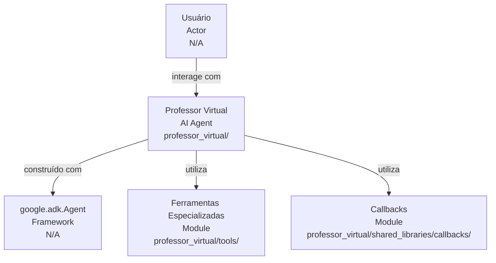
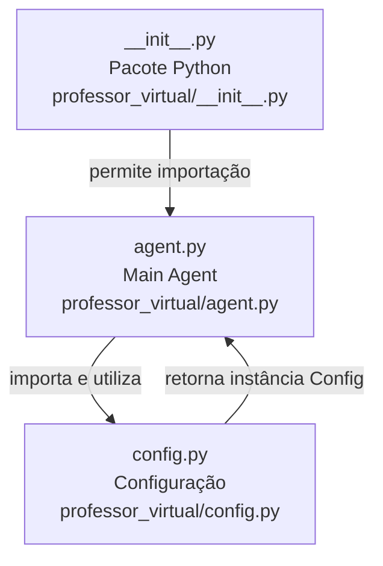
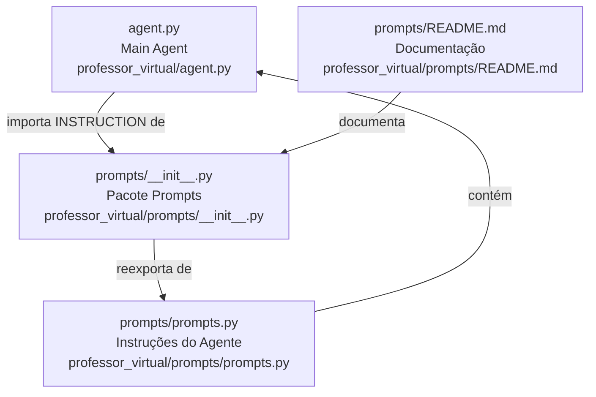
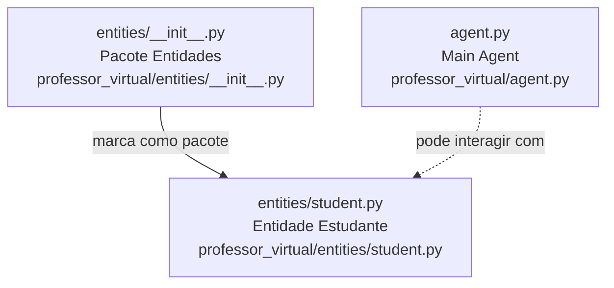
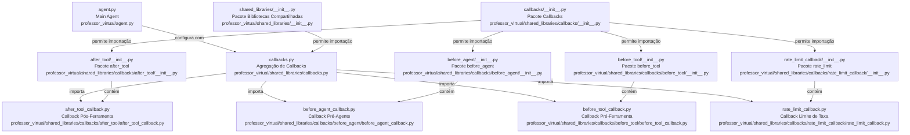
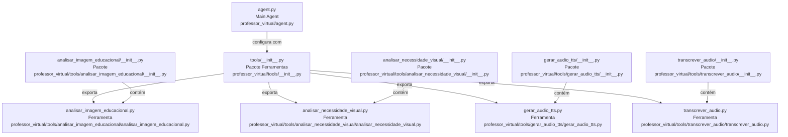
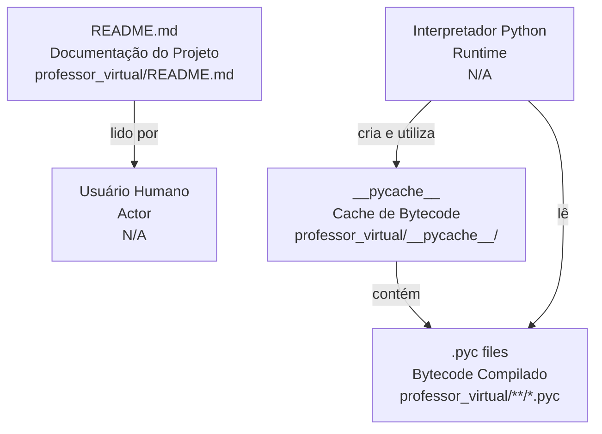

# Codebase Research Report

## Query
Revise todos os arquivos do diretório. Para cada arquivo forneça uma explicação detalhada sobre o que é o arquivo no contexto do projeto. Para que servem. Quem os chama. O que retornam. Como se relacionam com o arquivo "/Users/institutorecriare/VSCodeProjects/projeto_professor/professor-virtual/professor_virtual/agent.py". Em qual circunstâncias são chamados e o que retornam. Você é proibido de inferir informações. Consulte cada arquivo e somente retorne o que você tem certeza. 

## Answer
# Análise da Base de Código do Professor Virtual

Este relatório detalha a estrutura e a funcionalidade dos arquivos na base de código do projeto "Professor Virtual", com foco na sua relação com o arquivo central [agent.py](professor-virtual/professor_virtual/agent.py).

## Visão Geral do Projeto

O projeto "Professor Virtual" parece ser um agente de IA construído com o `google.adk.Agent`, projetado para interagir com os usuários e fornecer funcionalidades educacionais. Ele utiliza ferramentas especializadas e callbacks para gerenciar seu comportamento e interações.

## Arquivos de Configuração e Inicialização

### [config.py](professor-virtual/professor_virtual/config.py)
*   **Propósito:** Este arquivo é responsável por carregar e gerenciar as configurações do agente, como o modelo de IA a ser usado, o nome do agente e configurações para geração de conteúdo.
*   **Quem o chama:** O arquivo [agent.py](professor-virtual/professor_virtual/agent.py) importa e utiliza a classe `Config` para inicializar as configurações do agente.
*   **O que retorna:** Retorna uma instância da classe `Config`, que contém os atributos de configuração.
*   **Relação com [agent.py](professor-virtual/professor_virtual/agent.py):** O [agent.py](professor-virtual/professor_virtual/agent.py) depende diretamente do [config.py](professor-virtual/professor_virtual/config.py) para obter as configurações necessárias para instanciar o `Agent`.
*   **Circunstâncias de chamada e retorno:** É chamado uma vez durante a inicialização do [agent.py](professor-virtual/professor_virtual/agent.py) para carregar as configurações.

### [__init__.py](professor-virtual/professor_virtual/__init__.py)
*   **Propósito:** Este arquivo marca o diretório `professor_virtual` como um pacote Python, permitindo que seus módulos sejam importados.
*   **Quem o chama:** O interpretador Python o chama automaticamente quando o pacote é importado.
*   **O que retorna:** Não retorna explicitamente nada, mas sua presença permite a importação de módulos dentro do pacote.
*   **Relação com [agent.py](professor-virtual/professor_virtual/agent.py):** Indiretamente, permite que [agent.py](professor-virtual/professor_virtual/agent.py) importe outros módulos do mesmo pacote (e.g., `config`, `prompts`, `shared_libraries`, `tools`).
*   **Circunstâncias de chamada e retorno:** É processado pelo Python quando o pacote `professor_virtual` é importado.

## Arquivos de Prompts

### [prompts/__init__.py](professor-virtual/professor_virtual/prompts/__init__.py)
*   **Propósito:** Marca o diretório `prompts` como um pacote Python. Também pode ser usado para exportar variáveis ou funções de outros módulos dentro do pacote `prompts`.
*   **Quem o chama:** O interpretador Python o chama automaticamente quando o pacote `prompts` é importado.
*   **O que retorna:** Não retorna explicitamente nada.
*   **Relação com [agent.py](professor-virtual/professor_virtual/agent.py):** O [agent.py](professor-virtual/professor_virtual/agent.py) importa `INSTRUCTION` de `prompts`, o que implica que [prompts/__init__.py](professor-virtual/professor_virtual/prompts/__init__.py) pode estar reexportando-o de [prompts/prompts.py](professor-virtual/professor_virtual/prompts/prompts.py).
*   **Circunstâncias de chamada e retorno:** É processado pelo Python quando o pacote `prompts` é importado.

### [prompts/prompts.py](professor-virtual/professor_virtual/prompts/prompts.py)
*   **Propósito:** Este arquivo contém as instruções (prompts) que guiam o comportamento do agente de IA.
*   **Quem o chama:** O arquivo [agent.py](professor-virtual/professor_virtual/agent.py) importa `INSTRUCTION` deste módulo.
*   **O que retorna:** Contém variáveis que armazenam strings de instruções.
*   **Relação com [agent.py](professor-virtual/professor_virtual/agent.py):** O [agent.py](professor-virtual/professor_virtual/agent.py) utiliza as instruções definidas aqui para configurar o comportamento do `Agent`.
*   **Circunstâncias de chamada e retorno:** As variáveis são acessadas diretamente após a importação pelo [agent.py](professor-virtual/professor_virtual/agent.py).

### [prompts/README.md](professor-virtual/professor_virtual/prompts/README.md)
*   **Propósito:** Fornece documentação ou informações adicionais sobre o diretório `prompts`.
*   **Quem o chama:** Não é chamado por nenhum código Python. É um arquivo de documentação para humanos.
*   **O que retorna:** Conteúdo textual informativo.
*   **Relação com [agent.py](professor-virtual/professor_virtual/agent.py):** Nenhuma relação direta de código.
*   **Circunstâncias de chamada e retorno:** Não é chamado por código.

## Arquivos de Entidades

### [entities/__init__.py](professor-virtual/professor_virtual/entities/__init__.py)
*   **Propósito:** Marca o diretório `entities` como um pacote Python.
*   **Quem o chama:** O interpretador Python o chama automaticamente quando o pacote `entities` é importado.
*   **O que retorna:** Não retorna explicitamente nada.
*   **Relação com [agent.py](professor-virtual/professor_virtual/agent.py):** Nenhuma relação direta de código com [agent.py](professor-virtual/professor_virtual/agent.py) no momento, mas pode ser usado se o agente precisar interagir com entidades de estudante.
*   **Circunstâncias de chamada e retorno:** É processado pelo Python quando o pacote `entities` é importado.

### [entities/student.py](professor-virtual/professor_virtual/entities/student.py)
*   **Propósito:** Define a estrutura de dados ou classe para representar uma entidade de estudante.
*   **Quem o chama:** Não é chamado diretamente por [agent.py](professor-virtual/professor_virtual/agent.py) no código fornecido. Pode ser chamado por callbacks ou ferramentas que precisam manipular dados de estudantes.
*   **O que retorna:** Define uma classe ou estrutura de dados.
*   **Relação com [agent.py](professor-virtual/professor_virtual/agent.py):** Nenhuma relação direta de código. Se o agente precisar interagir com informações de estudantes, este módulo seria importado e utilizado.
*   **Circunstâncias de chamada e retorno:** Não é chamado por [agent.py](professor-virtual/professor_virtual/agent.py).

## Arquivos de Bibliotecas Compartilhadas (Callbacks)

### [shared_libraries/__init__.py](professor-virtual/professor_virtual/shared_libraries/__init__.py)
*   **Propósito:** Marca o diretório `shared_libraries` como um pacote Python.
*   **Quem o chama:** O interpretador Python o chama automaticamente quando o pacote `shared_libraries` é importado.
*   **O que retorna:** Não retorna explicitamente nada.
*   **Relação com [agent.py](professor-virtual/professor_virtual/agent.py):** Indiretamente, permite que [agent.py](professor-virtual/professor_virtual/agent.py) importe módulos de callback de `shared_libraries.callbacks`.
*   **Circunstâncias de chamada e retorno:** É processado pelo Python quando o pacote `shared_libraries` é importado.

### [shared_libraries/callbacks.py](professor-virtual/professor_virtual/shared_libraries/callbacks.py)
*   **Propósito:** Este arquivo parece ser um ponto de agregação ou reexportação para as funções de callback definidas em subdiretórios.
*   **Quem o chama:** O arquivo [agent.py](professor-virtual/professor_virtual/agent.py) importa as funções de callback (`rate_limit_callback`, `before_agent`, `before_tool`, `after_tool`) deste módulo.
*   **O que retorna:** Exporta as funções de callback para uso externo.
*   **Relação com [agent.py](professor-virtual/professor_virtual/agent.py):** O [agent.py](professor-virtual/professor_virtual/agent.py) configura o `Agent` com as funções de callback importadas deste arquivo.
*   **Circunstâncias de chamada e retorno:** As funções de callback são importadas e atribuídas aos parâmetros correspondentes do `Agent` durante a inicialização do [agent.py](professor-virtual/professor_virtual/agent.py).

### [shared_libraries/callbacks/__init__.py](professor-virtual/professor_virtual/shared_libraries/callbacks/__init__.py)
*   **Propósito:** Marca o diretório `callbacks` como um pacote Python. Pode ser usado para reexportar callbacks específicos.
*   **Quem o chama:** O interpretador Python o chama automaticamente quando o pacote `callbacks` é importado.
*   **O que retorna:** Não retorna explicitamente nada.
*   **Relação com [agent.py](professor-virtual/professor_virtual/agent.py):** Indiretamente, permite que [agent.py](professor-virtual/professor_virtual/agent.py) importe callbacks de `shared_libraries.callbacks`.
*   **Circunstâncias de chamada e retorno:** É processado pelo Python quando o pacote `callbacks` é importado.

### [shared_libraries/callbacks/after_tool/__init__.py](professor-virtual/professor_virtual/shared_libraries/callbacks/after_tool/__init__.py)
*   **Propósito:** Marca o diretório `after_tool` como um pacote Python.
*   **Quem o chama:** O interpretador Python o chama automaticamente quando o pacote `after_tool` é importado.
*   **O que retorna:** Não retorna explicitamente nada.
*   **Relação com [agent.py](professor-virtual/professor_virtual/agent.py):** Indiretamente, faz parte do caminho de importação para `after_tool_callback` usado em [agent.py](professor-virtual/professor_virtual/agent.py).
*   **Circunstâncias de chamada e retorno:** É processado pelo Python quando o pacote `after_tool` é importado.

### [shared_libraries/callbacks/after_tool/after_tool_callback.py](professor-virtual/professor_virtual/shared_libraries/callbacks/after_tool/after_tool_callback.py)
*   **Propósito:** Contém a implementação da função de callback que é executada **após** a execução de uma ferramenta pelo agente.
*   **Quem o chama:** A função `after_tool` é importada por [shared_libraries/callbacks.py](professor-virtual/professor_virtual/shared_libraries/callbacks.py) e, em seguida, atribuída ao parâmetro `after_tool_callback` do `Agent` em [agent.py](professor-virtual/professor_virtual/agent.py). O framework `google.adk` chama esta função automaticamente.
*   **O que retorna:** O tipo de retorno não é especificado no código, mas callbacks geralmente não retornam valores significativos para o fluxo principal, focando em efeitos colaterais (e.g., logging, modificação de estado).
*   **Relação com [agent.py](professor-virtual/professor_virtual/agent.py):** É uma das funções de callback configuradas no `Agent` em [agent.py](professor-virtual/professor_virtual/agent.py).
*   **Circunstâncias de chamada e retorno:** É chamado pelo framework `google.adk` sempre que uma ferramenta é executada pelo agente.

### [shared_libraries/callbacks/before_agent/__init__.py](professor-virtual/professor_virtual/shared_libraries/callbacks/before_agent/__init__.py)
*   **Propósito:** Marca o diretório `before_agent` como um pacote Python.
*   **Quem o chama:** O interpretador Python o chama automaticamente quando o pacote `before_agent` é importado.
*   **O que retorna:** Não retorna explicitamente nada.
*   **Relação com [agent.py](professor-virtual/professor_virtual/agent.py):** Indiretamente, faz parte do caminho de importação para `before_agent_callback` usado em [agent.py](professor-virtual/professor_virtual/agent.py).
*   **Circunstâncias de chamada e retorno:** É processado pelo Python quando o pacote `before_agent` é importado.

### [shared_libraries/callbacks/before_agent/before_agent_callback.py](professor-virtual/professor_virtual/shared_libraries/callbacks/before_agent/before_agent_callback.py)
*   **Propósito:** Contém a implementação da função de callback que é executada **antes** do agente iniciar seu processo de raciocínio ou ação.
*   **Quem o chama:** A função `before_agent` é importada por [shared_libraries/callbacks.py](professor-virtual/professor_virtual/shared_libraries/callbacks.py) e, em seguida, atribuída ao parâmetro `before_agent_callback` do `Agent` em [agent.py](professor-virtual/professor_virtual/agent.py). O framework `google.adk` chama esta função automaticamente.
*   **O que retorna:** O tipo de retorno não é especificado no código, mas callbacks geralmente não retornam valores significativos para o fluxo principal.
*   **Relação com [agent.py](professor-virtual/professor_virtual/agent.py):** É uma das funções de callback configuradas no `Agent` em [agent.py](professor-virtual/professor_virtual/agent.py).
*   **Circunstâncias de chamada e retorno:** É chamado pelo framework `google.adk` antes que o agente comece a processar uma nova entrada ou tarefa.

### [shared_libraries/callbacks/before_tool/__init__.py](professor-virtual/professor_virtual/shared_libraries/callbacks/before_tool/__init__.py)
*   **Propósito:** Marca o diretório `before_tool` como um pacote Python.
*   **Quem o chama:** O interpretador Python o chama automaticamente quando o pacote `before_tool` é importado.
*   **O que retorna:** Não retorna explicitamente nada.
*   **Relação com [agent.py](professor-virtual/professor_virtual/agent.py):** Indiretamente, faz parte do caminho de importação para `before_tool_callback` usado em [agent.py](professor-virtual/professor_virtual/agent.py).
*   **Circunstâncias de chamada e retorno:** É processado pelo Python quando o pacote `before_tool` é importado.

### [shared_libraries/callbacks/before_tool/before_tool_callback.py](professor-virtual/professor_virtual/shared_libraries/callbacks/before_tool/before_tool_callback.py)
*   **Propósito:** Contém a implementação da função de callback que é executada **antes** da execução de uma ferramenta pelo agente.
*   **Quem o chama:** A função `before_tool` é importada por [shared_libraries/callbacks.py](professor-virtual/professor_virtual/shared_libraries/callbacks.py) e, em seguida, atribuída ao parâmetro `before_tool_callback` do `Agent` em [agent.py](professor-virtual/professor_virtual/agent.py). O framework `google.adk` chama esta função automaticamente.
*   **O que retorna:** O tipo de retorno não é especificado no código, mas callbacks geralmente não retornam valores significativos para o fluxo principal.
*   **Relação com [agent.py](professor-virtual/professor_virtual/agent.py):** É uma das funções de callback configuradas no `Agent` em [agent.py](professor-virtual/professor_virtual/agent.py).
*   **Circunstâncias de chamada e retorno:** É chamado pelo framework `google.adk` antes que uma ferramenta seja executada pelo agente.

### [shared_libraries/callbacks/lowercase_value/__init__.py](professor-virtual/professor_virtual/shared_libraries/callbacks/lowercase_value/__init__.py)
*   **Propósito:** Marca o diretório `lowercase_value` como um pacote Python.
*   **Quem o chama:** O interpretador Python o chama automaticamente quando o pacote `lowercase_value` é importado.
*   **O que retorna:** Não retorna explicitamente nada.
*   **Relação com [agent.py](professor-virtual/professor_virtual/agent.py):** Nenhuma relação direta de código com [agent.py](professor-virtual/professor_virtual/agent.py). Pode ser um callback auxiliar para outras ferramentas ou callbacks.
*   **Circunstâncias de chamada e retorno:** É processado pelo Python quando o pacote `lowercase_value` é importado.

### [shared_libraries/callbacks/lowercase_value/lowercase_value.py](professor-virtual/professor_virtual/shared_libraries/callbacks/lowercase_value/lowercase_value.py)
*   **Propósito:** Provavelmente contém uma função de callback ou utilitário para converter um valor para minúsculas.
*   **Quem o chama:** Não é chamado diretamente por [agent.py](professor-virtual/professor_virtual/agent.py) ou [shared_libraries/callbacks.py](professor-virtual/professor_virtual/shared_libraries/callbacks.py) no código fornecido. Pode ser usado por outras ferramentas ou callbacks.
*   **O que retorna:** Uma string em minúsculas, se for uma função de transformação.
*   **Relação com [agent.py](professor-virtual/professor_virtual/agent.py):** Nenhuma relação direta de código.
*   **Circunstâncias de chamada e retorno:** Não é chamado por [agent.py](professor-virtual/professor_virtual/agent.py).

### [shared_libraries/callbacks/rate_limit_callback/__init__.py](professor-virtual/professor_virtual/shared_libraries/callbacks/rate_limit_callback/__init__.py)
*   **Propósito:** Marca o diretório `rate_limit_callback` como um pacote Python.
*   **Quem o chama:** O interpretador Python o chama automaticamente quando o pacote `rate_limit_callback` é importado.
*   **O que retorna:** Não retorna explicitamente nada.
*   **Relação com [agent.py](professor-virtual/professor_virtual/agent.py):** Indiretamente, faz parte do caminho de importação para `rate_limit_callback` usado em [agent.py](professor-virtual/professor_virtual/agent.py).
*   **Circunstâncias de chamada e retorno:** É processado pelo Python quando o pacote `rate_limit_callback` é importado.

### [shared_libraries/callbacks/rate_limit_callback/rate_limit_callback.py](professor-virtual/professor_virtual/shared_libraries/callbacks/rate_limit_callback/rate_limit_callback.py)
*   **Propósito:** Contém a implementação da função de callback responsável por aplicar limites de taxa às chamadas do modelo.
*   **Quem o chama:** A função `rate_limit_callback` é importada por [shared_libraries/callbacks.py](professor-virtual/professor_virtual/shared_libraries/callbacks.py) e, em seguida, atribuída ao parâmetro `before_model_callback` do `Agent` em [agent.py](professor-virtual/professor_virtual/agent.py). O framework `google.adk` chama esta função automaticamente.
*   **O que retorna:** O tipo de retorno não é especificado no código, mas callbacks geralmente não retornam valores significativos para o fluxo principal, focando em efeitos colaterais (e.g., atrasar a execução, levantar exceções).
*   **Relação com [agent.py](professor-virtual/professor_virtual/agent.py):** É uma das funções de callback configuradas no `Agent` em [agent.py](professor-virtual/professor_virtual/agent.py).
*   **Circunstâncias de chamada e retorno:** É chamado pelo framework `google.adk` antes de cada chamada ao modelo de IA.

### [shared_libraries/callbacks/validate_student_id/__init__.py](professor-virtual/professor_virtual/shared_libraries/callbacks/validate_student_id/__init__.py)
*   **Propósito:** Marca o diretório `validate_student_id` como um pacote Python.
*   **Quem o chama:** O interpretador Python o chama automaticamente quando o pacote `validate_student_id` é importado.
*   **O que retorna:** Não retorna explicitamente nada.
*   **Relação com [agent.py](professor-virtual/professor_virtual/agent.py):** Nenhuma relação direta de código com [agent.py](professor-virtual/professor_virtual/agent.py). Pode ser um callback auxiliar para outras ferramentas ou callbacks.
*   **Circunstâncias de chamada e retorno:** É processado pelo Python quando o pacote `validate_student_id` é importado.

### [shared_libraries/callbacks/validate_student_id/validate_student_id_callback.py](professor-virtual/professor_virtual/shared_libraries/callbacks/validate_student_id/validate_student_id_callback.py)
*   **Propósito:** Provavelmente contém uma função de callback ou utilitário para validar IDs de estudantes.
*   **Quem o chama:** Não é chamado diretamente por [agent.py](professor-virtual/professor_virtual/agent.py) ou [shared_libraries/callbacks.py](professor-virtual/professor_virtual/shared_libraries/callbacks.py) no código fornecido. Pode ser usado por outras ferramentas ou callbacks.
*   **O que retorna:** Um booleano (True/False) ou um valor validado, se for uma função de validação.
*   **Relação com [agent.py](professor-virtual/professor_virtual/agent.py):** Nenhuma relação direta de código.
*   **Circunstâncias de chamada e retorno:** Não é chamado por [agent.py](professor-virtual/professor_virtual/agent.py).

## Arquivos de Ferramentas (Tools)

### [tools/__init__.py](professor-virtual/professor_virtual/tools/__init__.py)
*   **Propósito:** Marca o diretório `tools` como um pacote Python. Também é usado para reexportar as ferramentas individuais para que possam ser importadas diretamente de `professor_virtual.tools`.
*   **Quem o chama:** O arquivo [agent.py](professor-virtual/professor_virtual/agent.py) importa as ferramentas (`transcrever_audio`, `analisar_necessidade_visual`, `analisar_imagem_educacional`, `gerar_audio_tts`) deste módulo.
*   **O que retorna:** Exporta as ferramentas para uso externo.
*   **Relação com [agent.py](professor-virtual/professor_virtual/agent.py):** O [agent.py](professor-virtual/professor_virtual/agent.py) configura o `Agent` com a lista de ferramentas importadas deste arquivo.
*   **Circunstâncias de chamada e retorno:** As ferramentas são importadas e passadas como uma lista para o parâmetro `tools` do `Agent` durante a inicialização do [agent.py](professor-virtual/professor_virtual/agent.py).

### [tools/analisar_imagem_educacional/__init__.py](professor-virtual/professor_virtual/tools/analisar_imagem_educacional/__init__.py)
*   **Propósito:** Marca o diretório `analisar_imagem_educacional` como um pacote Python.
*   **Quem o chama:** O interpretador Python o chama automaticamente quando o pacote `analisar_imagem_educacional` é importado.
*   **O que retorna:** Não retorna explicitamente nada.
*   **Relação com [agent.py](professor-virtual/professor_virtual/agent.py):** Indiretamente, faz parte do caminho de importação para a ferramenta `analisar_imagem_educacional` usada em [agent.py](professor-virtual/professor_virtual/agent.py).
*   **Circunstâncias de chamada e retorno:** É processado pelo Python quando o pacote `analisar_imagem_educacional` é importado.

### [tools/analisar_imagem_educacional/analisar_imagem_educacional.py](professor-virtual/professor_virtual/tools/analisar_imagem_educacional/analisar_imagem_educacional.py)
*   **Propósito:** Contém a implementação da ferramenta para analisar imagens educacionais.
*   **Quem o chama:** A ferramenta `analisar_imagem_educacional` é importada por [tools/__init__.py](professor-virtual/professor_virtual/tools/__init__.py) e, em seguida, incluída na lista de ferramentas do `Agent` em [agent.py](professor-virtual/professor_virtual/agent.py). O agente de IA decide quando chamar esta ferramenta com base na sua instrução e na entrada do usuário.
*   **O que retorna:** O tipo de retorno não é especificado no código, mas uma ferramenta geralmente retorna o resultado de sua operação (e.g., uma análise textual da imagem).
*   **Relação com [agent.py](professor-virtual/professor_virtual/agent.py):** É uma das ferramentas disponíveis para o `Agent` em [agent.py](professor-virtual/professor_virtual/agent.py).
*   **Circunstâncias de chamada e retorno:** É chamada pelo agente de IA quando ele determina que a análise de uma imagem educacional é necessária para responder à consulta do usuário.

### [tools/analisar_necessidade_visual/__init__.py](professor-virtual/professor_virtual/tools/analisar_necessidade_visual/__init__.py)
*   **Propósito:** Marca o diretório `analisar_necessidade_visual` como um pacote Python.
*   **Quem o chama:** O interpretador Python o chama automaticamente quando o pacote `analisar_necessidade_visual` é importado.
*   **O que retorna:** Não retorna explicitamente nada.
*   **Relação com [agent.py](professor-virtual/professor_virtual/agent.py):** Indiretamente, faz parte do caminho de importação para a ferramenta `analisar_necessidade_visual` usada em [agent.py](professor-virtual/professor_virtual/agent.py).
*   **Circunstâncias de chamada e retorno:** É processado pelo Python quando o pacote `analisar_necessidade_visual` é importado.

### [tools/analisar_necessidade_visual/analisar_necessidade_visual.py](professor-virtual/professor_virtual/tools/analisar_necessidade_visual/analisar_necessidade_visual.py)
*   **Propósito:** Contém a implementação da ferramenta para analisar necessidades visuais.
*   **Quem o chama:** A ferramenta `analisar_necessidade_visual` é importada por [tools/__init__.py](professor-virtual/professor_virtual/tools/__init__.py) e, em seguida, incluída na lista de ferramentas do `Agent` em [agent.py](professor-virtual/professor_virtual/agent.py). O agente de IA decide quando chamar esta ferramenta com base na sua instrução e na entrada do usuário.
*   **O que retorna:** O tipo de retorno não é especificado no código, mas uma ferramenta geralmente retorna o resultado de sua operação (e.g., uma avaliação da necessidade visual).
*   **Relação com [agent.py](professor-virtual/professor_virtual/agent.py):** É uma das ferramentas disponíveis para o `Agent` em [agent.py](professor-virtual/professor_virtual/agent.py).
*   **Circunstâncias de chamada e retorno:** É chamada pelo agente de IA quando ele determina que a análise de uma necessidade visual é relevante para responder à consulta do usuário.

### [tools/gerar_audio_tts/__init__.py](professor-virtual/professor_virtual/tools/gerar_audio_tts/__init__.py)
*   **Propósito:** Marca o diretório `gerar_audio_tts` como um pacote Python.
*   **Quem o chama:** O interpretador Python o chama automaticamente quando o pacote `gerar_audio_tts` é importado.
*   **O que retorna:** Não retorna explicitamente nada.
*   **Relação com [agent.py](professor-virtual/professor_virtual/agent.py):** Indiretamente, faz parte do caminho de importação para a ferramenta `gerar_audio_tts` usada em [agent.py](professor-virtual/professor_virtual/agent.py).
*   **Circunstâncias de chamada e retorno:** É processado pelo Python quando o pacote `gerar_audio_tts` é importado.

### [tools/gerar_audio_tts/gerar_audio_tts.py](professor-virtual/professor_virtual/tools/gerar_audio_tts/gerar_audio_tts.py)
*   **Propósito:** Contém a implementação da ferramenta para gerar áudio a partir de texto (Text-to-Speech - TTS).
*   **Quem o chama:** A ferramenta `gerar_audio_tts` é importada por [tools/__init__.py](professor-virtual/professor_virtual/tools/__init__.py) e, em seguida, incluída na lista de ferramentas do `Agent` em [agent.py](professor-virtual/professor_virtual/agent.py). O agente de IA decide quando chamar esta ferramenta com base na sua instrução e na entrada do usuário.
*   **O que retorna:** O tipo de retorno não é especificado no código, mas uma ferramenta TTS geralmente retorna o áudio gerado (e.g., um caminho de arquivo, dados de áudio).
*   **Relação com [agent.py](professor-virtual/professor_virtual/agent.py):** É uma das ferramentas disponíveis para o `Agent` em [agent.py](professor-virtual/professor_virtual/agent.py).
*   **Circunstâncias de chamada e retorno:** É chamada pelo agente de IA quando ele determina que a geração de áudio é necessária para responder à consulta do usuário.

### [tools/transcrever_audio/__init__.py](professor-virtual/professor_virtual/tools/transcrever_audio/__init__.py)
*   **Propósito:** Marca o diretório `transcrever_audio` como um pacote Python.
*   **Quem o chama:** O interpretador Python o chama automaticamente quando o pacote `transcrever_audio` é importado.
*   **O que retorna:** Não retorna explicitamente nada.
*   **Relação com [agent.py](professor-virtual/professor_virtual/agent.py):** Indiretamente, faz parte do caminho de importação para a ferramenta `transcrever_audio` usada em [agent.py](professor-virtual/professor_virtual/agent.py).
*   **Circunstâncias de chamada e retorno:** É processado pelo Python quando o pacote `transcrever_audio` é importado.

### [tools/transcrever_audio/transcrever_audio.py](professor-virtual/professor_virtual/tools/transcrever_audio/transcrever_audio.py)
*   **Propósito:** Contém a implementação da ferramenta para transcrever áudio para texto.
*   **Quem o chama:** A ferramenta `transcrever_audio` é importada por [tools/__init__.py](professor-virtual/professor_virtual/tools/__init__.py) e, em seguida, incluída na lista de ferramentas do `Agent` em [agent.py](professor-virtual/professor_virtual/agent.py). O agente de IA decide quando chamar esta ferramenta com base na sua instrução e na entrada do usuário.
*   **O que retorna:** O tipo de retorno não é especificado no código, mas uma ferramenta de transcrição geralmente retorna o texto transcrito.
*   **Relação com [agent.py](professor-virtual/professor_virtual/agent.py):** É uma das ferramentas disponíveis para o `Agent` em [agent.py](professor-virtual/professor_virtual/agent.py).
*   **Circunstâncias de chamada e retorno:** É chamada pelo agente de IA quando ele determina que a transcrição de áudio é necessária para responder à consulta do usuário.

## Outros Arquivos

### [README.md](professor-virtual/professor_virtual/README.md)
*   **Propósito:** Fornece uma visão geral do projeto, instruções de configuração, uso e outras informações importantes.
*   **Quem o chama:** Não é chamado por nenhum código Python. É um arquivo de documentação para humanos.
*   **O que retorna:** Conteúdo textual informativo.
*   **Relação com [agent.py](professor-virtual/professor_virtual/agent.py):** Nenhuma relação direta de código.
*   **Circunstâncias de chamada e retorno:** Não é chamado por código.

### Arquivos `__pycache__` e `.pyc`
*   **Propósito:** Estes diretórios e arquivos (`.pyc`) são gerados automaticamente pelo Python para armazenar versões compiladas em bytecode dos módulos Python. Isso acelera o tempo de carregamento de módulos em execuções subsequentes.
*   **Quem os chama:** O interpretador Python os cria e os utiliza internamente.
*   **O que retorna:** Não retornam valores diretamente; são arquivos de cache.
*   **Relação com [agent.py](professor-virtual/professor_virtual/agent.py):** Indiretamente, contribuem para o desempenho do carregamento dos módulos que [agent.py](professor-virtual/professor_virtual/agent.py) importa.
*   **Circunstâncias de chamada e retorno:** São criados ou lidos pelo Python quando os módulos correspondentes são importados.
# Análise da Base de Código do Professor Virtual

Este relatório detalha a estrutura e a funcionalidade dos arquivos na base de código do projeto "Professor Virtual", com foco na sua relação com o arquivo central [agent.py](professor-virtual/professor_virtual/agent.py).

## Visão Geral do Projeto

O projeto "Professor Virtual" parece ser um agente de IA construído com o `google.adk.Agent`, projetado para interagir com os usuários e fornecer funcionalidades educacionais. Ele utiliza ferramentas especializadas e callbacks para gerenciar seu comportamento e interações.

## Arquivos de Configuração e Inicialização

### [config.py](professor-virtual/professor_virtual/config.py)
*   **Propósito:** Este arquivo é responsável por carregar e gerenciar as configurações do agente, como o modelo de IA a ser usado, o nome do agente e configurações para geração de conteúdo.
*   **Quem o chama:** O arquivo [agent.py](professor-virtual/professor_virtual/agent.py) importa e utiliza a classe `Config` para inicializar as configurações do agente.
*   **O que retorna:** Retorna uma instância da classe `Config`, que contém os atributos de configuração.
*   **Relação com [agent.py](professor-virtual/professor_virtual/agent.py):** O [agent.py](professor-virtual/professor_virtual/agent.py) depende diretamente do [config.py](professor-virtual/professor_virtual/config.py) para obter as configurações necessárias para instanciar o `Agent`.
*   **Circunstâncias de chamada e retorno:** É chamado uma vez durante a inicialização do [agent.py](professor-virtual/professor_virtual/agent.py) para carregar as configurações.

### [__init__.py](professor-virtual/professor_virtual/__init__.py)
*   **Propósito:** Este arquivo marca o diretório `professor_virtual` como um pacote Python, permitindo que seus módulos sejam importados.
*   **Quem o chama:** O interpretador Python o chama automaticamente quando o pacote é importado.
*   **O que retorna:** Não retorna explicitamente nada, mas sua presença permite a importação de módulos dentro do pacote.
*   **Relação com [agent.py](professor-virtual/professor_virtual/agent.py):** Indiretamente, permite que [agent.py](professor-virtual/professor_virtual/agent.py) importe outros módulos do mesmo pacote (e.g., `config`, `prompts`, `shared_libraries`, `tools`).
*   **Circunstâncias de chamada e retorno:** É processado pelo Python quando o pacote `professor_virtual` é importado.

## Arquivos de Prompts

### [prompts/__init__.py](professor-virtual/professor_virtual/prompts/__init__.py)
*   **Propósito:** Marca o diretório `prompts` como um pacote Python. Também pode ser usado para exportar variáveis ou funções de outros módulos dentro do pacote `prompts`.
*   **Quem o chama:** O interpretador Python o chama automaticamente quando o pacote `prompts` é importado.
*   **O que retorna:** Não retorna explicitamente nada.
*   **Relação com [agent.py](professor-virtual/professor_virtual/agent.py):** O [agent.py](professor-virtual/professor_virtual/agent.py) importa `INSTRUCTION` de `prompts`, o que implica que [prompts/__init__.py](professor-virtual/professor_virtual/prompts/__init__.py) pode estar reexportando-o de [prompts/prompts.py](professor-virtual/professor_virtual/prompts/prompts.py).
*   **Circunstâncias de chamada e retorno:** É processado pelo Python quando o pacote `prompts` é importado.

### [prompts/prompts.py](professor-virtual/professor_virtual/prompts/prompts.py)
*   **Propósito:** Este arquivo contém as instruções (prompts) que guiam o comportamento do agente de IA.
*   **Quem o chama:** O arquivo [agent.py](professor-virtual/professor_virtual/agent.py) importa `INSTRUCTION` deste módulo.
*   **O que retorna:** Contém variáveis que armazenam strings de instruções.
*   **Relação com [agent.py](professor-virtual/professor_virtual/agent.py):** O [agent.py](professor-virtual/professor_virtual/agent.py) utiliza as instruções definidas aqui para configurar o comportamento do `Agent`.
*   **Circunstâncias de chamada e retorno:** As variáveis são acessadas diretamente após a importação pelo [agent.py](professor-virtual/professor_virtual/agent.py).

### [prompts/README.md](professor-virtual/professor_virtual/prompts/README.md)
*   **Propósito:** Fornece documentação ou informações adicionais sobre o diretório `prompts`.
*   **Quem o chama:** Não é chamado por nenhum código Python. É um arquivo de documentação para humanos.
*   **O que retorna:** Conteúdo textual informativo.
*   **Relação com [agent.py](professor-virtual/professor_virtual/agent.py):** Nenhuma relação direta de código.
*   **Circunstâncias de chamada e retorno:** Não é chamado por código.

## Arquivos de Entidades

### [entities/__init__.py](professor-virtual/professor_virtual/entities/__init__.py)
*   **Propósito:** Marca o diretório `entities` como um pacote Python.
*   **Quem o chama:** O interpretador Python o chama automaticamente quando o pacote `entities` é importado.
*   **O que retorna:** Não retorna explicitamente nada.
*   **Relação com [agent.py](professor-virtual/professor_virtual/agent.py):** Nenhuma relação direta de código com [agent.py](professor-virtual/professor_virtual/agent.py) no momento, mas pode ser usado se o agente precisar interagir com entidades de estudante.
*   **Circunstâncias de chamada e retorno:** É processado pelo Python quando o pacote `entities` é importado.

### [entities/student.py](professor-virtual/professor_virtual/entities/student.py)
*   **Propósito:** Define a estrutura de dados ou classe para representar uma entidade de estudante.
*   **Quem o chama:** Não é chamado diretamente por [agent.py](professor-virtual/professor_virtual/agent.py) no código fornecido. Pode ser chamado por callbacks ou ferramentas que precisam manipular dados de estudantes.
*   **O que retorna:** Define uma classe ou estrutura de dados.
*   **Relação com [agent.py](professor-virtual/professor_virtual/agent.py):** Nenhuma relação direta de código. Se o agente precisar interagir com informações de estudantes, este módulo seria importado e utilizado.
*   **Circunstâncias de chamada e retorno:** Não é chamado por [agent.py](professor-virtual/professor_virtual/agent.py).

## Arquivos de Bibliotecas Compartilhadas (Callbacks)

### [shared_libraries/__init__.py](professor-virtual/professor_virtual/shared_libraries/__init__.py)
*   **Propósito:** Marca o diretório `shared_libraries` como um pacote Python.
*   **Quem o chama:** O interpretador Python o chama automaticamente quando o pacote `shared_libraries` é importado.
*   **O que retorna:** Não retorna explicitamente nada.
*   **Relação com [agent.py](professor-virtual/professor_virtual/agent.py):** Indiretamente, permite que [agent.py](professor-virtual/professor_virtual/agent.py) importe módulos de callback de `shared_libraries.callbacks`.
*   **Circunstâncias de chamada e retorno:** É processado pelo Python quando o pacote `shared_libraries` é importado.

### [shared_libraries/callbacks.py](professor-virtual/professor_virtual/shared_libraries/callbacks.py)
*   **Propósito:** Este arquivo parece ser um ponto de agregação ou reexportação para as funções de callback definidas em subdiretórios.
*   **Quem o chama:** O arquivo [agent.py](professor-virtual/professor_virtual/agent.py) importa as funções de callback (`rate_limit_callback`, `before_agent`, `before_tool`, `after_tool`) deste módulo.
*   **O que retorna:** Exporta as funções de callback para uso externo.
*   **Relação com [agent.py](professor-virtual/professor_virtual/agent.py):** O [agent.py](professor-virtual/professor_virtual/agent.py) configura o `Agent` com as funções de callback importadas deste arquivo.
*   **Circunstâncias de chamada e retorno:** As funções de callback são importadas e atribuídas aos parâmetros correspondentes do `Agent` durante a inicialização do [agent.py](professor-virtual/professor_virtual/agent.py).

### [shared_libraries/callbacks/__init__.py](professor-virtual/professor_virtual/shared_libraries/callbacks/__init__.py)
*   **Propósito:** Marca o diretório `callbacks` como um pacote Python. Pode ser usado para reexportar callbacks específicos.
*   **Quem o chama:** O interpretador Python o chama automaticamente quando o pacote `callbacks` é importado.
*   **O que retorna:** Não retorna explicitamente nada.
*   **Relação com [agent.py](professor-virtual/professor_virtual/agent.py):** Indiretamente, permite que [agent.py](professor-virtual/professor_virtual/agent.py) importe callbacks de `shared_libraries.callbacks`.
*   **Circunstâncias de chamada e retorno:** É processado pelo Python quando o pacote `callbacks` é importado.

### [shared_libraries/callbacks/after_tool/__init__.py](professor-virtual/professor_virtual/shared_libraries/callbacks/after_tool/__init__.py)
*   **Propósito:** Marca o diretório `after_tool` como um pacote Python.
*   **Quem o chama:** O interpretador Python o chama automaticamente quando o pacote `after_tool` é importado.
*   **O que retorna:** Não retorna explicitamente nada.
*   **Relação com [agent.py](professor-virtual/professor_virtual/agent.py):** Indiretamente, faz parte do caminho de importação para `after_tool_callback` usado em [agent.py](professor-virtual/professor_virtual/agent.py).
*   **Circunstâncias de chamada e retorno:** É processado pelo Python quando o pacote `after_tool` é importado.

### [shared_libraries/callbacks/after_tool/after_tool_callback.py](professor-virtual/professor_virtual/shared_libraries/callbacks/after_tool/after_tool_callback.py)
*   **Propósito:** Contém a implementação da função de callback que é executada **após** a execução de uma ferramenta pelo agente.
*   **Quem o chama:** A função `after_tool` é importada por [shared_libraries/callbacks.py](professor-virtual/professor_virtual/shared_libraries/callbacks.py) e, em seguida, atribuída ao parâmetro `after_tool_callback` do `Agent` em [agent.py](professor-virtual/professor_virtual/agent.py). O framework `google.adk` chama esta função automaticamente.
*   **O que retorna:** O tipo de retorno não é especificado no código, mas callbacks geralmente não retornam valores significativos para o fluxo principal, focando em efeitos colaterais (e.g., logging, modificação de estado).
*   **Relação com [agent.py](professor-virtual/professor_virtual/agent.py):** É uma das funções de callback configuradas no `Agent` em [agent.py](professor-virtual/professor_virtual/agent.py).
*   **Circunstâncias de chamada e retorno:** É chamado pelo framework `google.adk` sempre que uma ferramenta é executada pelo agente.

### [shared_libraries/callbacks/before_agent/__init__.py](professor-virtual/professor_virtual/shared_libraries/callbacks/before_agent/__init__.py)
*   **Propósito:** Marca o diretório `before_agent` como um pacote Python.
*   **Quem o chama:** O interpretador Python o chama automaticamente quando o pacote `before_agent` é importado.
*   **O que retorna:** Não retorna explicitamente nada.
*   **Relação com [agent.py](professor-virtual/professor_virtual/agent.py):** Indiretamente, faz parte do caminho de importação para `before_agent_callback` usado em [agent.py](professor-virtual/professor_virtual/agent.py).
*   **Circunstâncias de chamada e retorno:** É processado pelo Python quando o pacote `before_agent` é importado.

### [shared_libraries/callbacks/before_agent/before_agent_callback.py](professor-virtual/professor_virtual/shared_libraries/callbacks/before_agent/before_agent_callback.py)
*   **Propósito:** Contém a implementação da função de callback que é executada **antes** do agente iniciar seu processo de raciocínio ou ação.
*   **Quem o chama:** A função `before_agent` é importada por [shared_libraries/callbacks.py](professor-virtual/professor_virtual/shared_libraries/callbacks.py) e, em seguida, atribuída ao parâmetro `before_agent_callback` do `Agent` em [agent.py](professor-virtual/professor_virtual/agent.py). O framework `google.adk` chama esta função automaticamente.
*   **O que retorna:** O tipo de retorno não é especificado no código, mas callbacks geralmente não retornam valores significativos para o fluxo principal.
*   **Relação com [agent.py](professor-virtual/professor_virtual/agent.py):** É uma das funções de callback configuradas no `Agent` em [agent.py](professor-virtual/professor_virtual/agent.py).
*   **Circunstâncias de chamada e retorno:** É chamado pelo framework `google.adk` antes que o agente comece a processar uma nova entrada ou tarefa.

### [shared_libraries/callbacks/before_tool/__init__.py](professor-virtual/professor_virtual/shared_libraries/callbacks/before_tool/__init__.py)
*   **Propósito:** Marca o diretório `before_tool` como um pacote Python.
*   **Quem o chama:** O interpretador Python o chama automaticamente quando o pacote `before_tool` é importado.
*   **O que retorna:** Não retorna explicitamente nada.
*   **Relação com [agent.py](professor-virtual/professor_virtual/agent.py):** Indiretamente, faz parte do caminho de importação para `before_tool_callback` usado em [agent.py](professor-virtual/professor_virtual/agent.py).
*   **Circunstâncias de chamada e retorno:** É processado pelo Python quando o pacote `before_tool` é importado.

### [shared_libraries/callbacks/before_tool/before_tool_callback.py](professor-virtual/professor_virtual/shared_libraries/callbacks/before_tool/before_tool_callback.py)
*   **Propósito:** Contém a implementação da função de callback que é executada **antes** da execução de uma ferramenta pelo agente.
*   **Quem o chama:** A função `before_tool` é importada por [shared_libraries/callbacks.py](professor-virtual/professor_virtual/shared_libraries/callbacks.py) e, em seguida, atribuída ao parâmetro `before_tool_callback` do `Agent` em [agent.py](professor-virtual/professor_virtual/agent.py). O framework `google.adk` chama esta função automaticamente.
*   **O que retorna:** O tipo de retorno não é especificado no código, mas callbacks geralmente não retornam valores significativos para o fluxo principal.
*   **Relação com [agent.py](professor-virtual/professor_virtual/agent.py):** É uma das funções de callback configuradas no `Agent` em [agent.py](professor-virtual/professor_virtual/agent.py).
*   **Circunstâncias de chamada e retorno:** É chamado pelo framework `google.adk` antes que uma ferramenta seja executada pelo agente.

### [shared_libraries/callbacks/lowercase_value/__init__.py](professor-virtual/professor_virtual/shared_libraries/callbacks/lowercase_value/__init__.py)
*   **Propósito:** Marca o diretório `lowercase_value` como um pacote Python.
*   **Quem o chama:** O interpretador Python o chama automaticamente quando o pacote `lowercase_value` é importado.
*   **O que retorna:** Não retorna explicitamente nada.
*   **Relação com [agent.py](professor-virtual/professor_virtual/agent.py):** Nenhuma relação direta de código com [agent.py](professor-virtual/professor_virtual/agent.py). Pode ser um callback auxiliar para outras ferramentas ou callbacks.
*   **Circunstâncias de chamada e retorno:** É processado pelo Python quando o pacote `lowercase_value` é importado.

### [shared_libraries/callbacks/lowercase_value/lowercase_value.py](professor-virtual/professor_virtual/shared_libraries/callbacks/lowercase_value/lowercase_value.py)
*   **Propósito:** Provavelmente contém uma função de callback ou utilitário para converter um valor para minúsculas.
*   **Quem o chama:** Não é chamado diretamente por [agent.py](professor-virtual/professor_virtual/agent.py) ou [shared_libraries/callbacks.py](professor-virtual/professor_virtual/shared_libraries/callbacks.py) no código fornecido. Pode ser usado por outras ferramentas ou callbacks.
*   **O que retorna:** Uma string em minúsculas, se for uma função de transformação.
*   **Relação com [agent.py](professor-virtual/professor_virtual/agent.py):** Nenhuma relação direta de código.
*   **Circunstâncias de chamada e retorno:** Não é chamado por [agent.py](professor-virtual/professor_virtual/agent.py).

### [shared_libraries/callbacks/rate_limit_callback/__init__.py](professor-virtual/professor_virtual/shared_libraries/callbacks/rate_limit_callback/__init__.py)
*   **Propósito:** Marca o diretório `rate_limit_callback` como um pacote Python.
*   **Quem o chama:** O interpretador Python o chama automaticamente quando o pacote `rate_limit_callback` é importado.
*   **O que retorna:** Não retorna explicitamente nada.
*   **Relação com [agent.py](professor-virtual/professor_virtual/agent.py):** Indiretamente, faz parte do caminho de importação para `rate_limit_callback` usado em [agent.py](professor-virtual/professor_virtual/agent.py).
*   **Circunstâncias de chamada e retorno:** É processado pelo Python quando o pacote `rate_limit_callback` é importado.

### [shared_libraries/callbacks/rate_limit_callback/rate_limit_callback.py](professor-virtual/professor_virtual/shared_libraries/callbacks/rate_limit_callback/rate_limit_callback.py)
*   **Propósito:** Contém a implementação da função de callback responsável por aplicar limites de taxa às chamadas do modelo.
*   **Quem o chama:** A função `rate_limit_callback` é importada por [shared_libraries/callbacks.py](professor-virtual/professor_virtual/shared_libraries/callbacks.py) e, em seguida, atribuída ao parâmetro `before_model_callback` do `Agent` em [agent.py](professor-virtual/professor_virtual/agent.py). O framework `google.adk` chama esta função automaticamente.
*   **O que retorna:** O tipo de retorno não é especificado no código, mas callbacks geralmente não retornam valores significativos para o fluxo principal, focando em efeitos colaterais (e.g., atrasar a execução, levantar exceções).
*   **Relação com [agent.py](professor-virtual/professor_virtual/agent.py):** É uma das funções de callback configuradas no `Agent` em [agent.py](professor-virtual/professor_virtual/agent.py).
*   **Circunstâncias de chamada e retorno:** É chamado pelo framework `google.adk` antes de cada chamada ao modelo de IA.

### [shared_libraries/callbacks/validate_student_id/__init__.py](professor-virtual/professor_virtual/shared_libraries/callbacks/validate_student_id/__init__.py)
*   **Propósito:** Marca o diretório `validate_student_id` como um pacote Python.
*   **Quem o chama:** O interpretador Python o chama automaticamente quando o pacote `validate_student_id` é importado.
*   **O que retorna:** Não retorna explicitamente nada.
*   **Relação com [agent.py](professor-virtual/professor_virtual/agent.py):** Nenhuma relação direta de código com [agent.py](professor-virtual/professor_virtual/agent.py). Pode ser um callback auxiliar para outras ferramentas ou callbacks.
*   **Circunstâncias de chamada e retorno:** É processado pelo Python quando o pacote `validate_student_id` é importado.

### [shared_libraries/callbacks/validate_student_id/validate_student_id_callback.py](professor-virtual/professor_virtual/shared_libraries/callbacks/validate_student_id/validate_student_id_callback.py)
*   **Propósito:** Provavelmente contém uma função de callback ou utilitário para validar IDs de estudantes.
*   **Quem o chama:** Não é chamado diretamente por [agent.py](professor-virtual/professor_virtual/agent.py) ou [shared_libraries/callbacks.py](professor-virtual/professor_virtual/shared_libraries/callbacks.py) no código fornecido. Pode ser usado por outras ferramentas ou callbacks.
*   **O que retorna:** Um booleano (True/False) ou um valor validado, se for uma função de validação.
*   **Relação com [agent.py](professor-virtual/professor_virtual/agent.py):** Nenhuma relação direta de código.
*   **Circunstâncias de chamada e retorno:** Não é chamado por [agent.py](professor-virtual/professor_virtual/agent.py).

## Arquivos de Ferramentas (Tools)

### [tools/__init__.py](professor-virtual/professor_virtual/tools/__init__.py)
*   **Propósito:** Marca o diretório `tools` como um pacote Python. Também é usado para reexportar as ferramentas individuais para que possam ser importadas diretamente de `professor_virtual.tools`.
*   **Quem o chama:** O arquivo [agent.py](professor-virtual/professor_virtual/agent.py) importa as ferramentas (`transcrever_audio`, `analisar_necessidade_visual`, `analisar_imagem_educacional`, `gerar_audio_tts`) deste módulo.
*   **O que retorna:** Exporta as ferramentas para uso externo.
*   **Relação com [agent.py](professor-virtual/professor_virtual/agent.py):** O [agent.py](professor-virtual/professor_virtual/agent.py) configura o `Agent` com a lista de ferramentas importadas deste arquivo.
*   **Circunstâncias de chamada e retorno:** As ferramentas são importadas e passadas como uma lista para o parâmetro `tools` do `Agent` durante a inicialização do [agent.py](professor-virtual/professor_virtual/agent.py).

### [tools/analisar_imagem_educacional/__init__.py](professor-virtual/professor_virtual/tools/analisar_imagem_educacional/__init__.py)
*   **Propósito:** Marca o diretório `analisar_imagem_educacional` como um pacote Python.
*   **Quem o chama:** O interpretador Python o chama automaticamente quando o pacote `analisar_imagem_educacional` é importado.
*   **O que retorna:** Não retorna explicitamente nada.
*   **Relação com [agent.py](professor-virtual/professor_virtual/agent.py):** Indiretamente, faz parte do caminho de importação para a ferramenta `analisar_imagem_educacional` usada em [agent.py](professor-virtual/professor_virtual/agent.py).
*   **Circunstâncias de chamada e retorno:** É processado pelo Python quando o pacote `analisar_imagem_educacional` é importado.

### [tools/analisar_imagem_educacional/analisar_imagem_educacional.py](professor-virtual/professor_virtual/tools/analisar_imagem_educacional/analisar_imagem_educacional.py)
*   **Propósito:** Contém a implementação da ferramenta para analisar imagens educacionais.
*   **Quem o chama:** A ferramenta `analisar_imagem_educacional` é importada por [tools/__init__.py](professor-virtual/professor_virtual/tools/__init__.py) e, em seguida, incluída na lista de ferramentas do `Agent` em [agent.py](professor-virtual/professor_virtual/agent.py). O agente de IA decide quando chamar esta ferramenta com base na sua instrução e na entrada do usuário.
*   **O que retorna:** O tipo de retorno não é especificado no código, mas uma ferramenta geralmente retorna o resultado de sua operação (e.g., uma análise textual da imagem).
*   **Relação com [agent.py](professor-virtual/professor_virtual/agent.py):** É uma das ferramentas disponíveis para o `Agent` em [agent.py](professor-virtual/professor_virtual/agent.py).
*   **Circunstâncias de chamada e retorno:** É chamada pelo agente de IA quando ele determina que a análise de uma imagem educacional é necessária para responder à consulta do usuário.

### [tools/analisar_necessidade_visual/__init__.py](professor-virtual/professor_virtual/tools/analisar_necessidade_visual/__init__.py)
*   **Propósito:** Marca o diretório `analisar_necessidade_visual` como um pacote Python.
*   **Quem o chama:** O interpretador Python o chama automaticamente quando o pacote `analisar_necessidade_visual` é importado.
*   **O que retorna:** Não retorna explicitamente nada.
*   **Relação com [agent.py](professor-virtual/professor_virtual/agent.py):** Indiretamente, faz parte do caminho de importação para a ferramenta `analisar_necessidade_visual` usada em [agent.py](professor-virtual/professor_virtual/agent.py).
*   **Circunstâncias de chamada e retorno:** É processado pelo Python quando o pacote `analisar_necessidade_visual` é importado.

### [tools/analisar_necessidade_visual/analisar_necessidade_visual.py](professor-virtual/professor_virtual/tools/analisar_necessidade_visual/analisar_necessidade_visual.py)
*   **Propósito:** Contém a implementação da ferramenta para analisar necessidades visuais.
*   **Quem o chama:** A ferramenta `analisar_necessidade_visual` é importada por [tools/__init__.py](professor-virtual/professor_virtual/tools/__init__.py) e, em seguida, incluída na lista de ferramentas do `Agent` em [agent.py](professor-virtual/professor_virtual/agent.py). O agente de IA decide quando chamar esta ferramenta com base na sua instrução e na entrada do usuário.
*   **O que retorna:** O tipo de retorno não é especificado no código, mas uma ferramenta geralmente retorna o resultado de sua operação (e.g., uma avaliação da necessidade visual).
*   **Relação com [agent.py](professor-virtual/professor_virtual/agent.py):** É uma das ferramentas disponíveis para o `Agent` em [agent.py](professor-virtual/professor_virtual/agent.py).
*   **Circunstâncias de chamada e retorno:** É chamada pelo agente de IA quando ele determina que a análise de uma necessidade visual é relevante para responder à consulta do usuário.

### [tools/gerar_audio_tts/__init__.py](professor-virtual/professor_virtual/tools/gerar_audio_tts/__init__.py)
*   **Propósito:** Marca o diretório `gerar_audio_tts` como um pacote Python.
*   **Quem o chama:** O interpretador Python o chama automaticamente quando o pacote `gerar_audio_tts` é importado.
*   **O que retorna:** Não retorna explicitamente nada.
*   **Relação com [agent.py](professor-virtual/professor_virtual/agent.py):** Indiretamente, faz parte do caminho de importação para a ferramenta `gerar_audio_tts` usada em [agent.py](professor-virtual/professor_virtual/agent.py).
*   **Circunstâncias de chamada e retorno:** É processado pelo Python quando o pacote `gerar_audio_tts` é importado.

### [tools/gerar_audio_tts/gerar_audio_tts.py](professor-virtual/professor_virtual/tools/gerar_audio_tts/gerar_audio_tts.py)
*   **Propósito:** Contém a implementação da ferramenta para gerar áudio a partir de texto (Text-to-Speech - TTS).
*   **Quem o chama:** A ferramenta `gerar_audio_tts` é importada por [tools/__init__.py](professor-virtual/professor_virtual/tools/__init__.py) e, em seguida, incluída na lista de ferramentas do `Agent` em [agent.py](professor-virtual/professor_virtual/agent.py). O agente de IA decide quando chamar esta ferramenta com base na sua instrução e na entrada do usuário.
*   **O que retorna:** O tipo de retorno não é especificado no código, mas uma ferramenta TTS geralmente retorna o áudio gerado (e.g., um caminho de arquivo, dados de áudio).
*   **Relação com [agent.py](professor-virtual/professor_virtual/agent.py):** É uma das ferramentas disponíveis para o `Agent` em [agent.py](professor-virtual/professor_virtual/agent.py).
*   **Circunstâncias de chamada e retorno:** É chamada pelo agente de IA quando ele determina que a geração de áudio é necessária para responder à consulta do usuário.

### [tools/transcrever_audio/__init__.py](professor-virtual/professor_virtual/tools/transcrever_audio/__init__.py)
*   **Propósito:** Marca o diretório `transcrever_audio` como um pacote Python.
*   **Quem o chama:** O interpretador Python o chama automaticamente quando o pacote `transcrever_audio` é importado.
*   **O que retorna:** Não retorna explicitamente nada.
*   **Relação com [agent.py](professor-virtual/professor_virtual/agent.py):** Indiretamente, faz parte do caminho de importação para a ferramenta `transcrever_audio` usada em [agent.py](professor-virtual/professor_virtual/agent.py).
*   **Circunstâncias de chamada e retorno:** É processado pelo Python quando o pacote `transcrever_audio` é importado.

### [tools/transcrever_audio/transcrever_audio.py](professor-virtual/professor_virtual/tools/transcrever_audio/transcrever_audio.py)
*   **Propósito:** Contém a implementação da ferramenta para transcrever áudio para texto.
*   **Quem o chama:** A ferramenta `transcrever_audio` é importada por [tools/__init__.py](professor-virtual/professor_virtual/tools/__init__.py) e, em seguida, incluída na lista de ferramentas do `Agent` em [agent.py](professor-virtual/professor_virtual/agent.py). O agente de IA decide quando chamar esta ferramenta com base na sua instrução e na entrada do usuário.
*   **O que retorna:** O tipo de retorno não é especificado no código, mas uma ferramenta de transcrição geralmente retorna o texto transcrito.
*   **Relação com [agent.py](professor-virtual/professor_virtual/agent.py):** É uma das ferramentas disponíveis para o `Agent` em [agent.py](professor-virtual/professor_virtual/agent.py).
*   **Circunstâncias de chamada e retorno:** É chamada pelo agente de IA quando ele determina que a transcrição de áudio é necessária para responder à consulta do usuário.

## Outros Arquivos

### [README.md](professor-virtual/professor_virtual/README.md)
*   **Propósito:** Fornece uma visão geral do projeto, instruções de configuração, uso e outras informações importantes.
*   **Quem o chama:** Não é chamado por nenhum código Python. É um arquivo de documentação para humanos.
*   **O que retorna:** Conteúdo textual informativo.
*   **Relação com [agent.py](professor-virtual/professor_virtual/agent.py):** Nenhuma relação direta de código.
*   **Circunstâncias de chamada e retorno:** Não é chamado por código.

### Arquivos `__pycache__` e `.pyc`
*   **Propósito:** Estes diretórios e arquivos (`.pyc`) são gerados automaticamente pelo Python para armazenar versões compiladas em bytecode dos módulos Python. Isso acelera o tempo de carregamento de módulos em execuções subsequentes.
*   **Quem os chama:** O interpretador Python os cria e os utiliza internamente.
*   **O que retorna:** Não retornam valores diretamente; são arquivos de cache.
*   **Relação com [agent.py](professor-virtual/professor_virtual/agent.py):** Indiretamente, contribuem para o desempenho do carregamento dos módulos que [agent.py](professor-virtual/professor_virtual/agent.py) importa.
*   **Circunstâncias de chamada e retorno:** São criados ou lidos pelo Python quando os módulos correspondentes são importados.

---
*Generated by [CodeViz.ai](https://codeviz.ai) on 27/07/2025, 13:13:46*
