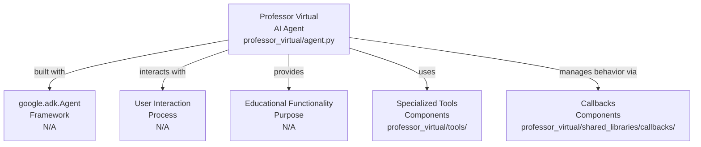

# Análise da Base de Código do Professor Virtual

Este relatório descreve a estrutura e a funcionalidade do projeto "Professor Virtual", com foco na interconexão de seus componentes e na sua relação com o arquivo central **agent.py**.

## Visão Geral do Projeto




O projeto **Professor Virtual** é um agente de IA construído com o framework `google.adk.Agent`. Seu propósito principal é interagir com usuários e fornecer funcionalidades educacionais. Ele opera utilizando um conjunto de ferramentas especializadas para executar ações e callbacks para gerenciar seu comportamento e fluxo de interação.

## Componentes Principais

```mermaid
graph TB
  agentPy["agent.py<br>Main Agent File<br>professor_virtual/agent.py"]
  configPy["config.py<br>Configuration<br>professor_virtual/config.py"]
  rootInitPy["__init__.py<br>Package Marker<br>professor_virtual/__init__.py"]
  promptsDir["prompts/<br>Prompts Module<br>professor_virtual/prompts/"]
  entitiesDir["entities/<br>Entities Module<br>professor_virtual/entities/"]
  sharedLibrariesDir["shared_libraries/<br>Callbacks Module<br>professor_virtual/shared_libraries/"]
  toolsDir["tools/<br>Tools Module<br>professor_virtual/tools/"]
  promptsPromptsPy["prompts.py<br>Instructions<br>professor_virtual/prompts/prompts.py"]
  callbacksPy["callbacks.py<br>Callback Aggregator<br>professor_virtual/shared_libraries/callbacks.py"]
  afterToolCb["after_tool_callback.py<br>Callback<br>professor_virtual/shared_libraries/callbacks/after_tool/after_tool_callback.py"]
  beforeAgentCb["before_agent_callback.py<br>Callback<br>professor_virtual/shared_libraries/callbacks/before_agent/before_agent_callback.py"]
  beforeToolCb["before_tool_callback.py<br>Callback<br>professor_virtual/shared_libraries/callbacks/before_tool/before_tool_callback.py"]
  rateLimitCb["rate_limit_callback.py<br>Callback<br>professor_virtual/shared_libraries/callbacks/rate_limit_callback/rate_limit_callback.py"]
  analisarImagemTool["analisar_imagem_educacional.py<br>Tool<br>professor_virtual/tools/analisar_imagem_educacional/analisar_imagem_educacional.py"]
  analisarNecessidadeTool["analisar_necessidade_visual.py<br>Tool<br>professor_virtual/tools/analisar_necessidade_visual/analisar_necessidade_visual.py"]
  gerarAudioTool["gerar_audio_tts.py<br>Tool<br>professor_virtual/tools/gerar_audio_tts/gerar_audio_tts.py"]
  transcreverAudioTool["transcrever_audio.py<br>Tool<br>professor_virtual/tools/transcrever_audio/transcrever_audio.py"]

  agentPy --> |"imports Config from"| configPy
  agentPy --> |"imports INSTRUCTION from"| promptsPromptsPy
  agentPy --> |"imports callbacks from"| callbacksPy
  agentPy --> |"imports tools from"| toolsDir

  subgraph Configuration and Initialization
    configPy
    rootInitPy
  end

  subgraph Prompts
    promptsDir
    promptsPromptsPy
  end

  subgraph Entities
    entitiesDir
  end

  subgraph Shared Libraries (Callbacks)
    sharedLibrariesDir
    callbacksPy --> |"aggregates"| afterToolCb
    callbacksPy --> |"aggregates"| beforeAgentCb
    callbacksPy --> |"aggregates"| beforeToolCb
    callbacksPy --> |"aggregates"| rateLimitCb
  end

  subgraph Tools
    toolsDir
    toolsDir --> |"contains"| analisarImagemTool
    toolsDir --> |"contains"| analisarNecessidadeTool
    toolsDir --> |"contains"| gerarAudioTool
    toolsDir --> |"contains"| transcreverAudioTool
  end
```


### Agente Principal

*   **agent.py**: Este é o arquivo central do projeto, responsável por instanciar e configurar o agente de IA. Ele integra as configurações, prompts, ferramentas e callbacks para definir o comportamento do **Professor Virtual**.

### Configuração e Inicialização

Este módulo gerencia as configurações essenciais para o funcionamento do agente.

*   **config.py**: Define e carrega as configurações do agente, como o modelo de IA a ser utilizado e outras configurações de conteúdo. O **agent.py** importa e utiliza a classe `Config` deste arquivo para inicializar suas configurações.
*   **__init__.py** (no diretório raiz): Marca o diretório `professor_virtual` como um pacote Python, permitindo que seus módulos (incluindo **agent.py**) sejam importados.

### Prompts

Este módulo contém as instruções textuais que guiam o comportamento do agente de IA.

*   **prompts/__init__.py**: Marca o diretório `prompts` como um pacote Python. Ele pode reexportar variáveis de outros módulos dentro do pacote `prompts`.
*   **prompts/prompts.py**: Armazena as instruções (prompts) que definem o comportamento do agente. O **agent.py** importa a variável `INSTRUCTION` deste módulo para configurar o `Agent`.
*   **prompts/README.md**: Fornece documentação e informações adicionais sobre o diretório `prompts`. Não é utilizado diretamente pelo código.

### Entidades

Este módulo define as estruturas de dados para as entidades do sistema.

*   **entities/__init__.py**: Marca o diretório `entities` como um pacote Python.
*   **entities/student.py**: Define a estrutura de dados ou classe para representar uma entidade de estudante. Atualmente, não é diretamente chamado por **agent.py**, mas pode ser utilizado por callbacks ou ferramentas que interagem com dados de estudantes.

### Bibliotecas Compartilhadas (Callbacks)

Este módulo contém funções de callback que são executadas em pontos específicos do ciclo de vida do agente, permitindo a interceptação e modificação do comportamento padrão.

*   **shared_libraries/__init__.py**: Marca o diretório `shared_libraries` como um pacote Python.
*   **shared_libraries/callbacks.py**: Atua como um ponto de agregação para as funções de callback. O **agent.py** importa funções como `rate_limit_callback`, `before_agent`, `before_tool` e `after_tool` deste módulo para configurar o `Agent`.
*   **shared_libraries/callbacks/__init__.py**: Marca o diretório `callbacks` como um pacote Python.
*   **shared_libraries/callbacks/after_tool/__init__.py**: Marca o diretório `after_tool` como um pacote Python.
*   **shared_libraries/callbacks/after_tool/after_tool_callback.py**: Implementa a função de callback executada **após** a execução de uma ferramenta. É configurada no **agent.py** e chamada pelo framework `google.adk`.
*   **shared_libraries/callbacks/before_agent/__init__.py**: Marca o diretório `before_agent` como um pacote Python.
*   **shared_libraries/callbacks/before_agent/before_agent_callback.py**: Implementa a função de callback executada **antes** do agente iniciar seu processo de raciocínio. É configurada no **agent.py** e chamada pelo framework `google.adk`.
*   **shared_libraries/callbacks/before_tool/__init__.py**: Marca o diretório `before_tool` como um pacote Python.
*   **shared_libraries/callbacks/before_tool/before_tool_callback.py**: Implementa a função de callback executada **antes** da execução de uma ferramenta. É configurada no **agent.py** e chamada pelo framework `google.adk`.
*   **shared_libraries/callbacks/lowercase_value/__init__.py**: Marca o diretório `lowercase_value` como um pacote Python.
*   **shared_libraries/callbacks/lowercase_value/lowercase_value.py**: Provavelmente contém uma função utilitária para converter valores para minúsculas. Não é diretamente chamado por **agent.py**.
*   **shared_libraries/callbacks/rate_limit_callback/__init__.py**: Marca o diretório `rate_limit_callback` como um pacote Python.
*   **shared_libraries/callbacks/rate_limit_callback/rate_limit_callback.py**: Implementa a função de callback para aplicar limites de taxa às chamadas do modelo. É configurada no **agent.py** como `before_model_callback` e chamada pelo framework `google.adk` antes de cada chamada ao modelo de IA.
*   **shared_libraries/callbacks/validate_student_id/__init__.py**: Marca o diretório `validate_student_id` como um pacote Python.
*   **shared_libraries/callbacks/validate_student_id/validate_student_id_callback.py**: Provavelmente contém uma função para validar IDs de estudantes. Não é diretamente chamado por **agent.py**.

### Ferramentas (Tools)

Este módulo contém as ferramentas especializadas que o agente pode utilizar para realizar tarefas específicas.

*   **tools/__init__.py**: Marca o diretório `tools` como um pacote Python e reexporta as ferramentas individuais. O **agent.py** importa as ferramentas deste módulo e as passa como uma lista para o parâmetro `tools` do `Agent` durante a inicialização.
*   **tools/analisar_imagem_educacional/__init__.py**: Marca o diretório `analisar_imagem_educacional` como um pacote Python.
*   **tools/analisar_imagem_educacional/analisar_imagem_educacional.py**: Implementa a ferramenta para analisar imagens educacionais. O agente de IA decide quando chamar esta ferramenta com base na sua instrução e na entrada do usuário.
*   **tools/analisar_necessidade_visual/__init__.py**: Marca o diretório `analisar_necessidade_visual` como um pacote Python.
*   **tools/analisar_necessidade_visual/analisar_necessidade_visual.py**: Implementa a ferramenta para analisar necessidades visuais. O agente de IA decide quando chamar esta ferramenta com base na sua instrução e na entrada do usuário.
*   **tools/gerar_audio_tts/__init__.py**: Marca o diretório `gerar_audio_tts` como um pacote Python.
*   **tools/gerar_audio_tts/gerar_audio_tts.py**: Implementa a ferramenta para gerar áudio a partir de texto (Text-to-Speech - TTS). O agente de IA decide quando chamar esta ferramenta.
*   **tools/transcrever_audio/__init__.py**: Marca o diretório `transcrever_audio` como um pacote Python.
*   **tools/transcrever_audio/transcrever_audio.py**: Implementa a ferramenta para transcrever áudio para texto. O agente de IA decide quando chamar esta ferramenta.

### Outros Arquivos

*   **README.md**: Fornece uma visão geral do projeto, instruções de configuração e uso. Não é chamado por nenhum código Python.
*   **__pycache__/** e arquivos `.pyc`: Diretórios e arquivos gerados automaticamente pelo Python para armazenar versões compiladas em bytecode dos módulos. Contribuem para o desempenho do carregamento dos módulos que **agent.py** importa.

---
*Generated by [CodeViz.ai](https://codeviz.ai) on 27/07/2025, 13:34:48*
